AR头条
------

测试

https://www.bilibili.com/video/BV1Qs4y1v7x4

## 介绍

### 技术栈

微服务项目


技术解决方案：

- 静态化模板方案
- 延迟发布方案
- 内容审核发布整套流程实现方案
- 热点数据筛选与处理方案
- 分布式任务调度解决方案
- 微服务持续集成解决方案


### 项目前置知识

- Springboot灵活使用的程度
- Spring cloud 入门程度
- Nacos基本使用程度

### 怎样学习项目

业务细节

学习的重点：

- 业务（B）。理解需求、准备面试
- 技术（T）。老技术融会贯通、新技术快速掌握
- 代码（C）。研究代码逻辑，量变影响质变
- 实战（P）。真需求，验证水平


遇到问题怎么办？

在调试中成长（学会debug）

## 1 项目介绍

怎么介绍一个项目：

项目背景、业务能力、技术栈说明、解决方案

### 项目概述

类似于今日头条，是一个新闻资讯类项目

#### 课程概述


课程大纲：

| 章节                           | 天数 | 内容                                                                               |
| ------------------------------ | ---- | ---------------------------------------------------------------------------------- |
| 第一章 环境搭建                | 1    | springboot、springcloud、nacos、swagger                                            |
| 第二章 文章列表查看            | 2    | freemarker、OSS、CDN、ElasticSearch、Redis                                         |
| 第三章 热点文章计算            | 3    | kafka、kafkaStream、XXL-JOB、Redis                                                 |
| 第四章 CMS自媒体端文章发布审核 | 3    | 第三方接口、延迟队列、                                                             |
| 第五章 项目部署 数据迁移       | 2    | Hbase、Jenkins、Git、Docker                                                        |
| 项目实战                       | 4    | app端-文章行为、<br />app端-评论系统、<br />自媒体端-评论管理、<br />自媒体端-报表 |

#### 环境搭建

使用登录及网关认证校验功能来测试环境搭建成功与否。

目标：接口测试工具及前后端联调


#### 业务说明

功能架构图


- 用户移动App


- 自媒体平台是新闻写文章、发布文章、管理的平台


- 管理平台相当于AR头条的官方平台，权限比较大


项目演示地址：
平台管理：http://heima-admin-java.research.itcast.cn
自媒体：http://heime-media-java.research.itcast.cn
app端：http://heima-app-java.research.itcast.cn

#### 项目术语

- 用户：黑马头条APP用户端用户
- 自媒体人：通过黑马自媒体系统发送文章的用户
- 管理员：使用黑马头条管理系统的用户
- App：黑马头条App
- We Media：黑马头条自媒体系统
- Admin：黑马头条管理系统

#### 技术栈


基础层


服务层


### nacos环境搭建

Centos 虚拟机

#### docker安装Nacos安装

1. 使用vm虚拟机打开资料中的contos7镜像
2. docker拉取镜像

   ```shell
   docker pull nacos/nacos-server:1.2.0
   ```
3. 创建容器

   ```shell
   docker run --env MODE=standalone --name nacos --restart=always  -d -p 8848:8848 nacos/nacos-server:1.2.0
   ```

> MODE=standalone  单机版
> --restart=always  开机启动
> -p 8848:8848   映射端口
> -d 创建一个守护式容器在后台运行

报错：

```
WARNING: The requested image's platform (linux/amd64) does not match the detected host platform (linux/arm64/v8) and no specific platform was requested

```

因为macos m1 ，添加 `--platform linux/arm64`

```shell
docker run --platform linux/arm64 --env MODE=standalone --name nacos --restart=always -d -p 8848:8848 nacos/nacos-server:1.2.0
```

🔖问题：

```
Unable to find image 'nacos/nacos-server:1.2.0' locally
1.2.0: Pulling from nacos/nacos-server
Digest: sha256:2db29d58eb4d3235ff55e44d5708c5690a399195c9e0504d79933a12b0a4f9f5
Status: Image is up to date for nacos/nacos-server:1.2.0
docker: image with reference docker.io/nacos/nacos-server:1.2.0 was found but does not match the specified platform: wanted linux/arm64, actual: linux/amd64.
See 'docker run --help'.
```

4. 访问地址：http://10.211.55.5:8848/nacos

使用本地macos上，源码安装启动nacos  `./startup.sh -m standalone` (单机模式运行)

http://localhost:8848/nacos

账号密码都是nacos

### 初始工程搭建

#### 工程主题结构

```
arleadnews								父工程，统一管理项目依赖（定义通用包的版本），springboot
		leadnews-common				通用配置
		leadnews-feign-api		feign对外的接口
		leadnews-model				pojo、dto
		leadnews-utils				通用工具
		leadnews-gateway			管理一系列网关
		leadnews-service			管理一系列微服务
		leadnews-test					测试案例
```

#### 全局异常


### 登录

#### 需求分析


- 用户点击**开始使用**

  登录后的用户权限较大，可以查看，也可以操作（点赞，关注，评论）
- 用户点击**不登录，先看看**

    游客只有查看的权限

#### 表结构分析

关于app端用户相关的内容较多，可以单独设置一个库leadnews_user

| **表名称** | **说明**    |
| ---------------- | ----------------- |
| ap_user          | APP用户信息表     |
| ap_user_fan      | APP用户粉丝信息表 |
| ap_user_follow   | APP用户关注信息表 |
| ap_user_realname | APP实名认证信息表 |

```mysql
CREATE TABLE `ap_user` (
  `id` int unsigned NOT NULL AUTO_INCREMENT COMMENT '主键',
  `salt` varchar(32) CHARACTER SET utf8mb4 COLLATE utf8mb4_unicode_ci DEFAULT NULL COMMENT '密码、通信等加密盐',
  `name` varchar(20) CHARACTER SET utf8mb4 COLLATE utf8mb4_unicode_ci DEFAULT NULL COMMENT '用户名',
  `password` varchar(32) CHARACTER SET utf8mb4 COLLATE utf8mb4_unicode_ci DEFAULT NULL COMMENT '密码,md5加密',
  `phone` varchar(11) CHARACTER SET utf8mb4 COLLATE utf8mb4_unicode_ci DEFAULT NULL COMMENT '手机号',
  `image` varchar(255) CHARACTER SET utf8mb4 COLLATE utf8mb4_unicode_ci DEFAULT NULL COMMENT '头像',
  `sex` tinyint unsigned DEFAULT NULL COMMENT '0 男\r\n            1 女\r\n            2 未知',
  `is_certification` tinyint unsigned DEFAULT NULL COMMENT '0 未\r\n            1 是',
  `is_identity_authentication` tinyint(1) DEFAULT NULL COMMENT '是否身份认证',
  `status` tinyint unsigned DEFAULT NULL COMMENT '0正常\r\n            1锁定',
  `flag` tinyint unsigned DEFAULT NULL COMMENT '0 普通用户\r\n            1 自媒体人\r\n            2 大V',
  `created_time` datetime DEFAULT NULL COMMENT '注册时间',
  PRIMARY KEY (`id`) USING BTREE
) ENGINE=InnoDB AUTO_INCREMENT=7 DEFAULT CHARSET=utf8mb4 COLLATE=utf8mb4_unicode_ci ROW_FORMAT=DYNAMIC COMMENT='APP用户信息表';
```

> `tinyint`类型：占1个字节，不指定unsigned（非负数），值范围（-128,127），指定了unsigned，值范围（0,255）
>
> tinyint通常表示小范围的数值，或者表示true或false，通常值为0表示false，值为1表示true

项目中的持久层使用的mybatis-plus，一般都使用mybais-plus逆向生成对应的实体类

#### 手动加密（md5+随机字符串）

md5是不可逆加密，md5相同的密码每次加密都一样，不太安全。在md5的基础上手动加盐（salt）处理

注册->生成盐（字段salt）：


登录->使用盐来配合验证：


#### 用户端（运营端）微服务搭建

在leadnews-service下创建工程leadnews-user


```yaml
spring:
  datasource:
      driver-class-name: com.mysql.cj.jdbc.Driver
      url: jdbc:mysql://localhost:3306/leadnews_user?serverTimezone=Asia/Shanghai&useUnicode=true&characterEncoding=utf-8&zeroDateTimeBehavior=convertToNull&useSSL=false&allowPublicKeyRetrieval=true
      username: root
      password: 33824
# 设置Mapper接口所对应的XML文件位置，如果你在Mapper接口中有自定义方法，需要进行该配置
mybatis-plus:
  mapper-locations: classpath*:mapper/*.xml
  # 设置别名包扫描路径，通过该属性可以给包中的类注册别名
  type-aliases-package: top.andyron.model.user.pojos
```

#### 登录功能实现

##### 接口定义


快捷键ctrl + a  （ctrl + i）


##### 思路分析

流程：


1. 用户输入了用户名和密码进行登录，校验成功后返回jwt（基于当前用户的id生成）
2. 用户游客登录，生成jwt返回（基于默认值0生成）

### 接口工具postman、swagger、knife4j

#### swagger

Spring已经将Swagger纳入自身的标准，建立了Spring-swagger项目，现在叫Springfox。通过在项目中引入Springfox ，即可非常简单快捷的使用Swagger。

```xml
<dependency>
    <groupId>io.springfox</groupId>
    <artifactId>springfox-swagger2</artifactId>
</dependency>
<dependency>
    <groupId>io.springfox</groupId>
    <artifactId>springfox-swagger-ui</artifactId>
</dependency>
```

在leadnews-common中进行配置即可，因为其他微服务工程都直接或间接依赖即可。

##### swagger常用注解

@Api：修饰整个类，描述Controller的作用

@ApiOperation：描述一个类的一个方法，或者说一个接口

@ApiParam：单个参数的描述信息

@ApiModel：用对象来接收参数

@ApiModelProperty：用对象接收参数时，描述对象的一个字段

@ApiResponse：HTTP响应其中1个描述

@ApiResponses：HTTP响应整体描述

@ApiIgnore：使用该注解忽略这个API

@ApiError ：发生错误返回的信息

@ApiImplicitParam：一个请求参数

@ApiImplicitParams：多个请求参数的描述信息

@ApiImplicitParam属性：

| 属性         | 取值   | 作用                                          |
| ------------ | ------ | --------------------------------------------- |
| paramType    |        | 查询参数类型                                  |
|              | path   | 以地址的形式提交数据                          |
|              | query  | 直接跟参数完成自动映射赋值                    |
|              | body   | 以流的形式提交 仅支持POST                     |
|              | header | 参数在request headers 里边提交                |
|              | form   | 以form表单的形式提交 仅支持POST               |
| dataType     |        | 参数的数据类型 只作为标志说明，并没有实际验证 |
|              | Long   |                                               |
|              | String |                                               |
| name         |        | 接收参数名                                    |
| value        |        | 接收参数的意义描述                            |
| required     |        | 参数是否必填                                  |
|              | true   | 必填                                          |
|              | false  | 非必填                                        |
| defaultValue |        | 默认值                                        |

启动微服务，访问 http://localhost:51801/swagger-ui.html

```json
{
  "password": "admin",
  "phone": "13511223456"
}
```

#### knife4j

knife4j是为Java MVC框架集成Swagger生成Api文档的增强解决方案,前身是swagger-bootstrap-ui,取名kni4j是希望它能像一把匕首一样小巧,轻量,并且功能强悍!

gitee地址：https://gitee.com/xiaoym/knife4j

官方文档：https://doc.xiaominfo.com/

效果演示：http://knife4j.xiaominfo.com/doc.html

该UI增强包主要包括两大核心功能：文档说明 和 在线调试

- 文档说明：根据Swagger的规范说明，详细列出接口文档的说明，包括接口地址、类型、请求示例、请求参数、响应示例、响应参数、响应码等信息，使用swagger-bootstrap-ui能根据该文档说明，对该接口的使用情况一目了然。
- 在线调试：提供在线接口联调的强大功能，自动解析当前接口参数,同时包含表单验证，调用参数可返回接口响应内容、headers、Curl请求命令实例、响应时间、响应状态码等信息，帮助开发者在线调试，而不必通过其他测试工具测试接口是否正确,简介、强大。
- ==个性化配置==：通过个性化ui配置项，可自定义UI的相关显示信息
- ==离线文档==：根据标准规范，生成的在线markdown离线文档，开发者可以进行拷贝生成markdown接口文档，通过其他第三方markdown转换工具转换成html或pdf，这样也可以放弃swagger2markdown组件
- ==接口排序==：自1.8.5后，ui支持了接口排序功能，例如一个注册功能主要包含了多个步骤,可以根据swagger-bootstrap-ui提供的接口排序规则实现接口的排序，step化接口操作，方便其他开发者进行接口对接

使用：

```xml
<dependency>
     <groupId>com.github.xiaoymin</groupId>
     <artifactId>knife4j-spring-boot-starter</artifactId>
</dependency>
```

```java
@Configuration
@EnableSwagger2
@EnableKnife4j
@Import(BeanValidatorPluginsConfiguration.class)
public class SwaggerConfiguration2 {
```

| 注解                | 说明                                                                                                                                         |
| ------------------- | -------------------------------------------------------------------------------------------------------------------------------------------- |
| `@EnableSwagger2` | 该注解是Springfox-swagger框架提供的使用Swagger注解，该注解必须加                                                                             |
| `@EnableKnife4j`  | 该注解是 `knife4j`提供的增强注解,Ui提供了例如动态参数、参数过滤、接口排序等增强功能,如果你想使用这些增强功能就必须加该注解，否则可以不用加 |

```
org.springframework.boot.autoconfigure.EnableAutoConfiguration=\
  top.andyron.common.exception.ExceptionCatch,\
  top.andyron.common.swagger.SwaggerConfiguration2
```

http://localhost:51801/doc.html

🔖  为什么会和swagger冲突

### app端网关

#### 网关概述


#### 项目中网关

```
leadnews-gateway									管理网关
		leadnews-admin-gateway    		管理平台网关
		leadnews-wemedia-gateway			自媒体网关
		leadnews-app-gateway					app网关
```

#### 实现

- 在leadnews-gateway

```xml
<dependencies>
    <dependency>
        <groupId>org.springframework.cloud</groupId>
        <artifactId>spring-cloud-starter-gateway</artifactId>
    </dependency>
    <dependency>
        <groupId>com.alibaba.cloud</groupId>
        <artifactId>spring-cloud-starter-alibaba-nacos-discovery</artifactId>
    </dependency>
     <dependency>
            <groupId>com.alibaba.cloud</groupId>
            <artifactId>spring-cloud-starter-alibaba-nacos-config</artifactId>
        </dependency>
    <dependency>
        <groupId>io.jsonwebtoken</groupId>
        <artifactId>jjwt</artifactId>
    </dependency>
</dependencies>
```

- 在leadnews-gateway下创建leadnews-app-gateway微服务

bootstrap.yml

```yaml
server:
  port: 51601
spring:
  application:
    name: leadnews-app-gateway
  cloud:
    nacos:
      discovery:
        server-addr: 192.168.0.102:8848
      config:
        server-addr: 192.168.0.102:8848
        file-extension: yml
```

在nacos的配置中心创建dataid为leadnews-app-gateway的yml配置

```yaml
spring:
  cloud:
    gateway:
      globalcors:
        add-to-simple-url-handler-mapping: true
        corsConfigurations:
          '[/**]':
            allowedHeaders: "*"
            allowedOrigins: "*"
            allowedMethods:
              - GET
              - POST
              - DELETE
              - PUT
              - OPTION
      routes:
        # 平台管理
        - id: user
          uri: lb://leadnews-user
          predicates:
            - Path=/user/**
          filters:
            - StripPrefix= 1
```

环境搭建完成以后，启动项目网关和用户两个服务，使用postman进行测试

请求地址：http://localhost:51601/user/api/v1/login/login_auth

#### 认证过滤器

认证过滤器用来校验token。

全局过滤器实现jwt校验


在leandews-app-gateway中创建 `AuthorizeFilter`

### App前端集成

nginx方式集成前端项目


- 前端项目app-web
- 配置nginx

> 每个项目单独创建一个配置文件，因为之后还有很多项目。

在nginx安装的conf目录下新建一个文件夹 `leadnews.conf`,在当前文件夹中新建 `leadnews-app.conf`文件:

```nginx
upstream  leadnews-app-gateway {
    server localhost:51601;    # 反向代理到app网关
}

server {
	listen 8801;
	location / {
		root /Users/andyron/myfield/git/ARLeadnews/app-web/;
		index index.html;
	}

	location ~/app/(.*) {
		proxy_pass http://leadnews-app-gateway/$1;
		proxy_set_header HOST $host;  # 不改变源请求头的值
		proxy_pass_request_body on;  #开启获取请求体
		proxy_pass_request_headers on;  #开启获取请求头
		proxy_set_header X-Real-IP $remote_addr;   # 记录真实发出请求的客户端IP
		proxy_set_header X-Forwarded-For $proxy_add_x_forwarded_for;  #记录代理信息
	}
}
```

在nginx.conf中引入 `leadnews-app.conf`文件：

```nginx
http {
  # ...
  include leadnews.conf/*.conf;
}
```

- 重新加载配置文件

`nginx -s reload`

- 测试

 http://localhost:8801

> 从业务角度分析如何分表
>
> 滚屏分页的逻辑
>
> 文章详情-大文本静态化方案（freemarker，minio）

## 2 app端文章查看，静态化freemarker,分布式文件系统minIO

### App文章列表

#### 需求分析

文章的布局展示


数据库leadnews_article


```mysql
CREATE TABLE `ap_article` (
  `id` bigint unsigned NOT NULL AUTO_INCREMENT,
  `title` varchar(50) CHARACTER SET utf8mb4 COLLATE utf8mb4_unicode_ci DEFAULT NULL COMMENT '标题',
  `author_id` int unsigned DEFAULT NULL COMMENT '文章作者的ID',
  `author_name` varchar(20) CHARACTER SET utf8mb4 COLLATE utf8mb4_unicode_ci DEFAULT NULL COMMENT '作者昵称',
  `channel_id` int unsigned DEFAULT NULL COMMENT '文章所属频道ID',
  `channel_name` varchar(10) CHARACTER SET utf8mb4 COLLATE utf8mb4_unicode_ci DEFAULT NULL COMMENT '频道名称',
  `layout` tinyint unsigned DEFAULT NULL COMMENT '文章布局\r\n            0 无图文章\r\n            1 单图文章\r\n            2 多图文章',
  `flag` tinyint unsigned DEFAULT NULL COMMENT '文章标记\r\n            0 普通文章\r\n            1 热点文章\r\n            2 置顶文章\r\n            3 精品文章\r\n            4 大V 文章',
  `images` varchar(1000) CHARACTER SET utf8mb4 COLLATE utf8mb4_unicode_ci DEFAULT NULL COMMENT '文章图片\r\n            多张逗号分隔',
  `labels` varchar(500) CHARACTER SET utf8mb4 COLLATE utf8mb4_unicode_ci DEFAULT NULL COMMENT '文章标签最多3个 逗号分隔',
  `likes` int unsigned DEFAULT NULL COMMENT '点赞数量',
  `collection` int unsigned DEFAULT NULL COMMENT '收藏数量',
  `comment` int unsigned DEFAULT NULL COMMENT '评论数量',
  `views` int unsigned DEFAULT NULL COMMENT '阅读数量',
  `province_id` int unsigned DEFAULT NULL COMMENT '省市',
  `city_id` int unsigned DEFAULT NULL COMMENT '市区',
  `county_id` int unsigned DEFAULT NULL COMMENT '区县',
  `created_time` datetime DEFAULT NULL COMMENT '创建时间',
  `publish_time` datetime DEFAULT NULL COMMENT '发布时间',
  `sync_status` tinyint(1) DEFAULT '0' COMMENT '同步状态',
  `origin` tinyint unsigned DEFAULT '0' COMMENT '来源',
  `static_url` varchar(150) CHARACTER SET utf8mb4 COLLATE utf8mb4_unicode_ci DEFAULT NULL,
  PRIMARY KEY (`id`) USING BTREE
) ENGINE=InnoDB AUTO_INCREMENT=1383828014629179394 DEFAULT CHARSET=utf8mb4 COLLATE=utf8mb4_unicode_ci ROW_FORMAT=DYNAMIC COMMENT='文章信息表，存储已发布的文章';
```


> 为什么文章信息要拆分成多个表？

表的拆分-**垂直分表**

垂直分表：将一个表的字段分散到多个表中，每个表存储其中一部分字段。

优势：

1. 减少IO争抢，减少锁表的几率，查看文章概述与文章详情互不影响
2. 充分发挥高频数据的操作效率，对文章概述数据操作的高效率不会被操作文章详情数据的低效率所拖累。

拆分规则：

1. 把**不常用的字段**单独放在一张表
2. 把text，blob等**大字段**拆分出来单独放在一张表
3. **经常组合查询的字段**单独放在一张表中

#### 实现思路


1. 在默认频道展示10条文章信息
2. 可以切换频道查看不同种类文章
3. 当用户==下拉==可以加载最新的文章（分页）本页文章列表中发布时间为最大的时间为依据
4. 当用户==上拉==可以加载更多的文章信息（按照发布时间）本页文章列表中发布时间最小的时间为依据
5. 如果是当前频道的首页，前端传递默认参数：

   `maxBehotTime`:0（毫秒）

   `minBehotTime`: 20000000000000（毫秒）2063年

首页默认加载小于2063年的数据

#### 接口定义


#### 实现

- 在leadnews-service中添加一个模块leadnews-article

```yaml
server:
  port: 51802
spring:
  application:
    name: leadnews-article
  cloud:
    nacos:
      discovery:
        server-addr: 192.168.0.102:8848
      config:
        server-addr: 192.168.0.102:8848
        file-extension: yml
```

- 需要在nacos中添加对应的配置

```yaml
spring:
  datasource:
      driver-class-name: com.mysql.cj.jdbc.Driver
      url: jdbc:mysql://localhost:3306/leadnews_article?serverTimezone=Asia/Shanghai&useUnicode=true&characterEncoding=utf-8&zeroDateTimeBehavior=convertToNull&useSSL=false&allowPublicKeyRetrieval=true
      username: root
      password: 33824
# 设置Mapper接口所对应的XML文件位置，如果你在Mapper接口中有自定义方法，需要进行该配置
mybatis-plus:
  mapper-locations: classpath*:mapper/*.xml
  # 设置别名包扫描路径，通过该属性可以给包中的类注册别名
  type-aliases-package: top.andyron.model.article.pojos
```


- 定义接口
- 编写mapper文件

文章表与文章配置表多表查询

- 编写业务层代码
- 编写控制器代码
- swagger测试或前后端联调测试

首页要在app网关的nacos配置中心添加文章微服务的路由：

```yaml

				# 文章微服务
        - id: article
          uri: lb://leadnews-article
          predicates:
            - Path=/article/**
          filters:
            - StripPrefix= 1
```

启动网关、user、article微服务

### 文章详情-实现方案分析

#### 方案1

根据文章的id去查询文章内容表，返回渲染页面


#### 方案2-静态模板展示


### freemarker

#### 模板引擎


[FreeMarker](https://github.com/apache/freemarker) 是一款 模板引擎： 即一种基于模板和要改变的数据， 并用来生成输出文本(==HTML网页，电子邮件，配置文件，源代码==等)的通用工具。 它**==不是面向最终用户的==**，而是一个Java类库，是一款程序员可以嵌入他们所开发产品的组件。

模板编写为FreeMarker Template Language (FTL)。它是简单的，专用的语言， *不是* 像PHP那样成熟的编程语言。 那就意味着要准备数据在真实编程语言中来显示，比如数据库查询和业务运算， 之后模板显示已经准备好的数据。在模板中，你可以专注于如何展现数据， 而在模板之外可以专注于要展示什么数据。

#### 技术选型对比

常用的java模板引擎还有哪些？

Jsp、Freemarker、Thymeleaf 、Velocity 等。

1. Jsp 为 Servlet 专用，不能单独进行使用。
2. Thymeleaf 为新技术，功能较为强大，但是执行的效率比较低。
3. Velocity从2010年更新完 2.0 版本后，便没有在更新。Spring Boot 官方在 1.4 版本后对此也不在支持，虽然 Velocity 在 2017 年版本得到迭代，但为时已晚。

#### 环境搭建-快速入门

freemarker作为springmvc一种视图格式，默认情况下SpringMVC支持freemarker视图格式。

- 创建一个freemarker-demo 的测试工程专门用于freemarker的功能测试与模板的测试。

```xml
    <dependencies>
        <dependency>
            <groupId>org.springframework.boot</groupId>
            <artifactId>spring-boot-starter-web</artifactId>
        </dependency>
        <dependency>
            <groupId>org.springframework.boot</groupId>
            <artifactId>spring-boot-starter-freemarker</artifactId>
        </dependency>

        <dependency>
            <groupId>org.springframework.boot</groupId>
            <artifactId>spring-boot-starter-test</artifactId>
        </dependency>
        <!-- lombok -->
        <dependency>
            <groupId>org.projectlombok</groupId>
            <artifactId>lombok</artifactId>
        </dependency>

        <!-- apache 对 java io 的封装工具库 -->
        <dependency>
            <groupId>org.apache.commons</groupId>
            <artifactId>commons-io</artifactId>
            <version>1.3.2</version>
        </dependency>
    </dependencies>
```

- 配置文件application.yml

```yaml
server:
  port: 8881 #服务端口
spring:
  application:
    name: freemarker-demo #指定服务名
  freemarker:
    cache: false  #关闭模板缓存，方便测试
    settings:
      template_update_delay: 0 #检查模板更新延迟时间，设置为0表示立即检查，如果时间大于0会有缓存不方便进行模板测试
    suffix: .ftl               #指定Freemarker模板文件的后缀名
```

- 创建模型类
- 创建模板

在resources下创建 `templates`，此目录为freemarker的默认模板存放目录。

在templates下创建模板文件 01-basic.ftl，模板中的==插值表达式==最终会被freemarker替换成具体的数据。

```html
<!DOCTYPE html>
<html>
<head>
    <meta charset="utf-8">
    <title>Hello World!</title>
</head>
<body>
<b>普通文本 String 展示：</b><br><br>
Hello ${name} <br>
<hr>
<b>对象Student中的数据展示：</b><br/>
姓名：${stu.name}<br/>
年龄：${stu.age}
<hr>
</body>
</html>
```

- 创建controller
- 创建启动类
- 测试

http://localhost:8881/basic


freemarker模板文件通常都是以ftl作为扩展名，也可以为html、xml、jsp等

`FreeMarkerAutoConfiguration`

`FreeMarkerProperties`

#### Freemarker指令语法

##### 基础语法种类

- 注释

```velocity
<#-- 我是一个freemarker注释 -->
```

- 插值（Interpolation）：即 **`${..}`** 部分,freemarker会用真实的值代替**`${..}`**

```velocity
Hello ${name}
```

- ==FTL指令==：和HTML标记类似，名字前加#予以区分，Freemarker会解析标签中的表达式或逻辑。

```html
<# >FTL指令</#> 
```

有很多FTL指令

- 文本，仅文本信息，这些不是freemarker的注释、插值、FTL指令的内容会被freemarker忽略解析，直接输出内容。

```velocity
<#--freemarker中的普通文本-->
我是一个普通的文本
```

##### 集合指令（List和Map）

```html
<#list></#list>
```

List:

```html
    <#list stus as stu >
      <tr>
        <td>${stu_index}</td>
        <td>${stu.name}</td>
        <td>${stu.age}</td>
        <td>${stu.money}</td>
      </tr>
    </#list>
```

`${k_index}`得到循环的下表，从0开始，是stu加上 `_index`。

获取map中的值：

```
map["keyname"].property
map.keyname.property
```

遍历map：

```html
		<#list stuMap?keys as key >
        <tr>
            <td>${key_index}</td>
            <td>${stuMap[key].name}</td>
            <td>${stuMap[key].age}</td>
            <td>${stuMap[key].money}</td>
        </tr>
    </#list>
```

##### if指令

```html
<#if expression>
<#else>
</#if>
```

```html
<table>
    <tr>
        <td>姓名</td>
        <td>年龄</td>
        <td>钱包</td>
    </tr>
    <#list stus as stu >
        <#if stu.name='小红'>
            <tr style="color: red">
                <td>${stu_index}</td>
                <td>${stu.name}</td>
                <td>${stu.age}</td>
                <td>${stu.money}</td>
            </tr>
            <#else >
            <tr>
                <td>${stu_index}</td>
                <td>${stu.name}</td>
                <td>${stu.age}</td>
                <td>${stu.money}</td>
            </tr>
        </#if>
    </#list>
</table>
```

##### 运算符

- 算数运算符

除了 + 运算以外，其他的运算只能和 number 数字类型的计算。

```html
<b>算数运算符</b>
<br/><br/>
    100+5 运算：  ${100 + 5 }<br/>
    100 - 5 * 5运算：${100 - 5 * 5}<br/>
    5 / 2运算：${5 / 2}<br/>
    12 % 10运算：${12 % 10}<br/>
<hr>
```

- 比较运算符


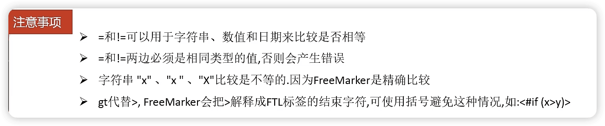

- 逻辑运算符

```html
<b>逻辑运算符</b>
    <br/>
    <br/>
    <#if (10 lt 12 )&&( 10  gt  5 )  >
        (10 lt 12 )&&( 10  gt  5 )  显示为 true
    </#if>
    <br/>
    <br/>
    <#if !false>
        false 取反为true
    </#if>
<hr>
```

##### 空值处理

- 判断某变量是否存在使用 “`??`”

```html
    <#if stus??>
    </#if>
```

- 缺失变量默认值使用 “`!`”

使用!要以指定一个默认值，当变量为空时显示默认值， `${name!''}`表示如果name为空显示空字符串。

如果是嵌套对象则建议使用（）括起来，例： `${(stu.bestFriend.name)!''}`表示，如果stu或bestFriend或name为空默认显示空字符串。

##### 内建函数

内建函数语法格式： `变量+?+函数名称`

- 集合的大小

  `${集合名?size}`
- 日期格式化

  显示年月日: `${today?date}`
  显示时分秒：`${today?time}`
  显示日期+时间：`${today?datetime}`
  自定义格式化：  `${today?string("yyyy年MM月")}`
- 内建函数 `c`

  ```java
  model.addAttribute("point", 102920122);
  ```

  point是数字型，使用${point}会显示这个数字的值，每三位使用逗号分隔。

  如果不想显示为每三位分隔的数字，可以使用c函数将数字型转成字符串输出

  `${point?c}`
- 将json字符串转成对象

 assign标签，assign的作用是定义一个变量

```html
<#assign text="{'bank':'工商银行','account':'10101920201920212'}" />
<#assign data=text?eval />
开户行：${data.bank}  账号：${data.account}
```

#### 输出静态化文件

使用freemarkder原始api讲页面生成html文件

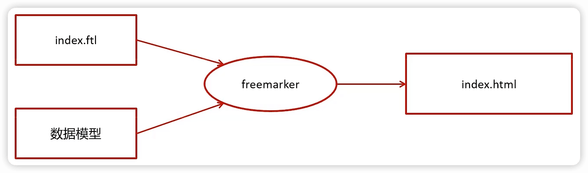

```java
Template template = configuration.getTemplate("02-list.ftl");

// 合成方法
// 第一个参数：模型数据
// 第二个参数：输出流
template.process(getData(), new FileWriter("/Users/andyron/Downloads/list.html"));

```

### 对象存储服务MinIO

分布式文件系统

#### 对象存储的方式对比


#### 分布式文件系统

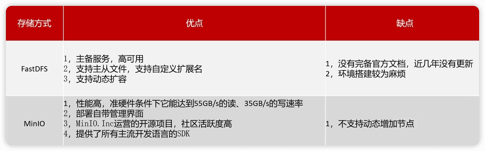

#### MinIO简介

[MinIO](https://github.com/minio/minio)基于Apache License v2.0开源协议的对象存储服务，可以做为云存储的解决方案用来保存海量的图片，视频，文档。

- Golang实现，配置简单，单行命令可以运行起来。
- MinIO兼容亚马逊S3云存储服务接口（之后不想自己维护了，可以直接将其部署到云上），非常适合于存储大容量非结构化的数据，例如图片、视频、日志文件、备份数据和容器/虚拟机镜像等，而一个对象文件可以是任意大小，从几kb到最大5T不等。

**S3 （ Simple Storage Service简单存储服务）**  一种云标准

MinIO基本概念

- bucket – 类比于文件系统的目录
- Object – 类比文件系统的文件
- Keys – 类比文件名

官网文档：http://docs.minio.org.cn/docs/

MinIO特点：

- 数据保护

  Minio使用Minio Erasure Code（纠删码）来防止硬件故障。即便损坏一半以上的driver，但是仍然可以从中恢复。
- 高性能

  作为高性能对象存储，在标准硬件条件下它能达到55GB/s的读、35GB/s的写速率
- 可扩容

  不同MinIO集群可以组成联邦，并形成一个全局的命名空间，并跨越多个数据中心
- SDK支持

  基于Minio轻量的特点，它得到类似Java、Python或Go等语言的sdk支持
- 有操作页面

  面向用户友好的简单操作界面，非常方便的管理Bucket及里面的文件资源
- 功能简单

  这一设计原则让MinIO不容易出错、更快启动
- 丰富的API

  支持文件资源的分享连接及分享链接的过期策略、存储桶操作、文件列表访问及文件上传下载的基本功能等。
- 文件变化主动通知

  存储桶（Bucket）如果发生改变,比如上传对象和删除对象，可以使用存储桶事件通知机制进行监控，并通过以下方式发布出去:AMQP、MQTT、Elasticsearch、Redis、NATS、MySQL、Kafka、Webhooks等。

#### MinIO安装

docker安装MinIOn

- `docker pull minio/minio`
- 创建容器

```shell
docker run -p 9000:9000 --name minio -d --restart=always -e "MINIO_ACCESS_KEY=minio" -e "MINIO_SECRET_KEY=minio123" -v /home/data:/data -v /home/config:/root/.minio minio/minio server /data
```

- 访问minio

```shell
docker run -p 9000:9000 --name minio -d --restart=always -e "MINIO_ROOT_USER=minio" -e "MINIO_ROOT_PASSWORD=minio123" -v /home/data:/data -v /home/config:/root/.minio minio/minio server /data
```

访问报错

```
Warning: The standard parity is set to 0. This can lead to data loss.
```

> 在macos本地部署minios
>
> ```shell
> curl -O https://dl.minio.org.cn/server/minio/release/darwin-arm64/minio
> chmod +x ./minio
> ```
>
> 下载，只是单一执行文件。
>
> 运行，配置一些参数
>
> ```shell
> ./minio server --config-dir=/Users/andyron/myfield/env/minio/config --address=:9000 /Users/andyron/myfield/env/minio/data
> ```
>
> minioadmin
>
> minioadmin
>
> 访问本地9000端口即可 http://localhost:9000

#### minio快速入门

创建模块minio-demo

```java

        try {
            FileInputStream fileInputStream = new FileInputStream("/Users/andyron/myfield/tmp/list.html"); 

            // 1 创建minio链接客户端
            MinioClient minioClient = MinioClient.builder().credentials("minioadmin", "minioadmin")
                    .endpoint("http://192.168.0.102:9000").build();
            // 2 上传
            PutObjectArgs objectArgs = PutObjectArgs.builder()
                    .object("list.html")        // 文件名
                    .contentType("text/html")         // 文件类型
                    .bucket("leadnews")         // 桶名称，与在minio管理界面创建的桶一致
                    // -1 表示上传所有
                    .stream(fileInputStream, fileInputStream.available(), -1)
                    .build();
            minioClient.putObject(objectArgs);

            // 访问路径
            System.out.println("http://192.168.0.102:9000/leadnews/list.html");
        } catch (Exception e) {
            e.printStackTrace();
        }
```

需要设置下通道访问权限，然后上传额文件就能在浏览器直接访问了


http://192.168.0.102:9000/leadnews/list.html

#### 封装MinIO为starter

为什么需要封装MinIO为starter？


> [p39 2:30](https://www.bilibili.com/video/BV1Qs4y1v7x4?p=39&vd_source=634715056d593def3fe15c44fd54e180)  当需要拷贝目录到项目中变成模块，怎么操作 ❤️

- 建立两个模块

```
leadnews-basic
		file-starter
```

```xml
				<dependency>
            <groupId>org.springframework.boot</groupId>
            <artifactId>spring-boot-autoconfigure</artifactId>
        </dependency>
        <dependency>
            <groupId>io.minio</groupId>
            <artifactId>minio</artifactId>
            <version>7.1.0</version>
        </dependency>
        <dependency>
            <groupId>org.springframework.boot</groupId>
            <artifactId>spring-boot-starter</artifactId>
        </dependency>
        <dependency>
            <groupId>org.springframework.boot</groupId>
            <artifactId>spring-boot-configuration-processor</artifactId>
            <optional>true</optional>
        </dependency>
        <dependency>
            <groupId>org.springframework.boot</groupId>
            <artifactId>spring-boot-starter-actuator</artifactId>
        </dependency>
```

```
org.springframework.boot.autoconfigure.EnableAutoConfiguration=\
  top.andyron.file.service.impl.MinIOFileStorageService
```

##### 测试封装的starter

- 在minio-demo中引入自定义的starter

```xml
				<dependency>
            <groupId>top.andyron</groupId>
            <artifactId>file-starter</artifactId>
            <version>0.0.1-SNAPSHOT</version>
        </dependency>
```

- 创建配置文件，配置属性与自定义的 `MinIOConfigProperties`一致

```yaml
minio:
  accessKey: minioadmin
  secretKey: minioadmin
  bucket: leadnews
  endpoint: http://192.168.0.102:9000
  readPath: http://192.168.0.102:9000
```

- 测试，注入`FileStorageService`使用：

```java
@SpringBootTest(classes = MinIOApplication.class)
@RunWith(SpringRunner.class)
public class MinIOTest {

    @Autowired
    private FileStorageService fileStorageService;
    // 测试自定义starter
    @Test
    public void test() throws FileNotFoundException {
        FileInputStream fileInputStream = new FileInputStream("/Users/andyron/myfield/tmp/list.html");
        String path = fileStorageService.uploadHtmlFile("", "list.html", fileInputStream);
        System.out.println(path);
    }
}
```

上传文件到MinIO，并返回了访问地址 http://192.168.0.102:9000/leadnews/2023/12/08/list.html

### 文章详情

#### 实现步骤

1. 在artile微服务中添加MinIO和freemarker的支持，参考测试项目

```xml
<dependency>
  <groupId>org.springframework.boot</groupId>
  <artifactId>spring-boot-starter-freemarker</artifactId>
</dependency>
<dependency>
  <groupId>top.andyron</groupId>
  <artifactId>file-starter</artifactId>
  <version>0.0.1-SNAPSHOT</version>
</dependency>
```

在nacos中的文章微服务添加备注：

```yaml
minio:
  accessKey: minioadmin
  secretKey: minioadmin
  bucket: leadnews
  endpoint: http://192.168.0.102:9000
  readPath: http://192.168.0.102:9000
```

2. 创建模板文件（article.ftl）
3. 创建index.js和index.css文件，手动上传到MinIO职工
4. 在artile微服务中新增测试类（后期新增文章的时候创建详情静态页，目前暂时手动生成）

```java
				// 1 获取文章内容
        ApArticleContent apArticleContent = apArticleContentMapper
                .selectOne(Wrappers.<ApArticleContent>lambdaQuery()
                .eq(ApArticleContent::getArticleId, "1383828014629179393"));
        if (apArticleContent != null && StringUtils.isNotBlank(apArticleContent.getContent())) {
            //2 文章内容通过freemarker生成html文件
            Template template = configuration.getTemplate("article.ftl");
            // 数据模型
            Map<String, Object> content = new HashMap<>();
            content.put("content", JSONArray.parseArray(apArticleContent.getContent()));
            StringWriter out = new StringWriter();
            template.process(content, out);

            //3 把html文件上传到minio中
            InputStream in = new ByteArrayInputStream(out.toString().getBytes());
            String path = fileStorageService.uploadHtmlFile("", apArticleContent.getArticleId() + ".html", in);

            //4 修改ap_article表，保存static_url字段
            apArticleService.update(Wrappers.<ApArticle>lambdaUpdate()
                    .eq(ApArticle::getId, apArticleContent.getArticleId())
                    .set(ApArticle::getStaticUrl, path));

        }
```

🔖 生成html中一些参数没有

> 自媒体环境
>
>     后台环境
>
>     前台环境
>
> 素材管理
>
>     minIO的图片上传
>
>     微服务中获取用户的方式
>
>     拦截器的使用
>
> 文章管理
>
>     多条件查询
>
>     复杂业务的处理（文章发布）
>
>     jdk8中的新特性

## 3 自媒体文章发布

### 自媒体前后端搭建

#### 后台搭建

```
arleandnews-service
		leandnews-service
				leandnews-wemedia
		leandnews-gateway
				leandnews-wemedia-gateway
```

搭建步骤

1. 基础环境和数据准备

数据库leadnews_wemedia

在leandnews-model模块中添加对应相应配置

2. leandnews-wemedia模块

添加相应nacos配置

```yaml
spring:
  datasource:
      driver-class-name: com.mysql.cj.jdbc.Driver
      url: jdbc:mysql://localhost:3306/leadnews_wemedia?serverTimezone=Asia/Shanghai&useUnicode=true&characterEncoding=utf-8&zeroDateTimeBehavior=convertToNull&useSSL=false&allowPublicKeyRetrieval=true
      username: root
      password: 33824
# 设置Mapper接口所对应的XML文件位置，如果你在Mapper接口中有自定义方法，需要进行该配置
mybatis-plus:
  mapper-locations: classpath*:mapper/*.xml
  # 设置别名包扫描路径，通过该属性可以给包中的类注册别名
  type-aliases-package: top.andyron.model.wemedia.pojos

```

3. leandnews-wemedia-gateway模块

添加对应nacos配置

```yaml
spring:
  cloud:
    gateway:
      globalcors:
        cors-configurations:
          '[/**]': # 匹配所有请求
            allowedOrigins: "*" #跨域处理 允许所有的域
            allowedMethods: # 支持的方法
              - GET
              - POST
              - PUT
              - DELETE
      routes:
        # 平台管理
        - id: wemedia
          uri: lb://leadnews-wemedia
          predicates:
            - Path=/wemedia/**
          filters:
            - StripPrefix= 1
```

#### 前台搭建

通过nginx的虚拟主机功能，使用同一个nginx访问多个项目


- 自媒体前端：wemedia-web
- 在nginx中配置leadnews.conf目录中新增leadnews-wemedia.conf文件

```nginx
upstream  leadnews-wemedia-gateway {
    server localhost:51602;  
}

server {
    listen 8802;
    location / {
        root /Users/andyron/myfield/git/ARLeadnews/wemedia-web/;
        index index.html;
    }
  
    location ~/wemedia/MEDIA/(.*) {
        proxy_pass http://leadnews-wemedia-gateway/$1;
        proxy_set_header HOST $host;  # 不改变源请求头的值
        proxy_pass_request_body on;  #开启获取请求体
        proxy_pass_request_headers on;  #开启获取请求头
        proxy_set_header X-Real-IP $remote_addr;   # 记录真实发出请求的客户端IP
        proxy_set_header X-Forwarded-For $proxy_add_x_forwarded_for;  #记录代理信息
    }
}
```

`nginx -s reload`

- 启动nginx，启动自媒体微服务和对应网关
- 联调测试登录功能

http://localhost:8802/

### 自媒体素材管理

自媒体核心：上传文章

#### 素材上传

```sql
CREATE TABLE `wm_news_material` (
  `id` int unsigned NOT NULL AUTO_INCREMENT COMMENT '主键',
  `material_id` int unsigned DEFAULT NULL COMMENT '素材ID',
  `news_id` int unsigned DEFAULT NULL COMMENT '图文ID',
  `type` tinyint unsigned DEFAULT NULL COMMENT '引用类型\r\n            0 内容引用\r\n            1 主图引用',
  `ord` tinyint unsigned DEFAULT NULL COMMENT '引用排序',
  PRIMARY KEY (`id`) USING BTREE
) ENGINE=InnoDB AUTO_INCREMENT=281 DEFAULT CHARSET=utf8mb4 COLLATE=utf8mb4_unicode_ci ROW_FORMAT=DYNAMIC COMMENT='自媒体图文引用素材信息表';
```

在素材表中的用户信息如何得到？
素材的信息保存到什么位置？

##### 实现思路


1. token中解析用户id，存入header。

在自媒体网关中的 `AuthorizeFilter`添加：

```java
            // 获取用户信息，之前token中存储的就是id
            Object userId = claimsBody.get("id");
            // 存储header中
            ServerHttpRequest serverHttpRequest = request.mutate().headers(httpHeaders -> {
                httpHeaders.add("userId", userId + "");
            }).build();
            // 重置请求
            exchange.mutate().request(serverHttpRequest);
```

2. 自定义拦截Token的拦截器WmTokenInterceptor，并配置添加

```java
@Configuration
public class WebMvcConfig implements WebMvcConfigurer {
    @Override
    public void addInterceptors(InterceptorRegistry registry) {
        // 添加自定义的拦截器，拦截所有请求
        registry.addInterceptor(new WmTokenInterceptor()).addPathPatterns("/**");
    }
}
```

##### 接口定义

|          | **说明**                  |
| -------- | ------------------------------- |
| 接口路径 | /api/v1/material/upload_picture |
| 请求方式 | POST                            |
| 参数     | MultipartFile                   |
| 响应结果 | ResponseResult                  |

`MultipartFile`  ：Springmvc指定的文件接收类型

ResponseResult  ：

成功需要回显图片，返回素材对象

- 导入自定义的file-starter，引入minio
- 在nacos中的自媒体微服务添加备注：

```yaml
minio:
  accessKey: minioadmin
  secretKey: minioadmin
  bucket: leadnews
  endpoint: http://192.168.0.102:9000
  readPath: http://192.168.0.102:9000
```

> ==注意==：nacos中服务名不要搞错（`_`,`-`）

#### 素材列表查询

##### 接口定义

|          | **说明**        |
| -------- | --------------------- |
| 接口路径 | /api/v1/material/list |
| 请求方式 | POST                  |
| 参数     | WmMaterialDto         |
| 响应结果 | ResponseResult        |

ResponseResult  :

```json
{
  "host":null,
  "code":200,
  "errorMessage":"操作成功",
  "data":[
    {
    "id":52,
      "userId":1102,
      "url":"http://192.168.200.130:9000/leadnews/2021/04/26/ec893175f18c4261af14df14b83cb25f.jpg",
      "type":0,
      "isCollection":0,
      "createdTime":"2021-01-20T16:49:48.000+0000"
    },
    ....
  ],
  "currentPage":1,
  "size":20,
  "total":0
}
```

##### 实现

在自媒体启动类中添加mybatis-plus的分页拦截器

```java
    @Bean
    public MybatisPlusInterceptor mybatisPlusInterceptor() {
        MybatisPlusInterceptor interceptor = new MybatisPlusInterceptor();
        interceptor.addInnerInterceptor(new PaginationInnerInterceptor(DbType.MYSQL));
        return interceptor;
    }
```

> 📢注意：先要登录，要不然会出现NullPointerException，因为WmThreadLocalUtil中没有存储用户信息

### 自媒体文章管理

#### 查询所有频道

#### 查询自媒体文章

```mysql
CREATE TABLE `wm_news` (
  `id` int NOT NULL AUTO_INCREMENT COMMENT '主键',
  `user_id` int unsigned DEFAULT NULL COMMENT '自媒体用户ID',
  `title` varchar(36) CHARACTER SET utf8mb4 COLLATE utf8mb4_unicode_ci DEFAULT NULL COMMENT '标题',
  `content` longtext CHARACTER SET utf8mb4 COLLATE utf8mb4_unicode_ci COMMENT '图文内容',
  `type` tinyint unsigned DEFAULT NULL COMMENT '文章布局\r\n            0 无图文章\r\n            1 单图文章\r\n            3 多图文章',
  `channel_id` int unsigned DEFAULT NULL COMMENT '图文频道ID',
  `labels` varchar(20) CHARACTER SET utf8mb4 COLLATE utf8mb4_unicode_ci DEFAULT NULL,
  `created_time` datetime DEFAULT NULL COMMENT '创建时间',
  `submited_time` datetime DEFAULT NULL COMMENT '提交时间',
  `status` tinyint unsigned DEFAULT NULL COMMENT '当前状态\r\n            0 草稿\r\n            1 提交（待审核）\r\n            2 审核失败\r\n            3 人工审核\r\n            4 人工审核通过\r\n            8 审核通过（待发布）\r\n            9 已发布',
  `publish_time` datetime DEFAULT NULL COMMENT '定时发布时间，不定时则为空',
  `reason` varchar(50) CHARACTER SET utf8mb4 COLLATE utf8mb4_unicode_ci DEFAULT NULL COMMENT '拒绝理由',
  `article_id` bigint unsigned DEFAULT NULL COMMENT '发布库文章ID',
  `images` longtext CHARACTER SET utf8mb4 COLLATE utf8mb4_unicode_ci COMMENT '//图片用逗号分隔',
  `enable` tinyint unsigned DEFAULT '1',
  PRIMARY KEY (`id`) USING BTREE
) ENGINE=InnoDB AUTO_INCREMENT=6232 DEFAULT CHARSET=utf8mb4 COLLATE=utf8mb4_unicode_ci ROW_FORMAT=DYNAMIC COMMENT='自媒体图文内容信息表';
```

#### 文章发布

##### 需求分析


##### 实现思路及流程

该功能为保存、修改（是否有id）、保存草稿的共有方法


1.前端提交发布或保存为草稿

2.后台判断请求中是否包含了文章id

3.如果不包含id,则为新增

    3.1 执行新增文章的操作
    
    3.2 关联文章内容图片与素材的关系
    
    3.3 关联文章封面图片与素材的关系

4.如果包含了id，则为修改请求

    4.1 删除该文章与素材的所有关系
    
    4.2 执行修改操作
    
    4.3 关联文章内容图片与素材的关系
    
    4.4 关联文章封面图片与素材的关系

##### 接口定义

|          | **说明**         |
| -------- | ---------------------- |
| 接口路径 | /api/v1/channel/submit |
| 请求方式 | POST                   |
| 参数     | WmNewsDto              |
| 响应结果 | ResponseResult         |


##### 实现

🔖  发布文章 内容标签不能为或超过20字符

## 4 自媒体文章-自动审核

文章数据流：


审核涉及的内容：

- 第三方内容安全审核接口
- 分布式主键
- 异步调用
- feign远程接口
- 熔断降级

### 4.1 自媒体文章自动审核流程

审核方式：

- 自动审核
  文章发布之后，系统自动审核，主要是通过第三方接口对文章内容进行审核（成功、失败、不确定）。
- 人工审核
  待自动审核返回==不确定==信息时，转到人工审核，由平台管理员进行审核。

审核流程-多端调用：


### 4.2 内容安全第三方接口

#### 内容安全接口选型

内容安全是识别服务，支持对图片、视频、文本、语音等对象进行多样化场景检测，有效降低内容违规风险。

目前很多平台都支持内容检测，如阿里云、腾讯云、百度AI、网易云等国内大型互联网公司都对外提供了API。
按照性能和收费来看，黑马头条项目使用的就是阿里云的内容安全接口，使用到了图片和文本的审核。
阿里云收费标准：https://www.aliyun.com/price/product/?spm=a2c4g.11186623.2.10.4146401eg5oeu8#/lvwang/detail

#### 准备工作

获取阿里云【内容安全】的AccessKeyID和AccessKeySecret。

#### 文本内容审核接口

文本垃圾内容检测：https://help.aliyun.com/document_detail/70439.html?spm=a2c4g.11186623.6.659.35ac3db3l0wV5k

文本垃圾内容Java SDK: https://help.aliyun.com/document_detail/53427.html?spm=a2c4g.11186623.6.717.466d7544QbU8Lr

#### 图片审核接口

图片垃圾内容检测：https://help.aliyun.com/document_detail/70292.html?spm=a2c4g.11186623.6.616.5d7d1e7f9vDRz4

图片垃圾内容Java SDK: https://help.aliyun.com/document_detail/53424.html?spm=a2c4g.11186623.6.715.c8f69b12ey35j4

#### 项目集成

1. 在leandnews-common模块下，添加阿里云【内容安全】相关工具类


并在spring.factories文件中添加自动配置

```
org.springframework.boot.autoconfigure.EnableAutoConfiguration=\
  top.andyron.common.exception.ExceptionCatch,\
  top.andyron.common.swagger.SwaggerConfiguration,\
  top.andyron.common.aliyun.GreenImageScan,\
  top.andyron.common.aliyun.GreenTextScan
```

2. 在leadnews-wemedia的nacos配置中心阿里云【内容安全】添加配置：

```yaml
aliyun:
 accessKeyId: 
 secret: 
#aliyun.scenes=porn,terrorism,ad,qrcode,live,logo
 scenes: terrorism
```

3. 在自媒体微服务中测试类中注入审核文本和图片的bean进行测试

### 4.3 app端文章保存接口

文章的保存是在之前的【4.审核通过】保存到文章微服务中，保存到article库：


而文章id格式是bigint，不是自增

#### 分布式id

随着业务的增长，文章表可能要占用很大的物理存储空间，为了解决该问题，后期使用数据库分片技术。将一个数据库进行拆分，通过数据库中间件连接。如果数据库中该表选用ID自增策略，则可能产生重复的ID，此时应该使用分布式ID生成策略来生成ID。


##### 分布式id-技术选型

| **方案** | **优势**                              | **劣势**                                                  |
| -------------- | ------------------------------------------- | --------------------------------------------------------------- |
| redis          | （INCR）生成一个全局连续递增 的数字类型主键 | 增加了一个外部组件的依赖，Redis不可用，则整个数据库将无法在插入 |
| UUID           | 全局唯一，Mysql也有UUID实现                 | 36个字符组成，占用空间大                                        |
| snowflake算法  | 全局唯一 ，数字类型，存储成本低             | 机器规模大于1024台无法支持                                      |

雪花算法（snowflake）是Twitter开源的分布式ID生成算法，结果是一个long型的ID。其核心思想是：使用41bit作为毫秒数，10bit作为机器的ID（5个bit是数据中心，5个bit的机器ID；可以理解为32个机房，每个机房最多32台机器），12bit作为毫秒内的流水号（意味着每个节点在每毫秒可以产生 4096 个 ID），最后还有一个符号位（第一个），永远是0。


文章端相关的表都使用雪花算法生成id,包括ap_article、 ap_article_config、 ap_article_content。

mybatis-plus已经集成了雪花算法，完成以下两步即可在项目中集成雪花算法

第一：在实体类中的id上加入如下配置，指定类型为id_worker

```java
@TableId(value = "id",type = IdType.ID_WORKER)
private Long id;
```

第二：在application.yml文件中配置数据中心id和机器id 【在leadnews-article的nacos中配置】

```yaml
mybatis-plus:
  mapper-locations: classpath*:mapper/*.xml
  # 设置别名包扫描路径，通过该属性可以给包中的类注册别名
  type-aliases-package: top.andyron.model.article.pojos
  global-config:
    datacenter-id: 1
    workerId: 1
```

datacenter-id:数据中心id(取值范围：0-31)

workerId:机器id(取值范围：0-31)

#### 保存app端文章-思路分析

在文章审核成功以后需要在app的article库中新增文章数据。

> wm_news的article_id对应ap_article的id，wm_news的article_id为空表示新增文章，不为空表示修改
>
> 当自媒体中添加文章后，但没有审核成功时article_id为空；
>
> 当审核成功后文章添加到app端文章模块并产生文章id，再添加到wm_news的article_id。

1.保存文章信息  ap_article
2.保存文章配置信息  ap_article_config
3.保存文章内容 ap_article_content


#### 保存app端文章-feign接口

自媒体模块通过 远程调用实现 数据保存到文章模块


`ApArticle`没有文章内容字段，需要在传输对象中添加。

`ResponseResult`结果可能为：


#### 实现

1. 在leadnews-feign-api中新增接口

导入feign的依赖

```xml
<dependency>
    <groupId>org.springframework.cloud</groupId>
    <artifactId>spring-cloud-starter-openfeign</artifactId>
</dependency>
```

定义文章端的远程接口:

```java
package top.andyron.apis.article;

import org.springframework.cloud.openfeign.FeignClient;
import org.springframework.web.bind.annotation.PostMapping;
import org.springframework.web.bind.annotation.RequestBody;
import top.andyron.model.article.dto.ArticleDto;
import top.andyron.model.common.dtos.ResponseResult;

/**
 * @author andyron
 **/
@FeignClient(value = "leadnews-article")
public interface IArticleClient {

    @PostMapping("/api/v1/article/save")
    public ResponseResult saveArticle(@RequestBody ArticleDto dto);
}
```

2. 在leadnews-article中实现feign接口

```java
@RestController
public class ArticleClient implements IArticleClient {
    @Autowired
    private ApArticleService apArticleService;
    @Override
    @PostMapping("/api/v1/article/save")
    public ResponseResult saveArticle(ArticleDto dto) {
        return apArticleService.saveArticle(dto);
    }
}
```

3. 在文章微服务中添加 `ApArticleConfigMapper`。

在 `ApArticleConfig`中添加构造函数，设置一些APP已发布文章默认配置：

```java
@Data
@NoArgsConstructor
@TableName("ap_article_config")
public class ApArticleConfig implements Serializable {

    public ApArticleConfig(Long articleId){
        this.articleId = articleId;
        this.isComment = true;
        this.isForward = true;
        this.isDelete = false;
        this.isDown = false;
    }
}
```

4. 在ApArticleService中新增方法saveArticle，并实现
5. 测试

POST http://localhost:51802/user/api/v1/article/save

```json
{
    "title":"AR头条项目背景",
    "authoId":1102,
    "layout":1,
    "labels":"AR头条项目背景",
    "publishTime":"2028-03-14T11:35:49.000Z",
    "images": "http://192.168.0.102:9000/leadnews/2023/12/11/585e27f794e9403681ca5080fe710d0e.jpg",
    "content":"AR头条项目背景,AR头条项目背景,AR头条项目背景,AR头条项目背景"
}
```

会在 `ap_article`、`ap_article_config`、`ap_article_content`保存各一条数据。

可以添加id字段，修改。

### 4.4 自媒体文章自动审核功能实现

wm_news 自媒体文章表

status字段：0 草稿  1 待审核  2 审核失败  3 人工审核  4 人工审核通过  8 审核通过（待发布） 9 已发布

#### 实现

在leadnews-wemedia中的service新增接口 `WmNewsAutoScanService`，及其实现

#### feign远程接口调用方式


leadnews-wemedia服务需要依赖了leadnews-feign-apis工程，并且在自媒体的启动类WemediaApplication上开启feign的远程调用即可 `@EnableFeignClients(basePackages = "top.andyron.apis")`：

```java
@EnableFeignClients(basePackages = "top.andyron.apis")
@SpringBootApplication
@EnableDiscoveryClient
@MapperScan("top.andyron.wemedia.mapper")
public class WemediaApplication {
    public static void main(String[] args) {
        SpringApplication.run(WemediaApplication.class, args);
    }
}

```

#### 单元测试

创建单元测试类和方法，打断点测试

#### 服务降级处理

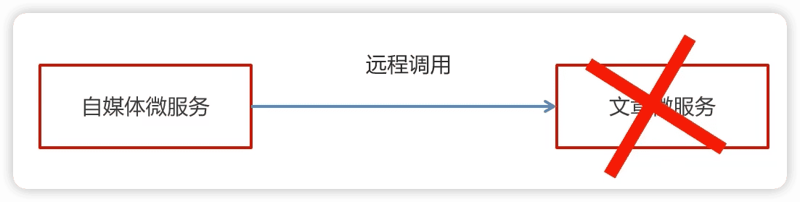

- 服务降级是服务自我保护的一种方式，或者保护下游服务的一种方式，用于确保服务不会受请求突增影响变得不可用，确保服务不会崩溃
- 服务降级虽然会导致请求失败，但是不会导致阻塞。

保护文章微服务

实现步骤：

1. 在leadnews-feign-api编写降级逻辑

```java
package top.andyron.apis.article.fallback;

import org.springframework.stereotype.Component;
import top.andyron.apis.article.IArticleClient;
import top.andyron.model.article.dto.ArticleDto;
import top.andyron.model.common.dtos.ResponseResult;
import top.andyron.model.common.enums.AppHttpCodeEnum;

/**
 * @author andyron
 **/
@Component
public class IArticleClientFallback implements IArticleClient {
    @Override
    public ResponseResult saveArticle(ArticleDto dto) {
        return ResponseResult.errorResult(AppHttpCodeEnum.SERVER_ERROR, "获取数据失败");
    }
}
```

在自媒体微服务中添加类，扫描降级代码类的包

```java
package top.andyron.wemedia.config;

import org.springframework.context.annotation.ComponentScan;
import org.springframework.context.annotation.Configuration;

/**
 * @author andyron
 **/
@Configuration
@ComponentScan("top.andyron.apis.article.fallback")
public class InitConfig {
}
```

2. 远程接口中指向降级代码


3. 在自媒体模块leadnews-wemedia的开启降级

在leadnews-wemedia的nacos配置中心里添加如下内容，开启服务降级，也可以指定服务响应的超时的时间

```yaml
feign:
  # 开启feign对hystrix熔断降级的支持
  hystrix:
    enabled: true
  # 修改调用超时时间
  client:
    config:
      default:
        connectTimeout: 2000
        readTimeout: 2000
```

4. 测试

在文章微服务leadnews-article中类ApArticleServiceImpl的saveArticle中添加：【注意重启】

```java
        // 为了测试服务降级
        try {
            Thread.sleep(3000);
        } catch (InterruptedException e) {
            e.printStackTrace();
        }
```

在自媒体端进行审核测试，会出现服务降级的现象【会调用IArticleClientFallback的saveArticle方法】

### 4.5 发布文章提交审核集成

#### 同步调用与异步调用

同步：就是在发出一个调用时，在没有得到结果之前， 该调用就不返回（实时处理）

异步：调用在发出之后，这个调用就直接返回了，没有返回结果（分时处理）

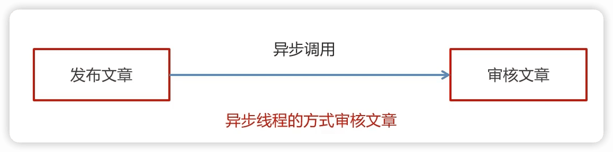

#### Springboot集成异步线程调用

1. 在自动审核的方法上加上@Async注解（标明要异步调用）

```java
    @Override
    @Async  // 标明当前方法是一个异步方法
    public void autoScanWmNews(Integer id) {
```

2. 在文章发布成功后调用审核的方法

```java
   	@Autowired
    private WmNewsAutoScanService wmNewsAutoScanService;

    @Override
    public ResponseResult submitNews(WmNewsDto dto) {
        ...

        // 4 不是草稿，保存文章封面图片与素材的关系，如果当前布局是自动，需要匹配封面图片
        saveRelativeInfoForCover(dto, wmNews, materials);
      
        // 审核文章
        wmNewsAutoScanService.autoScanWmNews(wmNews.getId());
      
        return ResponseResult.okResult(AppHttpCodeEnum.SUCCESS);
    }
```

3. 在自媒体启动类上添加@EnableAsync注解开启异步调用

```java
@EnableAsync // 开启异步调用
public class WemediaApplication {
```

### 4.6 文章审核功能-综合测试

#### 服务启动列表

1，nacos服务端

2，article微服务

3，wemedia微服务

4，启动wemedia网关微服务

5，启动wemedia前端系统

#### 测试情况列表

1，自媒体前端发布一篇正常的文章

   审核成功后，app端的article相关数据是否可以正常保存，自媒体文章状态和app端文章id是否回显

2，自媒体前端发布一篇包含敏感词的文章  🔖

   正常是审核失败， wm_news表中的状态是否改变，成功和失败原因正常保存

3，自媒体前端发布一篇包含敏感图片的文章 🔖

   正常是审核失败， wm_news表中的状态是否改变，成功和失败原因正常保存

### 4.7 新需求-自管理敏感词

#### 需求分析

文章审核功能已经交付了，文章也能正常发布审核。突然，产品经理过来说要开会。

会议的内容核心有以下内容：

- 文章审核不能过滤一些敏感词：

  私人侦探、针孔摄象、信用卡提现、广告代理、代开发票、刻章办、出售答案、小额贷款…

需要完成的功能：

需要自己维护一套敏感词，在文章审核的时候，需要验证文章是否包含这些敏感词

#### 敏感词-过滤

技术选型

| **方案**         | **说明**                   |
| ---------------------- | -------------------------------- |
| 数据库模糊查询         | 效率太低                         |
| String.indexOf("")查找 | 数据库量大的话也是比较慢         |
| 全文检索               | 分词再匹配                       |
| DFA算法                | 确定有穷自动机(一种==数据结构==) |

#### DFA实现原理

DFA全称为：Deterministic Finite Automaton,即确定有穷自动机。

存储：一次性的把所有的敏感词存储到了多个map中，就是下图表示这种结构

敏感词：冰毒、大麻、大坏蛋


检索的过程:


#### 自管理敏感词集成到文章审核中

敏感词一般存到一张表中。

1. 创建敏感词表wm_sensitive到leadnews_wemedia库中

```mysql
CREATE TABLE `wm_sensitive` (
  `id` int(11) unsigned NOT NULL AUTO_INCREMENT COMMENT '主键',
  `sensitives` varchar(10) COLLATE utf8mb4_unicode_ci DEFAULT NULL COMMENT '敏感词',
  `created_time` datetime DEFAULT NULL COMMENT '创建时间',
  PRIMARY KEY (`id`) USING BTREE
) ENGINE=InnoDB AUTO_INCREMENT=3201 DEFAULT CHARSET=utf8mb4 COLLATE=utf8mb4_unicode_ci ROW_FORMAT=DYNAMIC COMMENT='敏感词信息表';
```

2. 添加WmSensitiveMapper
3. 在文章审核的代码中添加自管理敏感词审核

```java
    private boolean handleSensitiveScan(String content, WmNews wmNews) {
        boolean flag = true;
        // 获取所有敏感词
        List<WmSensitive> wmSensitives = wmSensitiveMapper.selectList(Wrappers.<WmSensitive>lambdaQuery().select(WmSensitive::getSensitives));
        List<String> sensitiveList = wmSensitives.stream().map(WmSensitive::getSensitives).collect(Collectors.toList());

        SensitiveWordUtil.initMap(sensitiveList);
        Map<String, Integer> map = SensitiveWordUtil.matchWords(content);
        if (map.size() > 0) {
            updateWmNews(wmNews, (short) 2, "当前文章中存储违规内容 " + map);
            flag = false;
        }
        return flag;
    }
```

### 4.8 新需求-图片识别文字审核敏感词

#### 需求分析

产品经理召集开会，文章审核功能已经交付了，文章也能正常发布审核。对于上次提出的自管理敏感词也很满意，这次会议核心的内容如下：

- 文章中包含的图片要识别文字，过滤掉图片文字的敏感词

#### 图片文字识别

什么是OCR?

OCR （Optical Character Recognition，光学字符识别）是指电子设备（例如扫描仪或数码相机）检查纸上打印的字符，通过检测暗、亮的模式确定其形状，然后用字符识别方法将形状翻译成计算机文字的过程

| **方案** | **说明**                                      |
| -------------- | --------------------------------------------------- |
| 百度OCR        | 收费                                                |
| Tesseract-OCR  | Google维护的开源OCR引擎，支持Java，Python等语言调用 |
| Tess4J         | 封装了Tesseract-OCR  ，支持Java调用                 |

Tesseract-OCR 特点：

- Tesseract支持UTF-8编码格式，并且可以“开箱即用”地识别100多种语言。
- Tesseract支持多种输出格式：纯文本，hOCR（HTML），PDF等
- 官方建议，为了获得更好的OCR结果，最好提供给高质量的图像。
- Tesseract进行识别其他语言的训练
  具体的训练方式，请参考官方提供的文档：https://tesseract-ocr.github.io/tessdoc/

#### Tess4j案例 🔖

1. 创建项目导入tess4j对应的依赖

```xml
<dependency>
    <groupId>net.sourceforge.tess4j</groupId>
    <artifactId>tess4j</artifactId>
    <version>4.1.1</version>
</dependency>
```

2. 导入中文字体库， 把资料中的tessdata文件夹拷贝到自己的工作空间下。简体中文 `chi_sim.traineddata`
3. 编写测试类进行测试

#### 图片文字识别集成到文章审核 🔖

1. 在leadnews-common中创建工具类，简单封装一下tess4j

先导入依赖

在spring.factories配置中添加该类

2. 在leadnews-wemedia中的配置中添加两个属性

```yaml
tess4j:
  data-path: D:\workspace\tessdata
  language: chi_sim
```

3. 在WmNewsAutoScanServiceImpl中的handleImageScan方法上添加如下代码

### 4.9 文章详情-静态文件生成

#### 思路分析

文章端创建app相关文章时，生成文章详情静态页上传到MinIO中


#### 实现步骤

### 思考

分布式事务


目前，自媒体微服务和文章微服务，如果各自报错，它们相互是不知道

> 作业：使用seata来解决审核过程中的分布式事物的问题

> 文章发布时间是一个未来时间，该如何按照精确时间发布？
> 例如：如果今天是1月1日写了一篇文章，设定发布时间是1月5日，那这个文章什么时候审核

## 5 延迟任务精准发布文章

### 5.1 文章定时发布

延迟任务

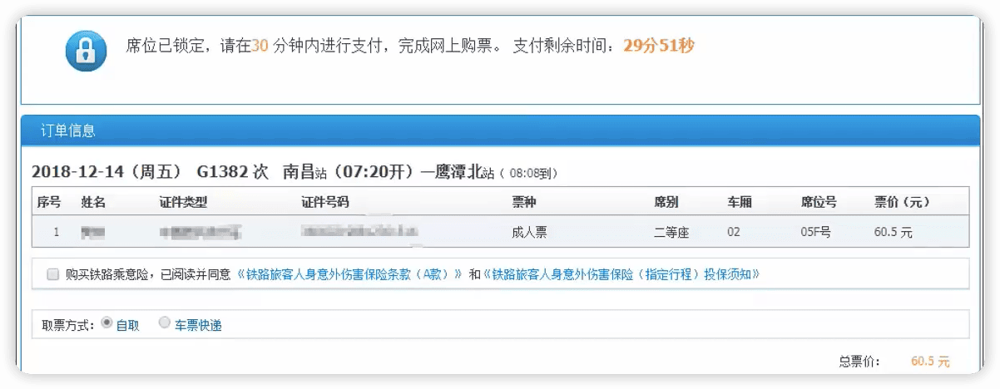

车票30min之内没有支付，当前的就取消了，这就是通过延迟任务完成。

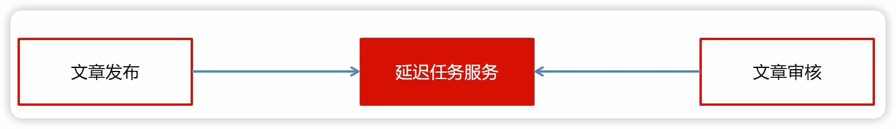

文章发布，不管是当下发布还是未来某个时间发布，都交给【延迟任务服务】，有它根据你的发布时间来决定什么时候进行审核。

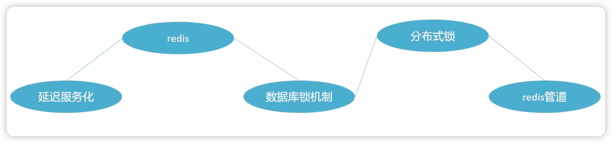

- 由于可能有多个需求都需要延迟任务，所以就把延迟任务服务化；
- 为了提升性能，采用redis进行任务数据的存储；
- 为了保证在可能的并发情况下，数据的准确性，采用了数据库锁机制；【集成乐观锁】
- 在分布式下，为了解决一个服务中的一个线程去执行一个方法，采用redis实现分布式锁的方案；
- 为了提升redis的执行效率，采用redis管道，也就是把多个redis操作合并成一个，最终达成提升性能的目的

### 5.2 延迟任务概述

#### 什么是延迟任务

- 定时任务：有==固定周期==的，有明确的触发时间。
- 延迟任务：==没有固定==的开始时间，它常常是由一个事件触发的，而在这个事件触发之后的**一段时间**内触发另一个事件，任务可以立即执行，也可以延迟。

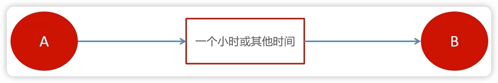

应用场景：

场景一：订单下单之后30分钟后，如果用户没有付钱，则系统自动取消订单；如果期间下单成功，任务取消

场景二：接口对接出现网络问题，1分钟后重试，如果失败，2分钟重试，直到出现阈值终止

#### 延迟任务实现技术对比

##### DelayQueue

JDK自带 `DelayQueue` 是一个支持延时获取元素的阻塞队列， 内部采用优先队列 `PriorityQueue` 存储元素，同时元素必须实现 `Delayed` 接口；在创建元素时可以指定多久才可以从队列中获取当前元素，只有在延迟期满时才能从队列中提取元素。


DelayQueue属于排序队列，它的特殊之处在于队列的元素必须实现Delayed接口，该接口需要实现compareTo和getDelay方法

getDelay方法：获取元素在队列中的剩余时间，只有当剩余时间为0时元素才可以出队列。

compareTo方法：用于排序，确定元素出队列的顺序。

**实现：**

1：在测试包jdk下创建延迟任务元素对象DelayedTask，实现compareTo和getDelay方法，

2：在main方法中创建DelayQueue并向延迟队列中添加三个延迟任务，

3：循环的从延迟队列中拉取任务

> 使用DelayQueue作为延迟任务，如果程序挂掉之后，任务都是放在内存，消息会丢失，如何保证数据不丢失？

##### RabbitMQ实现延迟任务（常用）

- TTL：Time To Live (消息存活时间)
- ==死信队列==：Dead Letter Exchange(死信交换机)，当消息成为Dead message后，可以重新发送另一个交换机（死信交换机）


##### redis实现（常用，本项目使用）

zset数据类型的去重有序（分数排序）特点进行延迟。例如：时间戳作为score进行排序

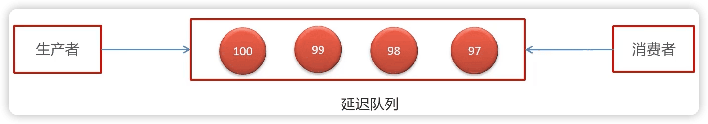

例如：

生产者添加4个任务到延迟队列中，时间毫秒值分别为97、98、99、100 。 当前时间的毫秒值为90，消费者端进行监听，如果当前时间的毫秒值匹配到了延迟队列中的毫秒值就立即消费。

### 5.3 redis实现延迟任务

#### 流程说明


只是把未来5min（预设时间）中的任务加载到zset中（为了提高效率），定时同步数据库中未来5min的任务到zset，也要定时刷新zset中当时要执行的任务到list中。

问题：

1. 为什么任务需要存储在数据库中？

延迟任务是一个通用的服务，任何需要延迟得任务都可以调用该服务，内存数据库的存储是有限的，需要考虑数据持久化的问题，存储数据库中是一种数据安全的考虑。

2. 为什么redis中使用两种数据类型，list和zset？

效率问题，算法的时间复杂度

原因一：list存储立即执行的任务，zset存储未来的数据

原因二：任务量过大以后，zset的性能会下降

时间复杂度：执行时间（次数）随着数据规模增长的变化趋势

操作redis中的list命令LPUSH：时间复杂度：`O(1)`

操作redis中的zset命令zadd：时间复杂度：`O(M*log((n))`


3. 在添加zset数据的时候，为什么需要预加载？

如果任务数据特别大，为了防止阻塞，只需要把未来几分钟要执行的数据存储缓存即可，是一种优化的形式

### 5.4 延迟任务服务实现

#### 搭建leadnews-schedule模块

leadnews-schedule是一个通用的服务，单独创建模块来管理任何类型的延迟任务


1. 在leadnews-service下创建leadnews-schedule模块
2. bootstrap.yml

```yaml
server:
  port: 51701
spring:
  application:
    name: leadnews-schedule
  cloud:
    nacos:
      discovery:
        server-addr: 192.168.0.102:8848
      config:
        server-addr: 192.168.0.102:8848
        file-extension: yml
```

3. 在nacos中添加相应配置

```yaml
spring:
  datasource:
      driver-class-name: com.mysql.cj.jdbc.Driver
      url: jdbc:mysql://localhost:3306/leadnews_schedule?serverTimezone=Asia/Shanghai&useUnicode=true&characterEncoding=utf-8&zeroDateTimeBehavior=convertToNull&useSSL=false&allowPublicKeyRetrieval=true
      username: root
      password: 33824
# 设置Mapper接口所对应的XML文件位置，如果你在Mapper接口中有自定义方法，需要进行该配置
mybatis-plus:
  mapper-locations: classpath*:mapper/*.xml
  # 设置别名包扫描路径，通过该属性可以给包中的类注册别名
  type-aliases-package: top.andyron.model.schedule.pojos  
```

#### 数据库准备

创建leadnews_schedule数据库

```mysql
CREATE TABLE `taskinfo` (
  `task_id` bigint NOT NULL COMMENT '任务id',
  `execute_time` datetime(3) NOT NULL COMMENT '执行时间',
  `parameters` longblob COMMENT '参数',
  `priority` int NOT NULL COMMENT '优先级',
  `task_type` int NOT NULL COMMENT '任务类型',
  PRIMARY KEY (`task_id`),
  KEY `index_taskinfo_time` (`task_type`,`priority`,`execute_time`)
) ENGINE=InnoDB DEFAULT CHARSET=utf8mb3;

CREATE TABLE `taskinfo_logs` (
  `task_id` bigint NOT NULL COMMENT '任务id',
  `execute_time` datetime(3) NOT NULL COMMENT '执行时间',
  `parameters` longblob COMMENT '参数',
  `priority` int NOT NULL COMMENT '优先级',
  `task_type` int NOT NULL COMMENT '任务类型',
  `version` int NOT NULL COMMENT '版本号,用乐观锁',
  `status` int DEFAULT '0' COMMENT '状态 0=初始化状态 1=EXECUTED 2=CANCELLED',
  PRIMARY KEY (`task_id`)
) ENGINE=InnoDB DEFAULT CHARSET=utf8mb3;
```

> mysql中，blob是一个二进制大型对象，是一个可以存储大量数据的容器；longblob最大存储4G。

##### 数据库自身解决并发的两种策略

- 悲观锁（Pessimistic Lock）

每次去拿数据的时候都认为别人会修改，所以每次在拿数据的时候都会上锁。

- 乐观锁（Optimistic Lock）

每次去拿数据的时候都认为别人不会修改，所以不会上锁，但是在更新的时候会判断一下在此期间别人有没有去更新这个数据，可以使用版本号等机制（也就是比对修改之前的version和提交修改之前的version）

##### mybatis-plus集成乐观锁的使用

1. 在实体类中使用 `@Version`标明是一个版本的字段

```java
		/**
     * 版本号,用乐观锁
     */
    @Version
    private Integer version;
```

2. mybatis-plus对乐观锁的支持，在启动类中向容器中放入乐观锁的拦截器

```java
		/**
     * mybatis-plus乐观锁支持
     * @return
     */
    @Bean
    public MybatisPlusInterceptor optimisticLockerInterceptor(){
        MybatisPlusInterceptor interceptor = new MybatisPlusInterceptor();
        interceptor.addInnerInterceptor(new OptimisticLockerInnerInterceptor());
        return interceptor;
    }
```

#### redis实现延迟任务

> docker安装redis
>
> ```shell
> docker pull redis
>
> docker run -d --name redis --restart=always -p 6379:6379 redis --requirepass "leadnews"
> ```

- 在leadnews-common模块导入redis相关依赖（放在common下，方便其他模块使用）

```xml
<!--spring data redis & cache-->
<dependency>
  <groupId>org.springframework.boot</groupId>
  <artifactId>spring-boot-starter-data-redis</artifactId>
</dependency>
<!-- redis依赖commons-pool 这个依赖一定要添加 -->
<dependency>
  <groupId>org.apache.commons</groupId>
  <artifactId>commons-pool2</artifactId>
</dependency>
```

- 在leadnews-schedule中集成redis,添加以下nacos配置，链接上redis

```yaml
spring:
	redis:
		host: 192.168.0.102
		password: 123456
		port: 6379
```

- 在leadnews-common模块创建CacheService，操作redis的工具类

要让其它微服务使用，需要添加配置

```
org.springframework.boot.autoconfigure.EnableAutoConfiguration=\
  top.andyron.common.exception.ExceptionCatch,\
  top.andyron.common.swagger.SwaggerConfiguration,\
  top.andyron.common.aliyun.GreenImageScan,\
  top.andyron.common.aliyun.GreenTextScan,\
  top.andyron.common.redis.CacheService
```

#### 添加任务

1. 创建TaskinfoMapper 和TaskinfoLogsMapper
2. 创建task类，用于接收添加任务的参数

```java
package top.andyron.model.schedule.dtos;

import lombok.Data;
import java.io.Serializable;

@Data
public class Task implements Serializable {
    /**
     * 任务id
     */
    private Long taskId;
    /**
     * 类型
     */
    private Integer taskType;
    /**
     * 优先级
     */
    private Integer priority;
    /**
     * 执行id
     */
    private long executeTime;
    /**
     * task参数
     */
    private byte[] parameters;
}
```

3. 创建TaskService
   - 添加任务到数据库中
   - 添加任务到redis中
     - 如果任务的执行时间小于等于当前时间存入list
     - 如果任务的执行时间大于当前时间，小于等于预设时间（未来5分钟）存入zset中
4. 测试

#### 取消任务

场景：第三接口网络不通，使用延迟任务进行重试，当达到阈值以后，取消任务。


1. 根据taskid删除任务,修改任务日志状态为 2(取消)
2. 删除redis中对应的任务数据，包括list和zset

#### 消费任务


#### 未来数据定时刷新


实现步骤：


##### 问题

> 如何获取zset中所有的key?

方案1：keys 模糊匹配


keys的模糊匹配功能很方便也很强大，但是在生产环境需要慎用！开发中使用keys的模糊匹配却发现redis的CPU使用率极高，所以公司的redis生产环境将keys命令禁用了！redis是单线程，会被堵塞。

方案2：scan


SCAN 命令是一个基于游标的迭代器，SCAN命令每次被调用之后， 都会向用户返回一个新的游标， 用户在下次迭代时需要使用这个新游标作为SCAN命令的游标参数， 以此来延续之前的迭代过程。

> 数据如何同步？
>
> 两件事：
> 第一：从zset中查出数据，并删除
> 第二：把数据存入到list中

普通redis客户端和服务器交互模式:


Pipeline请求模型【**==reids管道==**】:


多个命令一起请求，提高效率。

官方测试结果数据对比:


##### 具体实现

```java
   /**
     * 未来数据定时刷新
     *
     * 每分钟执行一次
     */
    @Scheduled(cron = "0 */1 * * * ?")
    public void refresh() {
        String token = cacheService.tryLock("FUTRUE_TASK_SYNC", 1000 * 30);

        if (StringUtils.isNotBlank(token)) {
            log.info("未来数据定时刷新---定时任务");

            // 获取所有未来数据的集合key
            Set<String> futureKeys = cacheService.scan(ScheduleConstants.FUTURE + "*");
            for (String futureKey : futureKeys) {
                // 获取所有未来数据的集合key   future_100_50
                String topicKey = ScheduleConstants.TOPIC + futureKey.split(ScheduleConstants.FUTURE)[1];

                // 按照key和分值查询符合条件的数据
                Set<String> tasks = cacheService.zRangeByScore(futureKey, 0, System.currentTimeMillis());

                // 同步数据
                if (!tasks.isEmpty()) {
                    cacheService.refreshWithPipeline(futureKey, topicKey, tasks);
                    log.info("成功的将" + futureKey + "刷新到了" + topicKey);
                }
            }
        }
    }
```

开启调度任务

```java
@EnableScheduling  //开启调度任务
public class ScheduleApplication 
```

#### 分布式锁解决集群下的方法抢占执行

> 问题描述：如果启动两台leadnews-schedule服务，每台服务都会去执行refresh定时任务方法。
>
> 展示问题p92 🔖


分布式锁：控制分布式系统有序的去对共享资源进行操作，通过互斥来保证数据的一致性。

分布式锁的解决方案：

| **方案** | **说明**                    |
| -------------- | --------------------------------- |
| 数据库         | 基于表的唯一索引                  |
| zookeeper      | 根据zookeeper中的临时有序节点排序 |
| redis          | 使用SETNX命令完成                 |

##### redis分布式锁

sexnx （SET if Not eXists） 命令在指定的 key 不存在时，为key设置指定的值。

加锁的思路：


首先A请求后加锁，B就无法请求；


30秒后A释放锁，B再请求就成功，同时再加锁。

在CacheService中添加

```java
    /**
     * 加锁
     * @param name 锁名称
     * @param expire 过期时间，毫秒值
     * @return
     */
    public String tryLock(String name, long expire) {
        name = name + "_lock";
        String token = UUID.randomUUID().toString();
        RedisConnectionFactory factory = stringRedisTemplate.getConnectionFactory();
        RedisConnection conn = factory.getConnection();
        try {
            // 参考redis命令：
            // set key value [EX seconds] [PX milliseconds] [NX|XX]
            Boolean result = conn.set(
                    name.getBytes(),
                    token.getBytes(),
                    Expiration.from(expire, TimeUnit.MILLISECONDS),
                    RedisStringCommands.SetOption.SET_IF_ABSENT
            );
            if (result != null && result) {
                return token;
            }

        } finally {
            RedisConnectionUtils.releaseConnection(conn, factory, false);
        }
        return null;
    }
```

修改：

```java
@Scheduled(cron = "0 */1 * * * ?")
public void refresh() {
  String token = cacheService.tryLock("FUTRUE_TASK_SYNC", 1000 * 30);

  if (StringUtils.isNotBlank(token)) {
    ...
  }
}
```

🔖测试

#### 数据库任务定时同步到redis

1. 清理缓存中的数据

因为是查询小于5min中的所有任务，清理缓存是为了防止缓存中有没有消费的任务（防止任务重复）。

```java
Set<String> topicKeys = cacheService.scan(ScheduleConstants.TOPIC + "*");
Set<String> futureKeys = cacheService.scan(ScheduleConstants.FUTURE + "*");
cacheService.delete(topicKeys);
cacheService.delete(futureKeys);
```

2. 查询小于未来5分钟的所有任务

```java
List<Taskinfo> taskinfoList = taskinfoMapper.selectList(Wrappers.<Taskinfo>lambdaQuery().lt(Taskinfo::getExecuteTime, calendar.getTime()));
```

3. 新增任务到redis

```java
for (Taskinfo taskinfo : taskinfoList) {
  Task task = new Task();
  BeanUtils.copyProperties(taskinfo,task);
  task.setExecuteTime(taskinfo.getExecuteTime().getTime());
  addTaskToCache(task);
}
```

4. 测试

清理掉缓存和数据库任务，添加新的几条任务，然后在删掉一两个缓存任务，重启ScheduleApplication微服务看看是否同步。

> 1. 在分布式系统环境下，一个方法在同一时间只能被一个机器的一个线程执行
> 2. 主要是通过redis的sexnx特性完成分布式锁的功能A获取到锁以后其他客户端不能操作，只能等待A释放锁以后，其他客户端才能操作

### 5.5 延迟队列解决精准时间发布文章

为了让其它微服务也能调用leadnews-schedule，需要leadnews-schedule提供对外的feign远程接口：


#### 延迟队列服务提供对外接口

- 在leadnews-feign-api模块中定义schedule的feign远程接口：

```java
@FeignClient("leadnews-schedule")
public interface IScheduleClient {
    /**
     * 添加延迟任务
     * @param task
     * @return
     */
    @PostMapping("/api/v1/task/add")
    public ResponseResult addTask(@RequestBody Task task);

    /**
     * 取消任务
     * @param taskId
     * @return
     */
    @GetMapping("/api/v1/task/{taskId}")
    public ResponseResult cancelTask(@PathVariable("taskId") long taskId);

    /**
     * 按照类型和优先级拉取任务
     * @param type
     * @param priority
     * @return
     */
    @GetMapping("/api/v1/task/{type}/{priority}")
    public ResponseResult poll(@PathVariable("type") int type, @PathVariable("priority") int priority);
}
```

在leadnews-schedule中创建上面远程接口的实现：

```

```

#### 发布文章集成添加延迟队列接口（添加任务）


- 在leadnews-wemedia模块中添加一个service：

```java
@Service
@Slf4j
public class WmNewsTaskServiceImpl implements WmNewsTaskService {

    @Autowired
    private IScheduleClient scheduleClient;

    /**
     * 添加任务到延迟队列中
     *
     * @param id          文章的id
     * @param publishTime 发布的时间 可以作为任务的执行时间
     */
    @Override
    @Async
    public void addNewsToTask(Integer id, Date publishTime) {
        log.info("添加任务到延迟队列中-----begin");

        Task task = new Task();
        task.setExecuteTime(publishTime.getTime());
        task.setTaskType(TaskTypeEnum.NEWS_SCAN_TIME.getTaskType());
        task.setPriority(TaskTypeEnum.NEWS_SCAN_TIME.getPriority());
        WmNews wmNews = new WmNews();
        wmNews.setId(id);
        task.setParameters(ProtostuffUtil.serialize(wmNews));

        scheduleClient.addTask(task);

        log.info("添加任务到延迟队列中-----end");
    }
}
```

- 修改WmNewsServiceImpl中的submitNews()方法：

```java
    @Override
    public ResponseResult submitNews(WmNewsDto dto) {
      ....
        // 审核文章
//        wmNewsAutoScanService.autoScanWmNews(wmNews.getId());
        wmNewsTaskService.addNewsToTask(wmNews.getId(), wmNews.getPublishTime());
    ...
```

- 测试

启动leadnews-schedule，leandnews-wemedia-gateway，leadnews-wemedia

http://localhost:8802/#/login

##### 序列化工具对比

`JdkSerialize`：java内置的序列化能将实现了Serilazable接口的对象进行序列化和反序列化， ObjectOutputStream的writeObject()方法可序列化对象生成字节数组

`Protostuff`：google开源的protostuff采用更为紧凑的二进制数组，表现更加优异，然后使用protostuff的编译工具生成pojo类

```xml
<dependency>
  <groupId>io.protostuff</groupId>
  <artifactId>protostuff-core</artifactId>
  <version>1.6.0</version>
</dependency>

<dependency>
  <groupId>io.protostuff</groupId>
  <artifactId>protostuff-runtime</artifactId>
  <version>1.6.0</version>
</dependency>
```

#### 消费任务进行审核文章（拉取任务）

按照固定频率拉去任务，每秒拉取一次。

- 添加拉取任务方法

```java
    @Autowired
    private WmNewsAutoScanService wmNewsAutoScanService;

    /**
     * 消费任务，审核文章
     * 每1秒拉取任务
     */
    @Scheduled(fixedRate = 1000)
    @Override
    public void scanNewsByTask() {
        log.info("消费任务，审核文章");
        ResponseResult res = scheduleClient.poll(TaskTypeEnum.NEWS_SCAN_TIME.getTaskType(), TaskTypeEnum.NEWS_SCAN_TIME.getPriority());
        if (res.getCode().equals(200) && res.getData() != null) {
            Task task = JSON.parseObject(JSON.toJSONString(res.getData()), Task.class);
            WmNews wmNews = ProtostuffUtil.deserialize(task.getParameters(), WmNews.class);
            wmNewsAutoScanService.autoScanWmNews(wmNews.getId());
        }
    }
```

- 开启调度任务

```java
@EnableScheduling
public class WemediaApplication 
```

- 测试

启动leadnews-schedule，leandnews-wemedia-gateway以及leadnews-article，重启leadnews-wemedia

http://localhost:8802/#/login

🔖

## 6 kafka及异步通知文章上下架

### 6.1 自媒体文章上下架

#### 需求分析

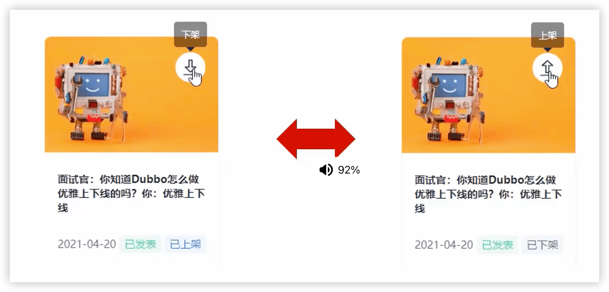

> 思考：这里的文章上下架指的自媒体文章还是app端文章？
>
> App端文章

在自媒体微服务上下架文章，需要通知文章微服务，如果采用feign远程调用可能会产生系统耦合🔖；更好的方式是MQ，它的优势是==系统解耦==。


文章的点赞不喜欢或关注，也可以用到MQ，用于==流量削峰==🔖：


### 6.2 kafka

消息中间件对比：

| 特性       | ActiveMQ                               | RabbitMQ                   | RocketMQ                 | Kafka                                    |
| ---------- | -------------------------------------- | -------------------------- | ------------------------ | ---------------------------------------- |
| 开发语言   | java                                   | erlang                     | java                     | scala                                    |
| 单机吞吐量 | 万级                                   | 万级                       | 10万级                   | 100万级                                  |
| 时效性     | ms                                     | us                         | ms                       | ms级以内                                 |
| 可用性     | 高（主从）                             | 高（主从）                 | 非常高（分布式）         | 非常高（分布式）                         |
| 功能特性   | 成熟的产品、较全的文档、各种协议支持好 | 并发能力强、性能好、延迟低 | MQ功能比较完善，扩展性佳 | 只支持主要的MQ功能，主要应用于大数据领域 |

消息中间件对比-选择建议：【ActiveMQ已不再推荐】

| **消息中间件** | **建议**                                                           |
| -------------------- | ------------------------------------------------------------------------ |
| Kafka                | 追求高吞吐量，适合产生大量数据的互联网服务的数据收集业务                 |
| RocketMQ             | 可靠性要求很高的金融互联网领域，稳定性高，经历了多次阿里双11考验         |
| RabbitMQ             | 性能较好，社区活跃度高，数据量没有那么大，优先选择功能比较完备的RabbitMQ |

#### kafka介绍

Kafka是一个分布式流媒体平台,类似于消息队列或企业消息传递系统。kafka官网：http://kafka.apache.org/


Producers：消息生产者

Consumers：消息消费者

Kafka CLuster：kafka集群

Stream Processors：消息流式处理

Connectors：连接器，与数据库数据交互


**kafka名词解释**

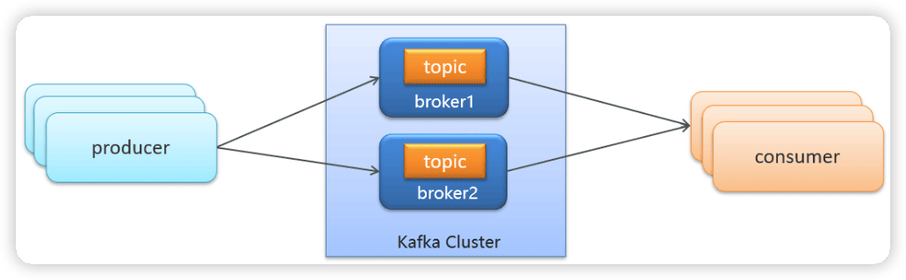

- producer：发布消息的对象称之为主题生产者（Kafka topic producer）
- topic：Kafka将消息分门别类，每一类的消息称之为一个**主题（Topic）**
- consumer：订阅消息并处理发布的消息的对象称之为主题消费者（consumers）
- broker：已发布的消息保存在一组服务器中，称之为**Kafka集群**。集群中的每一个服务器都是一个代理（Broker）。 消费者可以订阅一个或多个主题（topic），并从Broker拉数据，从而消费这些已发布的消息。

#### kafka安装配置

Kafka对于zookeeper是强依赖，保存kafka相关的节点数据，所以安装Kafka之前必须先安装zookeeper。

- Docker安装zookeeper

```shell
docker pull zookeeper:3.4.14

# mac m1 可能遇到没有arm64的情况，添加--platform linux/x86_64
docker pull --platform linux/arm64 zookeeper:3.4.14

```

```shell
docker run -d --name zookeeper -p 2181:2181 zookeeper:3.4.14

docker run --platform linux/amd64 -d --name zookeeper -p 2181:2181 zookeeper:3.4.14
```

```
WARNING: The requested image's platform (linux/amd64) does not match the detected host platform (linux/arm64/v8) and no specific platform was requested
```

- Docker安装kafka

注意kafka和zookeeper的版本对应

```shell
docker pull wurstmeister/kafka:2.12-2.3.1
```

```shell
docker run -d --name kafka \
--env KAFKA_ADVERTISED_HOST_NAME=10.211.55.5 \
--env KAFKA_ZOOKEEPER_CONNECT=10.211.55.5:2181 \
--env KAFKA_ADVERTISED_LISTENERS=PLAINTEXT://10.211.55.5:9092 \
--env KAFKA_LISTENERS=PLAINTEXT://0.0.0.0:9092 \
--env KAFKA_HEAP_OPTS="-Xmx256M -Xms256M" \
--net=host wurstmeister/kafka:2.12-2.3.1
```

> `10.211.55.5`是服务器地址
>
> `9092`是kafka对外监听的端口
>
> `--net=host`，kafka直接使用容器宿主机的网络命名空间， 即没有独立的网络环境。它使用宿主机的ip和端口。也可以使用-p来做映射（云主机就必须要使用-p了）。

> 最终在阿里云服务中搭建
>
> 或者在mac上直接安装使用:
>
> - 直接下载zookeeper 3.4.14的二进制版本(apache-zookeeper-3.7.2-bin)
>
> ```shell
> ➜  bin sudo ./zkServer.sh start
> 
> ➜  bin sudo ./zkCli.sh 
> zk: localhost:2181(CONNECTED) 0] ls /
> [zookeeper]
> [zk: localhost:2181(CONNECTED) 1] 
> ```
>
> - 直接下载kafka的二进制版本（kafka_2.12-2.3.1）
>
> ```shell
> ./kafka-topics.sh --version
> 2.3.1 (Commit:18a913733fb71c01)
> ```
>
> 配置文件`config/server.properties`中参数
>
> `broker.id`：每个 Kafka 服务都需要指定一个唯一的 broker.id
>
> `listeners`：Kafka 监听的地址和端口号，可以指定多个，以逗号分隔。默认情况下，Kafka 监听的地址是本机 IP 地址。
>
> `log.dirs`：Kafka 存储消息日志的路径。
>
> `zookeeper.connect`：ZooKeeper 的连接地址，可以指定多个，以逗号分隔。如果安装了多个 ZooKeeper，建议指定多个连接地址，以提高可用性。
>
> 1️⃣启动 Kafka 服务：
>
> ```shell
> ./kafka-server-start.sh config/server.properties
> ```
>
> 2️⃣创建一个test主题：
>
> ```
> ./kafka-topics.sh --create --zookeeper localhost:2181 --replication-factor 1 --partitions 1 --topic test
> ```
>
> 其中，--replication-factor 参数指定副本数，--partitions 参数指定分区数。在实际生产环境中，建议将副本数设置为 2 或 3，以提高可用性。
>
> 3️⃣生产消息：
>
> ```
> ./kafka-console-producer.sh --broker-list localhost:9092 --topic test
> ```
>
> 在命令行中输入消息，然后按回车键发送。
>
> 4️⃣接收消息
>
> ```
> ./kafka-console-consumer.sh --bootstrap-server localhost:9092 --topic test --from-beginning
> ```
>
> 其中，--from-beginning 参数表示从最早的消息开始接收。


> 由于zookeeper 3.4.14没有arm版本，选择更加新的版本：
>
> ```shell
> docker pull zookeeper:3.5.9
> 
> docker run -d --name zookeeper -p 2181:2181 zookeeper:3.5.9
> 
> docker run -d --name kafka \
> --env KAFKA_ADVERTISED_HOST_NAME=10.211.55.5 \
> --env KAFKA_ZOOKEEPER_CONNECT=10.211.55.5:2181 \
> --env KAFKA_ADVERTISED_LISTENERS=PLAINTEXT://10.211.55.5:9092 \
> --env KAFKA_LISTENERS=PLAINTEXT://0.0.0.0:9092 \
> --env KAFKA_HEAP_OPTS="-Xmx256M -Xms256M" \
> --net=host wurstmeister/kafka
> ```
>
> 

#### kafka入门

##### 入门案例


1. 创建kafka-demo项目，导入依赖

```xml
<dependency>
    <groupId>org.apache.kafka</groupId>
    <artifactId>kafka-clients</artifactId>
</dependency>
```

2. 生产者发送消息

```java
public class ProducerQuickStart {

    public static void main(String[] args) {
        // 1 kafka的配置信息
        Properties properties = new Properties();
        // kafka的连接地址
        properties.put(ProducerConfig.BOOTSTRAP_SERVERS_CONFIG, "localhost:9092");
        // 发送失败，失败的重试次数
        properties.put(ProducerConfig.RETRIES_CONFIG, 5);
        // 消息key的序列化器
        properties.put(ProducerConfig.KEY_SERIALIZER_CLASS_CONFIG, "org.apache.kafka.common.serialization.StringSerializer");
        // 消息value的序列化器
        properties.put(ProducerConfig.VALUE_SERIALIZER_CLASS_CONFIG, "org.apache.kafka.common.serialization.StringSerializer");

        // 2 生产者对象
        KafkaProducer<String,String> producer = new KafkaProducer<String, String>(properties);

        // 封装发送的消息:topic，key，value
        ProducerRecord<String,String> record = new ProducerRecord<String, String>("andyron-topic","100001","hello kafka-3");

        // 3 发送消息
        producer.send(record);

        // 4 关闭消息通道，必须关闭，否则消息发送不成功
        producer.close();
    }
}

```


3. 消费者接收消息

```java
public class ConsumerQuickStart {

    public static void main(String[] args) {
        // 1.添加kafka的配置信息
        Properties properties = new Properties();
        // kafka的连接地址
        properties.put(ConsumerConfig.BOOTSTRAP_SERVERS_CONFIG, "localhost:9092");
        // 消费者组
        properties.put(ConsumerConfig.GROUP_ID_CONFIG, "group2");
        // key、value的反序列化器
        properties.put(ConsumerConfig.KEY_DESERIALIZER_CLASS_CONFIG, "org.apache.kafka.common.serialization.StringDeserializer");
        properties.put(ConsumerConfig.VALUE_DESERIALIZER_CLASS_CONFIG, "org.apache.kafka.common.serialization.StringDeserializer");

        // 2.消费者对象
        KafkaConsumer<String, String> consumer = new KafkaConsumer<String, String>(properties);

        // 3.订阅主题
        consumer.subscribe(Collections.singletonList("andyron-topic"));

        // 当前线程一直处于监听状态
        while (true) {
            // 4.获取消息
            ConsumerRecords<String, String> consumerRecords = consumer.poll(Duration.ofMillis(1000));
            for (ConsumerRecord<String, String> consumerRecord : consumerRecords) {
                System.out.println(consumerRecord.key());
                System.out.println(consumerRecord.value());
            }
        }
    }
}
```


复制一份消费者


1️⃣生产者发送消息，多个消费者订阅同一个主题，只能有一个消费者收到消息（一对一）


2️⃣生产者发送消息，多个消费者订阅同一个主题，所有消费者都能收到消息（一对多）【修改复制的消费者的组名为group2】


##### 分区机制


T表示主题，P表示分区（可以理解为不同的文件夹）

- Kafka 中的分区机制指的是将每个主题划分成多个分区（Partition）【也就是可以理解为把topic存储在不同的机器里不同的文件夹下】
- 可以处理更多的消息，不受单台服务器的限制，可以不受限的处理更多的数据


##### topic剖析


每一个分区都是一个顺序的、不可变的消息队列， 并且可以持续的添加。分区中的消息都被分了一个序列号，称之为==偏移量(offset)==，在每个分区中此偏移量都是唯一的。

##### 分区策略

| **分区策略** | **说明**                                                                                     |
| ------------------ | -------------------------------------------------------------------------------------------------- |
| 轮询策略           | 按顺序轮流将每条数据分配到每个分区中                                                               |
| 随机策略           | 每次都随机地将消息分配到每个分区                                                                   |
| 按键保存策略       | 生产者发送数据的时候，可以指定一个key，计算这个key的hashCode值，按照hashCode的值对不同消息进行存储 |

不指定key默认就是轮询。

#### kafka高可用设计🔖

##### 方案一：集群


- Kafka 的服务器端由被称为Broker的服务进程构成，即一个Kafka集群由多个Broker组成
- 这样如果集群中某一台机器宕机，其他机器上的 Broker 也依然能够对外提供服务。这其实就是 Kafka 提供高可用的手段之一

##### 方案二：备份机制(Replication）


Kafka 中消息的备份又叫做 副本（Replica）

Kafka 定义了两类副本：

- 领导者副本（Leader Replica）
- 追随者副本（Follower Replica）

**同步方式**：


ISR（in-sync replica）需要同步复制保存的follower

如果leader失效后，需要选出新的leader，选举的原则如下：

第一：选举时优先从ISR中选定，因为这个列表中follower的数据是与leader同步的

第二：如果ISR列表中的follower都不行了，就只能从其他follower中选取

极端情况，就是所有副本都失效了，这时有两种方案：

第一：等待ISR中的一个活过来，选为Leader，数据可靠，但活过来的时间不确定

第二：选择第一个活过来的Replication，不一定是ISR中的，选为leader，以最快速度恢复可用性，但数据不一定完整

#### kafka生产者详解

##### 发送类型

- 同步发送

  使用send()方法发送，它会返回一个Future对象，调用get()方法进行等待，就可以知道消息是否发送成功

```java
//发送消息
try {
  RecordMetadata recordMetadata = producer.send(record).get();
  System.out.println(recordMetadata.offset());//获取偏移量
} catch (Exception e){
  e.printStackTrace();
}
```

- 异步发送

  调用send()方法，并指定一个回调函数，服务器在返回响应时调用函数

```java
//异步消息发送
producer.send(kvProducerRecord, new Callback() {
    @Override
    public void onCompletion(RecordMetadata recordMetadata, Exception e) {
        if(e != null){
            System.out.println("记录异常信息到日志表中");
        }
        System.out.println(recordMetadata.offset());
    }
});
```

##### 参数详解

[kafka详细配置](resource/kafka配置.md)

- ack  消息确认机制

| **确认机制**     | **说明**                                                     |
| ---------------- | ------------------------------------------------------------ |
| acks=0           | 生产者在成功写入消息之前**不会等待**任何来自服务器的响应,消息有丢失的风险，但是速度最快 |
| acks=1（默认值） | 只要集群首领节点收到消息，生产者就会收到一个来自服务器的**成功响应** |
| acks=all         | 只有当所有参与赋值的节点全部收到消息时，生产者才会收到一个来自服务器的成功响应 |

- retries  重试次数

```java
//设置重试次数
prop.put(ProducerConfig.RETRIES_CONFIG,10);
```

生产者从服务器收到的错误有可能是临时性错误，在这种情况下，retries参数的值决定了生产者可以重发消息的次数，如果达到这个次数，生产者会放弃重试返回错误，默认情况下，生产者会在每次重试之间等待100ms

- 消息压缩

默认情况下， 消息发送时不会被压缩。

```java
//消息压缩
prop.put(ProducerConfig.COMPRESSION_TYPE_CONFIG,"gzip");
```

| **压缩算法** | **说明**                                                     |
| ------------ | ------------------------------------------------------------ |
| snappy       | 占用较少的 CPU， 却能提供较好的性能和相当可观的压缩比， 如果看重性能和网络带宽，建议采用 |
| lz4          | 占用较少的 CPU， 压缩和解压缩速度较快，压缩比也很客观        |
| gzip         | 占用较多的 CPU，但会提供更高的压缩比，网络带宽有限，可以使用这种算法 |

使用压缩可以降低网络传输开销和存储开销，而这往往是向 Kafka 发送消息的瓶颈所在。


#### kafka消费者详解

##### 消费者组


- 消费者组（Consumer Group） ：指的就是由一个或多个消费者组成的群体
- 一个发布在Topic上消息被分发给此消费者组中的一个消费者

  - 所有的消费者都在一个组中，那么这就变成了==queue模型==
  - 所有的消费者都在不同的组中，那么就完全变成了==发布-订阅模型==

##### 消息有序性

应用场景：

- 即时消息中的单对单聊天和群聊，保证发送方消息发送顺序与接收方的顺序一致
- 充值转账两个渠道在同一个时间进行余额变更，短信通知必须要有顺序
- ...


kafka集群托管4个分区（P0-P3），2个消费者组，消费组A有2个消费者，消费组B有4个。


topic分区中消息只能由消费者组中的唯一一个消费者处理，所以消息肯定是按照先后顺序进行处理的。但是它也仅仅是保证Topic的一个分区顺序处理，不能保证跨分区的消息先后处理顺序。 所以，如果你想要顺序的处理Topic的所有消息，那就只提供一个分区。

##### 提交和偏移量

kafka不会像其他JMS队列那样需要得到消费者的确认，消费者可以使用kafka来追踪消息在分区的位置（偏移量）

消费者会往一个叫做`_consumer_offset`的特殊主题发送消息，消息里包含了每个分区的偏移量。如果消费者发生崩溃或有新的消费者加入群组，就会触发**再均衡**。


##### 偏移量


如果提交偏移量小于客户端处理的最后一个消息的偏移量，那么处于两个偏移量之间的消息就会被重复处理。


如果提交的偏移量大于客户端的最后一个消息的偏移量，那么处于两个偏移量之间的消息将会丢失。

##### 偏移量提交方式🔖

提交偏移量的方式有两种，分别是

- 自动提交偏移量【默认】

当enable.auto.commit被设置为true，提交方式就是让消费者自动提交偏移量，每隔5秒消费者会自动把从poll()方法接收的最大偏移量提交上去。

- 手动提交

  当enable.auto.commit被设置为false可以有以下三种提交方式

  + 提交当前偏移量（同步提交）

    ```java
    while (true) {  
      ConsumerRecords<String, String> records = consumer.poll(Duration.ofMillis(1000));
      for (ConsumerRecord<String, String> record : records) {
        System.out.println(record.value());
        System.out.println(record.key());
        try {
          consumer.commitSync();//同步提交当前最新的偏移量
        } catch (CommitFailedException e){
          System.out.println("记录提交失败的异常："+e);
        }
      }
    }
    ```

    

  + 异步提交

    ```java
    while (true) {  
      ConsumerRecords<String, String> records = consumer.poll(Duration.ofMillis(1000));
      for (ConsumerRecord<String, String> record : records) {
        System.out.println(record.value());
        System.out.println(record.key());
      }
      consumer.commitAsync(new OffsetCommitCallback() {
        @Override
        public void onComplete(Map<TopicPartition, OffsetAndMetadata> map, Exception e) {
          if(e!=null){
            System.out.println("记录错误的提交偏移量："+ map+",异常信息"+e);
          }
        }
      });
    }
    ```

    

  + 同步和异步组合提交

    ```java
    try {
      while (true){
        ConsumerRecords<String, String> records = consumer.poll(Duration.ofMillis(1000));
        for (ConsumerRecord<String, String> record : records) {
          System.out.println(record.value());
          System.out.println(record.key());
        }
        consumer.commitAsync();
      }
    } catch (Exception e){
      e.printStackTrace();
      System.out.println("记录错误信息："+e);
    } finally {
      try { 
        consumer.commitSync();
      } finally {
        consumer.close();
      }
    }
    ```

    

​		


### 6.3 springboot集成kafka

#### spring boot集成kafka收发消息

1. 导入spring-kafka依赖信息

```xml
    <dependencies>
        <dependency>
            <groupId>org.springframework.boot</groupId>
            <artifactId>spring-boot-starter-web</artifactId>
        </dependency>

        <dependency>
            <groupId>org.apache.kafka</groupId>
            <artifactId>kafka-clients</artifactId>
        </dependency>
        <dependency>
            <groupId>org.springframework.kafka</groupId>
            <artifactId>spring-kafka</artifactId>
            <exclusions>
                <exclusion>
                    <groupId>org.apache.kafka</groupId>
                    <artifactId>kafka-clients</artifactId>
                </exclusion>
            </exclusions>
        </dependency>
        <dependency>
            <groupId>com.alibaba</groupId>
            <artifactId>fastjson</artifactId>
        </dependency>
        <dependency>
            <groupId>org.springframework</groupId>
            <artifactId>spring-web</artifactId>
        </dependency>
    </dependencies>
```

2. 在resources下创建文件application.yml

```yaml
server:
  port: 9991
spring:
  application:
    name: kafka-demo
  kafka:
    bootstrap-servers: localhost:9092
    producer:
      retries: 10
      key-serializer: org.apache.kafka.common.serialization.StringSerializer
      value-serializer: org.apache.kafka.common.serialization.StringSerializer
    consumer:
      group-id: ${spring.application.name}-test
      key-deserializer: org.apache.kafka.common.serialization.StringDeserializer
      value-deserializer: org.apache.kafka.common.serialization.StringDeserializer
```

3. 消息生产者

```java
@RestController
public class HelloController {
    @Autowired
    private KafkaTemplate<String,String> kafkaTemplate;

    @GetMapping("/hello")
    public String hello() {
        // 第一个参数：topics
        // 第二个参数：消息内容
        kafkaTemplate.send("andy-kafka-hello","成为优秀的程序员");
        return "ok";
    }
}
```

4. 消息消费者

```java
@Component
public class HelloListener {
    @KafkaListener(topics = {"andy-kafka-hello"})
    public void onMessage(String message){
        if(!StringUtils.isEmpty(message)){
            System.out.println(message);
        }
    }
}
```

5. 编写启动类

```java
```

6. 测试：启动，访问 http://localhost:9991/hello

#### 传递消息为对象

目前springboot整合后的kafka，因为序列化器是`StringSerializer`，这个时候如果需要传递对象可以有两种方式

- 方式一：可以自定义序列化器，对象类型众多，这种方式通用性不强，本章节不介绍
- 方式二：可以把要传递的对象进行转json字符串，接收消息后再转为对象即可，本项目采用这种方式

```java
    @GetMapping("/hello2")
    public String hello2() {
        User user = new User();
        user.setName("zhangsan");
        user.setAge(18);
        kafkaTemplate.send("andy-kafka-hello2", JSON.toJSONString(user));
        return "ok";
    }
```

```java
    @KafkaListener(topics = {"andy-kafka-hello2"})
    public void onMessage2(String message){
        if(!StringUtils.isEmpty(message)){
            User user = JSONObject.parseObject((String) message, User.class);
            System.out.println(user);
        }
    }
```


### 6.4 自媒体文章上下架功能完成

#### 需求分析


**已发表且已上架**的文章可以下架


**已发表且已下架**的文章可以上架


#### 流程说明


`wm_news`

`ap_article_config`


#### 接口定义


#### 消息传递article端文章上下架

🔖p111

```java
    @ApiOperation(value = "文章上下架")
    @PostMapping("/downOrUp")
    public ResponseResult DownOrUp(@RequestBody WmNewsDto dto) {
        return wmNewsService.DownOrUp(dto);
    }
```


1. 导入kafka依赖【leadnews-common模块】

```xml
<dependency>
  <groupId>org.springframework.kafka</groupId>
  <artifactId>spring-kafka</artifactId>
</dependency>
<dependency>
  <groupId>org.apache.kafka</groupId>
  <artifactId>kafka-clients</artifactId>
</dependency>
```


2. 在自媒体端的nacos配置中心【leadnews-wemedia】，添加kafka的生产者配置

```yaml
spring:
  kafka:
    bootstrap-servers: localhost:9092
    producer:
      retries: 10
      key-serializer: org.apache.kafka.common.serialization.StringSerializer
      value-serializer: org.apache.kafka.common.serialization.StringSerializer
```


3. 在自媒体端文章上下架后，发送消息

`WmNewsServiceImpl::DownOrUp`

```java
            if(wmNews.getArticleId() != null){
                //发送消息，通知article修改文章的配置
                Map<String,Object> map = new HashMap<>();
                map.put("articleId",wmNews.getArticleId());
                map.put("enable",dto.getEnable());
                kafkaTemplate.send(WmNewsMessageConstants.WM_NEWS_UP_OR_DOWN_TOPIC, JSON.toJSONString(map));
            }
```

4. 在article端的nacos配置中心【leadnews-article】，添加kafka的消费者配置

```yaml
spring:
  kafka:
    bootstrap-servers: localhost:9092
    consumer:
      group-id: ${spring.application.name}
      key-deserializer: org.apache.kafka.common.serialization.StringDeserializer
      value-deserializer: org.apache.kafka.common.serialization.StringDeserializer
```


5. 在article端编写监听【leadnews-article】，接收数据

```java
@Component
@Slf4j
public class ArticleIsDownListener {

    @Autowired
    private ApArticleConfigService apArticleConfigService;

    @KafkaListener(topics = WmNewsMessageConstants.WM_NEWS_UP_OR_DOWN_TOPIC)
    public void onMessage(String message){
        if(StringUtils.isNotBlank(message)){
            Map map = JSON.parseObject(message, Map.class);
            apArticleConfigService.updateByMap(map);
        }
    }
}
```


6. 修改ap_article_config表的数据

```java
@Service
@Slf4j
@Transactional
public class ApArticleConfigServiceImpl extends ServiceImpl<ApArticleConfigMapper, ApArticleConfig> implements ApArticleConfigService {
    /**
     * 修改文章
     * @param map
     */
    @Override
    public void updateByMap(Map map) {
        // 0 下架  1 上架
        Object enable = map.get("enable");
        boolean isDown = true;
        if(enable.equals(1)){
           isDown = false;
        }
        //修改文章
        update(Wrappers.<ApArticleConfig>lambdaUpdate().eq(ApArticleConfig::getArticleId,map.get("articleId"))
                .set(ApArticleConfig::getIsDown,isDown));
    }
}
```

7. 测试 🔖


## 7 app端文章搜索

今日内容预览

- 文章搜索

  - ElasticSearch环境搭建
  - 索引库创建
  - 文章搜索多条件复合查询
  - 索引数据同步
- 搜索历史记录

  - Mongodb环境搭建
  - 异步保存搜索历史
  - 查看搜索历史列表
  - 删除搜索历史
- 联想词查询

  - 联想词的来源
  - 联想词功能实现


### 7.1 搭建ElasticSearch环境

- 拉取ElasticSearch镜像

```
docker pull elasticsearch:7.4.0
```

- 创建ElasticSearch容器

```
docker run -id --name elasticsearch -p 9200:9200 -p 9300:9300 -v /usr/share/elasticsearch/plugins:/usr/share/elasticsearch/plugins -e "discovery.type=single-node" elasticsearch:7.4.0
```

- 配置中文分词器 ik  https://github.com/infinilabs/analysis-ik

  在/usr/share/elasticsearch/plugins目录中新建analysis-ik目录，然后`elasticsearch-analysis-ik-7.4.0.zip`上传到服务器上并解压到analysis-ik目录

- 分词测试。重启elasticsearch容器


> ```
> # docker pull elasticsearch:7.4.0
> 7.4.0: Pulling from library/elasticsearch
> 7.4.0: Pulling from library/elasticsearch
> no matching manifest for linux/arm64/v8 in the manifest list entries
> ```
>
> 原因可能是es低版本没有arm64docker镜像。

> 另一种选择是  elasticsearch:7.14.2
>
> ```shell
> docker run -id --name elasticsearch -p 9200:9200 -p 9300:9300 -v /usr/share/elasticsearch/plugins:/usr/share/elasticsearch/plugins -e "discovery.type=single-node" elasticsearch:7.14.2
> ```
>
> post `localhost:9200/_analyze`  json


> 另一种选择，在macos本地启动运行elasticsearch，测试
> 
> post `10.211.55.5:9200/_analyze`  json
> 
> ```json
> {
> "analyzer": "ik_max_word",
>  "text": "欢迎来到黑马程序员学习"
>}
> ```
>
> 结果：
>
> ```json
> {
>     "tokens": [
>         {
>          "token": "欢迎",
>          "start_offset": 0,
>         "end_offset": 2,
>          "type": "CN_WORD",
>         "position": 0
>      },
>      {
>             "token": "迎来",
>             "start_offset": 1,
>             "end_offset": 3,
>             "type": "CN_WORD",
>             "position": 1
>         },
>         {
>             "token": "来到",
>             "start_offset": 2,
>             "end_offset": 4,
>             "type": "CN_WORD",
>             "position": 2
>         },
>         {
>             "token": "黑马",
>             "start_offset": 4,
>             "end_offset": 6,
>             "type": "CN_WORD",
>             "position": 3
>         },
>         {
>             "token": "程序员",
>             "start_offset": 6,
>             "end_offset": 9,
>             "type": "CN_WORD",
>             "position": 4
>         },
>         {
>             "token": "程序",
>             "start_offset": 6,
>             "end_offset": 8,
>             "type": "CN_WORD",
>             "position": 5
>         },
>         {
>             "token": "员",
>             "start_offset": 8,
>             "end_offset": 9,
>             "type": "CN_CHAR",
>             "position": 6
>         },
>         {
>             "token": "学习",
>             "start_offset": 9,
>             "end_offset": 11,
>             "type": "CN_WORD",
>             "position": 7
>         }
>     ]
>    }
>    ```
>    
>    


### 7.2 app端文章搜索

#### 需求说明

- 用户输入关键可搜索文章列表
- 关键词高亮显示
- 文章列表展示与home展示一样，当用户点击某一篇文章，可查看文章详情

#### 思路分析

为了加快检索的效率，在查询的时候不会直接从数据库中查询文章，需要在elasticsearch中进行高速检索。

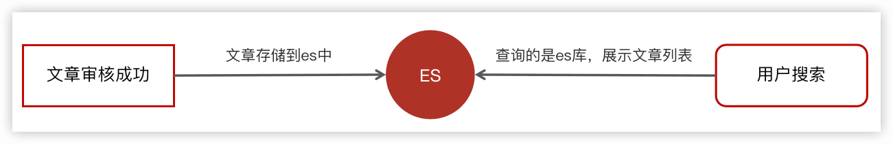

#### 创建索引和映射


搜索结果页面展示什么内容?

- 标题
- 布局
- 封面图片
- 发布时间
- 作者名称
- 文章id
- 作者id
- 静态url

哪些需要索引和分词？

- 标题
- 内容

#### 使用postman/apifox添加映射和查询

- put `localhost:9200/app_info_article`  

请求body，json：【对应上面搜索结果页面展示的内容】

```json
{
    "mappings":{
        "properties":{
            "id":{
                "type":"long"
            },
            "publishTime":{
                "type":"date"
            },
            "layout":{
                "type":"integer"
            },
            "images":{
                "type":"keyword",
                "index": false
            },
            "staticUrl":{
                "type":"keyword",
                "index": false
            },
            "authorId": {
                "type": "long"
            },
            "authorName": {
                "type": "text"
            },
            "title":{
                "type":"text",
                "analyzer":"ik_smart"
            },
            "content":{
                "type":"text",
                "analyzer":"ik_smart"
            }
        }
    }
}
```

结果：

```json
{
    "acknowledged": true,
    "shards_acknowledged": true,
    "index": "app_info_article"
}
```


- GET请求查询映射：http://localhost:9200/app_info_article

- DELETE请求，删除索引及映射：http://localhost:9200/app_info_article

- GET请求，查询所有文档：http://localhost:9200/app_info_article/_search

```json
{
    "took": 115,
    "timed_out": false,
    "_shards": {
        "total": 1,
        "successful": 1,
        "skipped": 0,
        "failed": 0
    },
    "hits": {
        "total": {
            "value": 0,
            "relation": "eq"
        },
        "max_score": null,
        "hits": []
    }
}
```

#### 数据初始化到索引库

项目上线时会进行一次批量导入数据到索引库

1. 在测试模块下新建es-init模块


2. 查询所有的文章信息，批量导入到es索引库中

```java
    @Autowired
    private ApArticleMapper apArticleMapper;
    @Autowired
    private RestHighLevelClient restHighLevelClient;
    /**
     * 注意：数据量的导入，如果数据量过大，需要分页导入
     * @throws Exception
     */
    @Test
    public void init() throws Exception {
        // 1 查询所有符合条件的文章
        List<SearchArticleVo> searchArticleVos = apArticleMapper.loadArticleList();

        // 2 批量导入索引库
        BulkRequest bulkRequest = new BulkRequest("app_info_article");
        for (SearchArticleVo searchArticleVo : searchArticleVos) {
            IndexRequest indexRequest = new IndexRequest().id(searchArticleVo.getId().toString())
                    .source(JSON.toJSONString(searchArticleVo), XContentType.JSON);
            bulkRequest.add(indexRequest);
        }

        BulkResponse response = restHighLevelClient.bulk(bulkRequest, RequestOptions.DEFAULT);
        System.out.println("插入结果： " + response.status());

    }
```

http://10.211.55.5:9200/app_info_article/_search  查看已经导入的索引库

#### 搜索接口定义

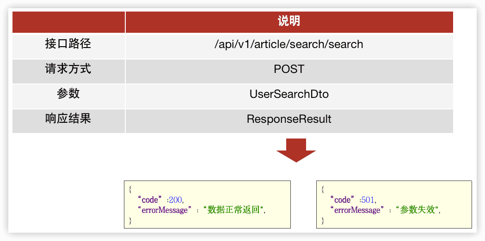

UserSearchDto 

```java
@Data
public class UserSearchDto {

    /**
    * 搜索关键字
    */
    String searchWords;
    /**
    * 当前页
    */
    int pageNum;
    /**
    * 分页条数
    */
    int pageSize;
    /**
    * 最小时间
    */
    Date minBehotTime;

    public int getFromIndex(){
        if(this.pageNum<1)return 0;
        if(this.pageSize<1) this.pageSize = 10;
        return this.pageSize * (pageNum-1);
    }
}
```


最小时间来判断分页

#### 实现

1. 在leadnews-service模块下创建新的微服务模块leadnews-search

> IDEA中拷贝模块的步骤：
>
> 1. 把想要拷贝的目录拷贝相应的目录下
> 2. 在对应的父模块的pom登记
> 3. 在Maven出刷新

2. 在nacos的新建配置 leadnews-search

```yaml
spring:
  autoconfigure:
    exclude: org.springframework.boot.autoconfigure.jdbc.DataSourceAutoConfiguration
elasticsearch:
  host: 10.211.55.5
  port: 9200
```


3. 搜索接口定义

```java
@RestController
@RequestMapping("/api/v1/article/search")
public class ArticleSearchController{
    @PostMapping("/search")
    public ResponseResult search(@RequestBody UserSearchDto userSearchDto) {
        return null;
    }
}
```


4. 业务层

ArticleSearchServiceImpl


6. 测试

需要在app的网关中添加搜索微服务的路由配置【在nacos配置leadnews-app-gateway中添加】：

```yaml
#搜索微服务
- id: leadnews-search
 uri: lb://leadnews-search
 predicates:
   - Path=/search/**
 filters:
   - StripPrefix= 1
```

启动项目进行测试，至少要启动文章微服务，用户微服务，搜索微服务，app网关微服务，app前端工程


### 7.3 新增文章创建索引

前面的，项目上线时，会初始化一次索引库，之后每一次新增文章时也需要创建索引。

#### 思路分析


#### 实现步骤

1. 文章审核成功使用kafka发送消息

在文章微服务`ArticleFreemarkerServiceImpl#buildArticleToMinIO` 中添加

```java
// 发送消息，创建es索引
createArticleEsIndex(apArticle, content, path);
```

```java
    @Autowired
    private KafkaTemplate<String,String> kafkaTemplate;
    /**
     * 发送消息，创建es索引
     * @param apArticle
     * @param content
     * @param path
     */
    private void createArticleEsIndex(ApArticle apArticle, String content, String path) {
        SearchArticleVo vo = new SearchArticleVo();
        BeanUtils.copyProperties(apArticle,vo);
        vo.setContent(content);
        vo.setStaticUrl(path);

        kafkaTemplate.send(ArticleConstants.ARTICLE_ES_SYNC_TOPIC, JSON.toJSONString(vo));
    }
```


2. 文章微服务集成kafka发送消息

在文章微服务的nacos的配置中心添加kafka消息生产者的配置：

```yaml
kafka:
    bootstrap-servers: localhost:9092
    producer:
      retries: 10
      key-serializer: org.apache.kafka.common.serialization.StringSerializer
      value-serializer: org.apache.kafka.common.serialization.StringSerializer
```


3. 在搜索微服务中创建监听，用于接收消息，添加数据到索引库

```java
@Component
@Slf4j
public class SyncArticleListener {
    @Autowired
    private RestHighLevelClient restHighLevelClient;

    @KafkaListener(topics = ArticleConstants.ARTICLE_ES_SYNC_TOPIC)
    public void onMessage(String message) {
        if(StringUtils.isNotBlank(message)){

            log.info("SyncArticleListener,message={}", message);

            SearchArticleVo searchArticleVo = JSON.parseObject(message, SearchArticleVo.class);
            IndexRequest indexRequest = new IndexRequest("app_info_article");
            indexRequest.id(searchArticleVo.getId().toString());
            indexRequest.source(message, XContentType.JSON);
            try {
                restHighLevelClient.index(indexRequest, RequestOptions.DEFAULT);
            } catch (IOException e) {
                e.printStackTrace();
                log.error("sync es error={}",e);
            }
        }
    }
}
```


4. 在nacos中的搜索微服务中添加，kafka消费者配置

```yaml
spring:
  kafka:
    bootstrap-servers: localhost:9092
    consumer:
      group-id: ${spring.application.name}
      key-deserializer: org.apache.kafka.common.serialization.StringDeserializer
      value-deserializer: org.apache.kafka.common.serialization.StringDeserializer
```


5. 测试

🔖


### 7.4 app端搜索-搜索记录

#### 需求说明

- 展示用户的搜索记录10条，按照搜索关键词的时间倒序
- 可以删除搜索记录
- 保存历史记录，保存10条，多余的则删除最久的历史记录


#### 数据存储说明

用户的搜索记录，需要给**每一个用户都保存一份**，数据量较大，要求加载速度快，通常这样的数据存储到mongodb更合适，不建议直接存储到关系型数据库中。


#### MongoDB安装及集成

- 拉取镜像

```
docker pull mongo
```

- 创建容器

```
docker run -di --name mongo-service --restart=always -p 27017:27017 -v ~/data/mongodata:/data mongo
```

- 使用navicat链接MongoDB测试


- 在leadnews-test模块中新建mongo-demo模块用于mongo学习

```xml
<dependency>
  <groupId>org.springframework.boot</groupId>
  <artifactId>spring-boot-starter-data-mongodb</artifactId>
</dependency>
```

```yaml
server:
  port: 9998
spring:
  data:
    mongodb:
      host: 10.211.55.5
      port: 27017
      database: leadnews-history
```


核心方法：

```java
		@Autowired
    private MongoTemplate mongoTemplate;

    //保存
    @Test
    public void saveTest(){
        for (int i = 0; i < 10; i++) {
            ApAssociateWords apAssociateWords = new ApAssociateWords();
            apAssociateWords.setAssociateWords("AR头条" + i);
            apAssociateWords.setCreatedTime(new Date());
            mongoTemplate.save(apAssociateWords);
        }

    }

    //查询一个
    @Test
    public void saveFindOne(){
        ApAssociateWords apAssociateWords = mongoTemplate.findById("65f2eb852fd072556df0c1a6", ApAssociateWords.class);
        System.out.println(apAssociateWords);
    }

    //条件查询
    @Test
    public void testQuery(){
        Query query = Query.query(Criteria.where("associateWords").is("AR头条"))
                .with(Sort.by(Sort.Direction.DESC,"createdTime"));
        List<ApAssociateWords> apAssociateWordsList = mongoTemplate.find(query, ApAssociateWords.class);
        System.out.println(apAssociateWordsList);
    }

    @Test
    public void testDel(){
        mongoTemplate.remove(Query.query(Criteria.where("associateWords").is("黑马头条")),ApAssociateWords.class);
    }
```


#### 保存搜索记录-实现思路

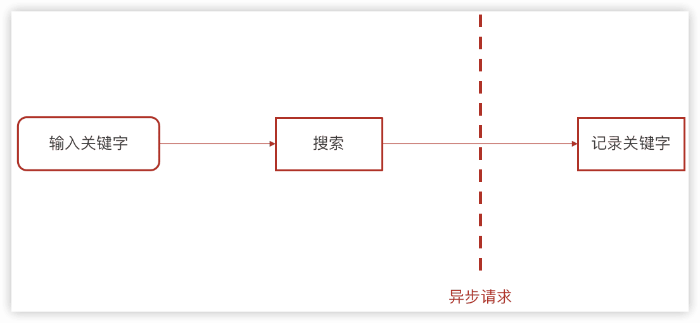

用户输入关键字进行搜索的异步记录关键字


用户搜索记录对应的集合，对应实体类：`ApUserSearch` 


#### 保存搜索记录-实现步骤

1. 在搜索微服务集成mongodb

```xml
<dependency>
  <groupId>org.springframework.boot</groupId>
  <artifactId>spring-boot-starter-data-mongodb</artifactId>
</dependency>
```

在nacos中的搜索微服务配置中添加：

```yaml
spring:
  data:
    mongodb:
      host: 10.211.55.5
      port: 27017
      database: leadnews-history
```

导入MongoDB数据sql，leadnews-history.sql；

在搜索微服务下创建对应的两个实体类：`ApUserSearch`（搜索的历史表）、`ApAssociateWords`（联想词表）


2. 创建`ApUserSearchService`新增insert方法

```java
@Override
public void insert(String keyword, Integer userId) {
  // 1 查询当前用户搜索的关键词
  Query query = Query.query(Criteria.where("userId").is(userId).and("keyword").is(keyword));
  ApUserSearch apUserSearch = mongoTemplate.findOne(query, ApUserSearch.class);

  // 2 存在则更新最新时间
  if (apUserSearch != null) {
    apUserSearch.setCreatedTime(new Date());
    mongoTemplate.save(apUserSearch);
    return;
  }

  // 3 不存在则新增, 判断当前历史记录是否超过10条记录
  apUserSearch = new ApUserSearch();
  apUserSearch.setUserId(userId);
  apUserSearch.setKeyword(keyword);
  apUserSearch.setCreatedTime(new Date());

  Query q = Query.query(Criteria.where("userId").is(userId));
  q.with(Sort.by(Sort.Direction.DESC, "createdTime"));
  List<ApUserSearch> apUserSearchList = mongoTemplate.find(q, ApUserSearch.class);
  if (apUserSearchList == null || apUserSearchList.size() < 10) {
    mongoTemplate.save(apUserSearch);
  } else {
    ApUserSearch lastUserSearch = apUserSearchList.get(apUserSearchList.size() - 1);
    mongoTemplate.findAndReplace(Query.query(Criteria.where("id").is(lastUserSearch.getId())), apUserSearch);
  }

}
```


3. 在app的网关的过滤器`AuthorizeFilter`中添加：

```java
            // 获取用户
            Object userId = claimsBody.get("id");
            // 存储header中
            ServerHttpRequest serverHttpRequest = request.mutate().headers(httpHeaders -> {
                httpHeaders.add("userId", userId + "");
            }).build();
            // 重置请求
            exchange.mutate().request(serverHttpRequest);
```


4. 参考自媒体微服务，在搜索微服务中添加拦截器   获取当前登录的用户

```java
public class AppTokenInterceptor implements HandlerInterceptor {
    @Override
    public boolean preHandle(HttpServletRequest request, HttpServletResponse response, Object handler) throws Exception {
        String userId = request.getHeader("userId");
        if (userId != null) {
            // 存入到当前线程中
            ApUser apUser = new ApUser();
            apUser.setId(Integer.valueOf(userId));
            AppThreadLocalUtil.setUser(apUser);
        }
        return true;
    }

    @Override
    public void afterCompletion(HttpServletRequest request, HttpServletResponse response, Object handler, Exception ex) throws Exception {
        AppThreadLocalUtil.clear();
    }
}
```

🔖p126 `AppThreadLocalUtil`


想让上面的拦截器生效，还需要添加配置:

```java
@Configuration
public class WebMvcConfig implements WebMvcConfigurer {
    @Override
    public void addInterceptors(InterceptorRegistry registry) {
        // 添加自定义的拦截器，拦截所有请求
        registry.addInterceptor(new AppTokenInterceptor()).addPathPatterns("/**");
    }
}
```


5. 在`ArticleSearchService`的search方法中添加调用保存历史记录

```java
        // 异步调用，保存搜索记录
        ApUser user = AppThreadLocalUtil.getUser();
        if (user != null && dto.getFromIndex() == 0) {
            apUserSearchService.insert(dto.getSearchWords(), user.getId());
        }
```

注意要在insert方法上添加`@Async`，已经search启动类开启异步调用`@EnableAsync`


6. 测试，开启app网关、用户微服务、文章微服务、搜索微服务，搜索后查看mongodb找那个的结果


#### 加载搜索历史

按照当前用户，按照时间倒序查询。  `/api/v1/history/load`  POST

```java
List<ApUserSearch> userSearchList = mongoTemplate.find(Query.query(Criteria.where("userId").is(userId))               .with(Sort.by(Sort.Direction.DESC, "createdTime")), ApUserSearch.class);
```


#### 删除搜索历史

按照搜索历史id删除。`/api/v1/history/del` POST `HistorySearchDto`

```java
// 删除
Query query = Query.query(Criteria.where("userId").is(user.getId()).and("id").is(historySearchDto.getId()));
mongoTemplate.remove(query, ApUserSearch.class);

```


### 7.5 app端搜索-关键字联想词

#### 需求分析

根据用户输入的关键字展示联想词


`ApAssociateWords`

```java
@Data
@Document("ap_associate_words")
public class ApAssociateWords implements Serializable {

    private static final long serialVersionUID = 1L;
    private String id;

    /**
     * 联想词
     */
    private String associateWords;

    /**
     * 创建时间
     */
    private Date createdTime;
}
```

 

#### 搜索词-联想词的数据来源

通常是网上搜索频率比较高的一些词，通常在企业中有两部分来源：

- 第一：自己维护搜索词
  通过分析用户搜索频率较高的词，按照排名作为搜索词

- 第二：第三方获取
  关键词规划师（百度）、[5118](https://www.5118.com/ciku/index)、爱站网


可以根据需求导入联想词到mongo中

#### 接口定义

`/api/v1/associate/search`  POST  `UserSearchDto`

```java
//3 执行查询 模糊查询
Query query = Query.query(Criteria.where("associateWords").regex(".*?\\" + userSearchDto.getSearchWords() + ".*"));
query.limit(userSearchDto.getPageSize());
List<ApAssociateWords> wordsList = mongoTemplate.find(query, ApAssociateWords.class);
```

正则表达式说明

|      | **说明**                                    |
| ---- | ------------------------------------------- |
| `.`  | 表示匹配任意字符                            |
| `*`  | 表示匹配0次以上                             |
| `*?` | 则是表示非贪婪匹配,碰到符合条件的立马就匹配 |

2

## 8 平台管理


## 9 用户行为

### 1 什么是行为

用户行为数据的记录包括了关注、点赞、不喜欢、收藏、阅读等行为

黑马头条项目整个项目开发涉及web展示和大数据分析来给用户推荐文章，如何找出哪些文章是热点文章进行针对性的推荐呢？这个时候需要进行大数据分析的准备工作，埋点。

所谓“==埋点==”，是数据采集领域（尤其是用户行为数据采集领域）的术语，指的是针对特定用户行为或事件进行捕获、处理和发送的相关技术及其实施过程。比如用户某个icon点击次数、阅读文章的时长，观看视频的时长等等。

### 2 关注


如上效果：

当前登录后的用户可以关注作者，也可以取消关注作者

一个用户关注了作者，作者是由用户实名认证以后开通的作者权限，才有了作者信息，作者肯定是app中的一个用户。

从用户的角度出发：一个用户可以关注其他多个作者 —— 我的关注

从作者的角度出发：一个用户（同是作者）也可以拥有很多个粉丝 —— 我的粉丝


### 3 点赞或取消点赞

### 4 阅读

当用户查看了某一篇文章，需要记录当前用户查看的次数，阅读时长（非必要），阅读文章的比例（非必要），加载的时长（非必要）

### 5 不喜欢

为什么会有不喜欢？

一旦用户点击了不喜欢，不再给当前用户推荐这一类型的文章信息

### 6 收藏

记录当前登录人收藏的文章

### 7 文章详情-行为数据回显

主要是用来展示文章的关系，app端用户必须登录，判断当前用户**是否已经关注该文章的作者、是否收藏了此文章、是否点赞了文章、是否不喜欢该文章等**

例：如果当前用户点赞了该文章，点赞按钮进行高亮，其他功能类似。

### 8 注意：

- 所有的行为数据，都存储到redis中
- 点赞、阅读、不喜欢需要专门创建一个微服务来处理数据，新建模块：heima-leadnews-behavior
- 关注需要在heima-leadnews-user微服务中实现
- 收藏与文章详情数据回显在heima-leadnews-article微服务中实现

## 10 热点文章-定时计算

### 今日内容

#### 需求分析

目前实现的思路：从数据库直接按照发布时间倒序查询

- 问题1：

  如何访问量较大，直接查询数据库，压力较大
- 问题2：

  新发布的文章会展示在前面，并不是热点文章

#### 实现思路

把热点数据存入redis进行展示

判断文章是否是热点，有几项标准： **点赞数量，评论数量，阅读数量，收藏数量**

计算文章热度，有两种方案：

- 定时计算文章热度
- 实时计算文章热度

#### 定时计算


- 根据文章的行为（点赞、评论、阅读、收藏）计算文章的分值，利用定时任务每天完成一次计算
- 把分值较大的文章数据存入到redis中
- App端用户查询文章列表的时候，优先从redis中查询热度较高的文章数据

#### 定时任务框架-xxljob

spring传统的定时任务@Scheduled，但是这样存在这一些问题 ：

- 做集群任务的重复执行问题
- cron表达式定义在代码之中，修改不方便
- 定时任务失败了，无法重试也没有统计
- 如果任务量过大，不能有效的分片执行

解决这些问题的方案为：

**xxl-job分布式任务调度框架**

### 分布式任务调度🔖

#### 什么是分布式任务调度

当前软件的架构已经开始向分布式架构转变，将单体结构拆分为若干服务，服务之间通过网络交互来完成业务处理。在分布式架构下，一个服务往往会部署多个实例来运行我们的业务，如果在这种分布式系统环境下运行任务调度，我们称之为**分布式任务调度**。


将任务调度程序分布式构建，这样就可以具有分布式系统的特点，并且提高任务的调度处理能力：

1、并行任务调度

并行任务调度实现靠多线程，如果有大量任务需要调度，此时光靠多线程就会有瓶颈了，因为一台计算机CPU的处理能力是有限的。

如果将任务调度程序分布式部署，每个结点还可以部署为集群，这样就可以让多台计算机共同去完成任务调度，我们可以将任务分割为若干个分片，由不同的实例并行执行，来提高任务调度的处理效率。

2、高可用

若某一个实例宕机，不影响其他实例来执行任务。

3、弹性扩容

当集群中增加实例就可以提高并执行任务的处理效率。

4、任务管理与监测

对系统中存在的所有定时任务进行统一的管理及监测。让开发人员及运维人员能够时刻了解任务执行情况，从而做出快速的应急处理响应。

**分布式任务调度面临的问题：**

当任务调度以集群方式部署，同一个任务调度可能会执行多次，例如：电商系统定期发放优惠券，就可能重复发放优惠券，对公司造成损失，信用卡还款提醒就会重复执行多次，给用户造成烦恼，所以我们需要控制相同的任务在多个运行实例上只执行一次。常见解决方案：

- 分布式锁，多个实例在任务执行前首先需要获取锁，如果获取失败那么就证明有其他服务已经在运行，如果获取成功那么证明没有服务在运行定时任务，那么就可以执行。
- ZooKeeper选举，利用ZooKeeper对Leader实例执行定时任务，执行定时任务的时候判断自己是否是Leader，如果不是则不执行，如果是则执行业务逻辑，这样也能达到目的。

#### xxl-Job简介

针对分布式任务调度的需求，市场上出现了很多的产品：

1） TBSchedule：淘宝推出的一款非常优秀的高性能分布式调度框架，目前被应用于阿里、京东、支付宝、国美等很多互联网企业的流程调度系统中。但是已经多年未更新，文档缺失严重，缺少维护。

2） XXL-Job：大众点评的分布式任务调度平台，是一个轻量级分布式任务调度平台, 其核心设计目标是开发迅速、学习简单、轻量级、易扩展。现已开放源代码并接入多家公司线上产品线，开箱即用。

3）Elastic-job：当当网借鉴TBSchedule并基于quartz 二次开发的弹性分布式任务调度系统，功能丰富强大，采用zookeeper实现分布式协调，具有任务高可用以及分片功能。

4）Saturn： 唯品会开源的一个分布式任务调度平台，基于Elastic-job，可以全域统一配置，统一监控，具有任务高可用以及分片功能。

XXL-JOB是一个分布式任务调度平台，其核心设计目标是开发迅速、学习简单、轻量级、易扩展。现已开放源代码并接入多家公司线上产品线，开箱即用。

源码地址：https://gitee.com/xuxueli0323/xxl-job

文档地址：https://www.xuxueli.com/xxl-job/

**特性**

- **简单灵活**
  提供Web页面对任务进行管理，管理系统支持用户管理、权限控制；
  支持容器部署；
  支持通过通用HTTP提供跨平台任务调度；
- **丰富的任务管理功能**
  支持页面对任务CRUD操作；
  支持在页面编写脚本任务、命令行任务、Java代码任务并执行；
  支持任务级联编排，父任务执行结束后触发子任务执行；
  支持设置指定任务执行节点路由策略，包括轮询、随机、广播、故障转移、忙碌转移等；
  支持Cron方式、任务依赖、调度中心API接口方式触发任务执行
- **高性能**
  任务调度流程全异步化设计实现，如异步调度、异步运行、异步回调等，有效对密集调度进行流量削峰；
- **高可用**
  任务调度中心、任务执行节点均 集群部署，支持动态扩展、故障转移
  支持任务配置路由故障转移策略，执行器节点不可用是自动转移到其他节点执行
  支持任务超时控制、失败重试配置
  支持任务处理阻塞策略：调度当任务执行节点忙碌时来不及执行任务的处理策略，包括：串行、抛弃、覆盖策略
- **易于监控运维**
  支持设置任务失败邮件告警，预留接口支持短信、钉钉告警；
  支持实时查看任务执行运行数据统计图表、任务进度监控数据、任务完整执行日志；

#### XXL-Job-环境搭建

##### 调度中心环境要求

- Maven3+
- Jdk1.8+
- Mysql5.7+

##### 源码仓库地址

| 源码仓库地址                         | Release Download                                       |
| :----------------------------------- | :----------------------------------------------------- |
| https://github.com/xuxueli/xxl-job   | [Download](https://github.com/xuxueli/xxl-job/releases)   |
| http://gitee.com/xuxueli0323/xxl-job | [Download](http://gitee.com/xuxueli0323/xxl-job/releases) |

也可以使用资料文件夹中的源码


#### XXL-Job源码说明


#### 配置部署调度中心


##### 2.3.3 初始化“调度数据库”

请下载项目源码并解压，获取 “调度数据库初始化SQL脚本” 并执行即可。

位置：`/xxl-job/doc/db/tables_xxl_job.sql`  共8张表

- xxl_job_lock：任务调度锁表；
- xxl_job_group：执行器信息表，维护任务执行器信息；
- xxl_job_info：调度扩展信息表： 用于保存XXL-JOB调度任务的扩展信息，如任务分组、任务名、机器地址、执行器、执行入参和报警邮件等等；
- xxl_job_log：调度日志表： 用于保存XXL-JOB任务调度的历史信息，如调度结果、执行结果、调度入参、调度机器和执行器等等；
- xxl_job_logglue：任务GLUE日志：用于保存GLUE更新历史，用于支持GLUE的版本回溯功能；
- xxl_job_registry：执行器注册表，维护在线的执行器和调度中心机器地址信息；
- xxl_job_user：系统用户表；

调度中心支持集群部署，集群情况下各节点务必连接同一个mysql实例;

如果mysql做主从,调度中心集群节点务必强制走主库;

##### 2.3.4 编译源码

解压源码,按照maven格式将源码导入IDE, 使用maven进行编译即可，源码结构如下：


##### 2.3.5 配置部署“调度中心”

调度中心项目：xxl-job-admin

作用：统一管理任务调度平台上调度任务，负责触发调度执行，并且提供任务管理平台。

步骤一：调度中心配置

调度中心配置文件地址：`/xxl-job/xxl-job-admin/src/main/resources/application.properties`

数据库的连接信息修改为自己的数据库

```properties
### web
server.port=8888
server.servlet.context-path=/xxl-job-admin

### actuator
management.server.servlet.context-path=/actuator
management.health.mail.enabled=false

### resources
spring.mvc.servlet.load-on-startup=0
spring.mvc.static-path-pattern=/static/**
spring.resources.static-locations=classpath:/static/

### freemarker
spring.freemarker.templateLoaderPath=classpath:/templates/
spring.freemarker.suffix=.ftl
spring.freemarker.charset=UTF-8
spring.freemarker.request-context-attribute=request
spring.freemarker.settings.number_format=0.##########

### mybatis
mybatis.mapper-locations=classpath:/mybatis-mapper/*Mapper.xml
#mybatis.type-aliases-package=com.xxl.job.admin.core.model

### xxl-job, datasource
spring.datasource.url=jdbc:mysql://127.0.0.1:3306/xxl_job?Unicode=true&serverTimezone=Asia/Shanghai&characterEncoding=UTF-8
spring.datasource.username=root
spring.datasource.password=root
spring.datasource.driver-class-name=com.mysql.cj.jdbc.Driver

### datasource-pool
spring.datasource.type=com.zaxxer.hikari.HikariDataSource
spring.datasource.hikari.minimum-idle=10
spring.datasource.hikari.maximum-pool-size=30
spring.datasource.hikari.auto-commit=true
spring.datasource.hikari.idle-timeout=30000
spring.datasource.hikari.pool-name=HikariCP
spring.datasource.hikari.max-lifetime=900000
spring.datasource.hikari.connection-timeout=10000
spring.datasource.hikari.connection-test-query=SELECT 1

### xxl-job, email
spring.mail.host=smtp.qq.com
spring.mail.port=25
spring.mail.username=xxx@qq.com
spring.mail.password=xxx
spring.mail.properties.mail.smtp.auth=true
spring.mail.properties.mail.smtp.starttls.enable=true
spring.mail.properties.mail.smtp.starttls.required=true
spring.mail.properties.mail.smtp.socketFactory.class=javax.net.ssl.SSLSocketFactory

### xxl-job, access token
xxl.job.accessToken=

### xxl-job, i18n (default is zh_CN, and you can choose "zh_CN", "zh_TC" and "en")
xxl.job.i18n=zh_CN

## xxl-job, triggerpool max size
xxl.job.triggerpool.fast.max=200
xxl.job.triggerpool.slow.max=100

### xxl-job, log retention days
xxl.job.logretentiondays=30
```

启动调度中心，默认登录账号 “admin/123456”, 登录后运行界面如下图所示。

#### 配置部署调度中心-docker安装

//....🔖

### 热点文章-定时计算

#### 需求分析

需求：为每个频道缓存热度较高的30条文章优先展示

判断文章热度较高的标准是什么？

文章：阅读，点赞，评论，收藏

ap_article文章表


#### 实现

1.查询前5天的文章


2.计算文章分值


3.为每个频道缓存30条分值较高的文章


4.定时任务


### 查询文章接口改造

#### 思路分析


#### 实现


## 11 热点文章-实时计算

kafkaStream

- 什么是流式计算
- kafkaStream概述
- kafkaStream入门案例
- Springboot集成kafkaStream

实时计算

- 用户行为发送消息
- kafkaStream聚合处理消息
- 更新文章行为数量
- 替换热点文章数据

定时计算与实时计算


### 实时流式计算


#### 概念

一般流式计算会与批量计算相比较。在流式计算模型中，输入是持续的，可以认为在时间上是无界的，也就意味着，永远拿不到全量数据去做计算。同时，计算结果是持续输出的，也即计算结果在时间上也是无界的。流式计算一般对实时性要求较高，同时一般是先定义目标计算，然后数据到来之后将计算逻辑应用于数据。同时为了提高计算效率，往往尽可能采用增量计算代替全量计算。

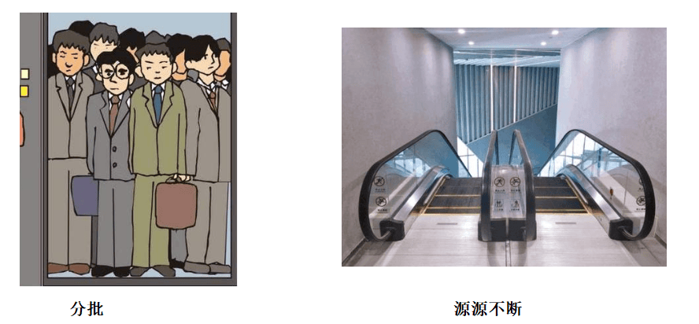

流式计算就相当于上图的右侧扶梯，是可以源源不断的产生数据，源源不断的接收数据，没有边界。

#### 应用场景

- 日志分析

  网站的用户访问日志进行实时的分析，计算访问量，用户画像，留存率等等，实时的进行数据分析，帮助企业进行决策
- 大屏看板统计

  可以实时的查看网站注册数量，订单数量，购买数量，金额等。
- 公交实时数据

  可以随时更新公交车方位，计算多久到达站牌等
- 实时文章分值计算

  头条类文章的分值计算，通过用户的行为实时文章的分值，分值越高就越被推荐。

#### 技术方案选型

- Hadoop
- Apche Storm

  Storm 是一个分布式实时大数据处理系统，可以帮助我们方便地处理海量数据，具有高可靠、高容错、高扩展的特点。是流式框架，有很高的数据吞吐能力。
- Kafka Stream

  可以轻松地将其嵌入任何Java应用程序中，并与用户为其流应用程序所拥有的任何现有打包，部署和操作工具集成。

### Kafka Stream

#### 概述

Kafka Stream是Apache Kafka从0.10版本引入的一个新Feature。它是提供了对存储于Kafka内的数据进行流式处理和分析的功能。

Kafka Stream的特点如下：

- Kafka Stream提供了一个非常简单而轻量的Library，它可以非常方便地嵌入任意Java应用中，也可以任意方式打包和部署
- 除了Kafka外，无任何外部依赖
- 充分利用Kafka分区机制实现水平扩展和顺序性保证
- 通过可容错的state store实现高效的状态操作（如windowed join和aggregation）
- 支持正好一次处理语义
- 提供记录级的处理能力，从而实现毫秒级的低延迟
- 支持基于事件时间的窗口操作，并且可处理晚到的数据（late arrival of records）
- 同时提供底层的处理原语Processor（类似于Storm的spout和bolt），以及高层抽象的DSL（类似于Spark的map/group/reduce）

#### Kafka Streams的关键概念

- 源处理器（Source Processor）：源处理器是一个没有任何上游处理器的特殊类型的流处理器。它从一个或多个kafka主题生成输入流。通过消费这些主题的消息并将它们转发到下游处理器。
- Sink处理器：sink处理器是一个没有下游流处理器的特殊类型的流处理器。它接收上游流处理器的消息发送到一个指定的Kafka主题。

#### KStream

- 数据结构类似于map
- KStream数据流（data stream），即是一段顺序的，可以无限长，不断更新的数据集。


#### Kafka Stream入门案例


结果：通过流式计算，会把生产者的多条消息汇总成一条发送到消费者中输出


#### SpringBoot集成Kafka Stream


### 热点文章-实时计算

#### 思路说明


#### 实现

1.修改ApLikesBehaviorServiceImpl和ApReadBehaviorServiceImpl新增发送消息


2.在leadnews-article微服务中集成kafkaStream（参考kafka-demo）


3.在leadnews-article微服务中实时接收消息，聚合内容


4.重新计算文章的分值，更新到数据库和缓存中


5.定义监听，接收聚合之后的数据，文章的分值重新进行计算


## 12 项目部署_持续集成

### 什么是持续集成

持续集成（ Continuous integration ， 简称 CI ）指的是，频繁地（一天多次）将代码集成到主干


**持续集成的组成要素**

一个自动构建过程， 从检出代码、 编译构建、 运行测试、 结果记录、 测试统计等都是自动完成的， 无需人工干预。

一个代码存储库，即需要版本控制软件来保障代码的可维护性，同时作为构建过程的素材库，一般使用SVN或Git。

一个持续集成服务器， Jenkins 就是一个配置简单和使用方便的持续集成服务器。

持续集成的好处

1、降低风险，由于持续集成不断去构建，编译和测试，可以很早期发现问题，所以修复的代价就少；
2、对系统健康持续检查，减少发布风险带来的问题；
3、减少重复性工作；
4、持续部署，提供可部署单元包；
5、持续交付可供使用的版本；
6、增强团队信心；

### 软件开发模式

#### 软件开发生命周期

软件开发生命周期又叫做SDLC（Software Development Life Cycle），它是集合了计划、开发、测试和部署过程的集合。如下图所示 ：


- 需求分析

  这是生命周期的第一阶段，根据项目需求，团队执行一个可行性计划的分析。项目需求可能是公司内部或者客户提出的。这阶段主要是对信息的收集，也有可能是对现有项目的改善和重新做一个新的项目。还要分析项目的预算多长，可以从哪方面受益及布局，这也是项目创建的目标。
- 设计

  第二阶段就是设计阶段，系统架构和满意状态（就是要做成什么样子，有什么功能），和创建一个项目计划。计划可以使用图表，布局设计或者文字的方式呈现。
- 实现

  第三阶段就是实现阶段，项目经理创建和分配工作给开者，开发者根据任务和在设计阶段定义的目标进行开发代码。依据项目的大小和复杂程度，可以需要数月或更长时间才能完成。
- 测试

  测试人员进行代码测试 ，包括功能测试、代码测试、压力测试等。
- 进化

  最后进阶段就是对产品不断的进化改进和维护阶段，根据用户的使用情况，可能需要对某功能进行修改，bug修复，功能增加等。

#### 软件开发瀑布模型

瀑布模型是最著名和最常使用的软件开发模型。瀑布模型就是一系列的软件开发过程。它是由制造业繁衍出来的。一个高度化的结构流程在一个方向上流动，有点像生产线一样。在瀑布模型创建之初，没有其它开发的模型，有很多东西全靠开发人员去猜测，去开发。这样的模型仅适用于那些简单的软件开发， 但是已经不适合现在的开发了。

下图对软件开发模型的一个阐述。


| 优势                                       | 劣势                                                                                   |
| ------------------------------------------ | -------------------------------------------------------------------------------------- |
| 简单易用和理解                             | 各个阶段的划分完全固定，阶段之间产生大量的文档，极大地增加了工作量。                   |
| 当前一阶段完成后，您只需要去关注后续阶段。 | 由于开发模型是线性的，用户只有等到整个过程的末期才能见到开发成果，从而增加了开发风险。 |
| 为项目提供了按阶段划分的检查节点           | 瀑布模型的突出缺点是不适应用户需求的变化。                                             |

#### 软件的敏捷开发

- 什么是敏捷开发？

  敏捷开发（Agile Development） 的核心是迭代开发（Iterative Development） 与 增量开发（Incremental Development）。
- 何为迭代开发？

  对于大型软件项目，传统的开发方式是采用一个大周期（比如一年）进行开发，整个过程就是一次"大开发"；迭代开发的方式则不一样，它将开发过程拆分成多个小周期，即一次"大开发"变成多次"小开发"，每次小开发都是同样的流程，所以看上去就好像重复在做同样的步骤。

  举例来说，SpaceX 公司想造一个大推力火箭，将人类送到火星。但是，它不是一开始就造大火箭，而是先造一个最简陋的小火箭 Falcon 1。结果，第一次发射就爆炸了，直到第四次发射，才成功进入轨道。然后，开发了中型火箭 Falcon 9，九年中发射了70次。最后，才开发 Falcon 重型火箭。如果SpaceX 不采用迭代开发，它可能直到现在还无法上天。
- 何为增量开发？

  软件的每个版本，都会新增一个用户可以感知的完整功能。也就是说，按照新增功能来划分迭代。

  举例来说，房产公司开发一个10栋楼的小区。如果采用增量开发的模式，该公司第一个迭代就是交付一号楼，第二个迭代交付二号楼......每个迭代都是完成一栋完整的楼。而不是第一个迭代挖好10栋楼的地基，第二个迭代建好每栋楼的骨架，第三个迭代架设屋顶......
- 敏捷开发如何迭代？

  虽然敏捷开发将软件开发分成多个迭代，但是也要求，每次迭代都是一个完整的软件开发周期，必须按照软件工程的方法论，进行正规的流程管理。


- 敏捷开发有什么好处？

  - 早期交付

    敏捷开发的第一个好处，就是早期交付，从而大大降低成本。 还是以上一节的房产公司为例，如果按照传统的"瀑布开发模式"，先挖10栋楼的地基、再盖骨架、然后架设屋顶，每个阶段都等到前一个阶段完成后开始，可能需要两年才能一次性交付10栋楼。也就是说，如果不考虑预售，该项目必须等到两年后才能回款。 敏捷开发是六个月后交付一号楼，后面每两个月交付一栋楼。因此，半年就能回款10%，后面每个月都会有现金流，资金压力就大大减轻了。
  - 降低风险

    敏捷开发的第二个好处是，及时了解市场需求，降低产品不适用的风险。 请想一想，哪一种情况损失比较小：10栋楼都造好以后，才发现卖不出去，还是造好第一栋楼，就发现卖不出去，从而改进或停建后面9栋楼？

### Jenkins安装配置

#### Jenkins介绍

Jenkins  是一款流行的开源持续集成（Continuous Integration）工具，广泛用于项目开发，具有自动化构建、测试和部署等功能。官网：  http://jenkins-ci.org/。


Jenkins的特征：

- 开源的 Java语言开发持续集成工具，支持持续集成，持续部署。
- 易于安装部署配置：可通过 yum安装,或下载war包以及通过docker容器等快速实现安装部署，可方便web界面配置管理。
- 消息通知及测试报告：集成 RSS/E-mail通过RSS发布构建结果或当构建完成时通过e-mail通知，生成JUnit/TestNG测试报告。
- 分布式构建：支持 Jenkins能够让多台计算机一起构建/测试。
- 文件识别： Jenkins能够跟踪哪次构建生成哪些jar，哪次构建使用哪个版本的jar等。
- 丰富的插件支持：支持扩展插件，你可以开发适合自己团队使用的工具，如 git，svn，maven，docker等。

#### Jenkins安装


##### 插件安装

如果想让Jenkins来实现更多的功能，需要安装插件完成

Maven Integration plugin： Maven 集成管理插件。
Docker plugin： Docker集成插件。
GitLab Plugin： GitLab集成插件。
Publish Over SSH：远程文件发布插件。
SSH: 远程脚本执行插件。


可以在jenkins的管理界面中查看安装插件：Manage Jenkins-->Manage Plugins


#### 服务器环境准备


#### Jenkins工具配置

在jenkins管理页面中集成环境， Manage Jenkins-->Tool Configuration ，需要指定环境的目录。


### 后端项目部署

#### 多环境切换

在项目开发部署的过程中，一般都会有三套项目环境

- Development ：开发环境
- Production ：生产环境
- Test ：测试环境

例如：开发环境的mysql连接的是本地，生产环境需要连接线上的mysql环境

##### 微服务中多环境配置

1.在微服务中的bootstrap.yml中新增配置


2.在nacos的配置中心中新增各个环境的配置文件，例如user微服务中新增


#### 整体思路

目标：把AR头条的app端相关的微服务部署到192.168.200.100这台服务器上


> 注意：192.168.200.100与192.168.200.130必须使用NAT这个网卡，必须在同一个网段，是可以互相通信的，可以使用ping命令来检查


#### 服务集成Docker配置

目标：部署的每一个微服务都是先创建docker镜像后创建对应容器启动

方式一：本地微服务打包以后上传到服务器，编写Dockerfile文件完成。
方式二：使用dockerfile-maven-plugin插件，可以直接把微服务创建为镜像使用（更省事）

🔖


#### 基础依赖打包配置

在微服务运行之前需要在本地仓库中先去install所依赖的jar包，所以第一步应该是从git中拉取代码，并且把基础的依赖部分安装到仓库中


#### 微服务打包配置

所有微服务打包的方式类似，以leadnews-user微服务为例


#### 部署服务到远程服务器上

目标：使用jenkins（192.168.200.100）把微服务打包部署到192.168.200.130服务器上

1，安装私有仓库


2，jenkins中安装插件


3，jenkins系统配置远程服务器链接


4，jenkins项目创建与其他微服务相同


5，设置参数


6，构建执行Execute shell


7，在远程服务器上执行脚本


8.构建完成以后，可以登录130服务器，查看是否有相关的镜像和容器


#### 联调测试

1.参考jenkins中leadnews-user微服务把app端网关部署起来
2.修改本地nginx中的配置反向代理地址为100这台服务器：leadnews-app.conf

```nginx
upstream  heima-app-gateway{
  server 192.168.200.100:51601;
}
```

3.启动nginx，打开页面进行测试


### jenkins触发器配置

#### URL触发远程构建


#### 其他工程构建后触发


#### 定时构建


##### 定时构建-定时表达式

定时字符串从左往右分别为： 分 时 日 月 周

| 组成部分 | 含义        | 取值范围                   |
| -------- | ----------- | -------------------------- |
| 第一部分 | minute (分) | 0~59                       |
| 第二部分 | hour(小时)  | 0~23                       |
| 第三部分 | day(天)     | 1~31                       |
| 第四部分 | month(月)   | 1~12                       |
| 第五部分 | week(周)    | 0~7，0 和 7 都是表示星期天 |

- 每30分钟构建一次：H/30 * * * * 10:02 10:32
- 每2个小时构建一次: H H/2 * * *
- 每天的8点，12点，22点，一天构建3次： (多个时间点中间用逗号隔开) 0 8,12,22 * * *
- 每天中午12点定时构建一次 H 12 * * *
- 每天下午18点定时构建一次 H 18 * * *

> 符号`H`表示一个随机数
> 符号`*`取值范围的任意值


#### 轮询

轮询SCM（Poll SCM），是指定时扫描本地代码仓库的代码是否有变更，如果代码有变更就触发项目构建。


Jenkins会定时扫描本地整个项目的代码，增大系统的开销，不建议使用。


> 总结：
>
> 构建项目的方式
>
> 1. 手动构建（常用）
> 2. URL触发远程构建
> 3. 其他工程构建后触发（常用）
> 4. 定时构建
> 5. 轮询，扫描代码仓库查看是否变更

## 13 更多功能

- 01-文章评论[实战]-->使用mongodb进行存储
- 02-自媒体评论管理[实战]-->使用mongodb进行存储
- 03-自媒体图文统计[实战]
