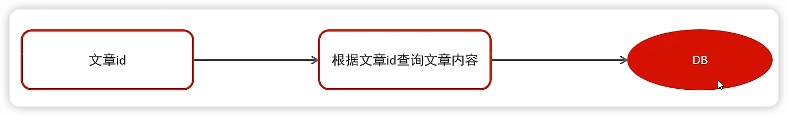
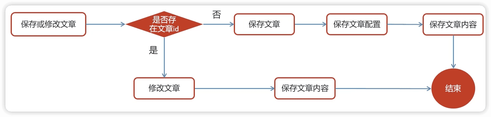

AR头条
-----
测试

https://www.bilibili.com/video/BV1Qs4y1v7x4

## 介绍

### 技术栈

微服务项目


技术解决方案：

- 静态化模板方案
- 延迟发布方案
- 内容审核发布整套流程实现方案
- 热点数据筛选与处理方案
- 分布式任务调度解决方案
- 微服务持续集成解决方案


### 项目前置知识

- Springboot灵活使用的程度

- Spring cloud 入门程度

- Nacos基本使用程度


### 怎样学习项目

业务细节

学习的重点：

- 业务（B）。理解需求、准备面试
- 技术（T）。老技术融会贯通、新技术快速掌握
- 代码（C）。研究代码逻辑，量变影响质变
- 实战（P）。真需求，验证水平


遇到问题怎么办？

在调试中成长（学会debug）

## 1 项目介绍

怎么介绍一个项目：

项目背景、业务能力、技术栈说明、解决方案

### 项目概述

类似于今日头条，是一个新闻资讯类项目

#### 课程概述


课程大纲：

| 章节                           | 天数 | 内容                                                         |
| ------------------------------ | ---- | ------------------------------------------------------------ |
| 第一章 环境搭建                | 1    | springboot、springcloud、nacos、swagger                      |
| 第二章 文章列表查看            | 2    | freemarker、OSS、CDN、ElasticSearch、Redis                   |
| 第三章 热点文章计算            | 3    | kafka、kafkaStream、xxl-job、Redis                           |
| 第四章 CMS自媒体端文章发布审核 | 3    | 第三方接口、延迟队列、                                       |
| 第五章 项目部署 数据迁移       | 2    | Hbase、Jenkins、Git、Docker                                  |
| 项目实战                       | 4    | app端-文章行为、<br />app端-评论系统、<br />自媒体端-评论管理、<br />自媒体端-报表 |


#### 环境搭建

使用登录及网关认证校验功能来测试环境搭建成功与否。

目标：接口测试工具及前后端联调


#### 业务说明

功能架构图


- 用户移动App


- 自媒体平台是新闻写文章、发布文章、管理的平台


- 管理平台相当于AR头条的官方平台，权限比较大


项目演示地址：
平台管理：http://heima-admin-java.research.itcast.cn 
自媒体：http://heime-media-java.research.itcast.cn 
app端：http://heima-app-java.research.itcast.cn 

#### 项目术语

- 用户：黑马头条APP用户端用户
- 自媒体人：通过黑马自媒体系统发送文章的用户
- 管理员：使用黑马头条管理系统的用户
- App：黑马头条App
- We Media：黑马头条自媒体系统
- Admin：黑马头条管理系统

#### 技术栈


基础层


服务层


### nacos环境搭建

Centos 虚拟机

#### docker安装Nacos安装

1. 使用vm虚拟机打开资料中的contos7镜像

2. docker拉取镜像

   ```shell
   docker pull nacos/nacos-server:1.2.0
   ```

3. 创建容器

   ```shell
   docker run --env MODE=standalone --name nacos --restart=always  -d -p 8848:8848 nacos/nacos-server:1.2.0
   ```

> MODE=standalone  单机版
> --restart=always  开机启动
> -p 8848:8848   映射端口
> -d 创建一个守护式容器在后台运行

报错：
```
WARNING: The requested image's platform (linux/amd64) does not match the detected host platform (linux/arm64/v8) and no specific platform was requested

```
因为macos m1 ，添加 `--platform linux/arm64`

```shell
docker run --platform linux/arm64 --env MODE=standalone --name nacos --restart=always -d -p 8848:8848 nacos/nacos-server:1.2.0
```


🔖问题：

```
Unable to find image 'nacos/nacos-server:1.2.0' locally
1.2.0: Pulling from nacos/nacos-server
Digest: sha256:2db29d58eb4d3235ff55e44d5708c5690a399195c9e0504d79933a12b0a4f9f5
Status: Image is up to date for nacos/nacos-server:1.2.0
docker: image with reference docker.io/nacos/nacos-server:1.2.0 was found but does not match the specified platform: wanted linux/arm64, actual: linux/amd64.
See 'docker run --help'.
```


4. 访问地址：http://10.211.55.5:8848/nacos 


使用本地macos上，源码安装启动nacos  `./startup.sh -m standalone` (单机模式运行)

http://localhost:8848/nacos

账号密码都是nacos


### 初始工程搭建


#### 工程主题结构

```
arleadnews								父工程，统一管理项目依赖（定义通用包的版本），springboot
		leadnews-common				通用配置
		leadnews-feign-api		feign对外的接口
		leadnews-model				pojo、dto
		leadnews-utils				通用工具
		leadnews-gateway			管理一系列网关
		leadnews-service			管理一系列微服务
		leadnews-test					测试案例
```


#### 全局异常


### 登录

#### 需求分析


- 用户点击**开始使用**

  登录后的用户权限较大，可以查看，也可以操作（点赞，关注，评论）

- 用户点击**不登录，先看看**

​       游客只有查看的权限

#### 表结构分析

关于app端用户相关的内容较多，可以单独设置一个库leadnews_user

| **表名称**       | **说明**          |
| ---------------- | ----------------- |
| ap_user          | APP用户信息表     |
| ap_user_fan      | APP用户粉丝信息表 |
| ap_user_follow   | APP用户关注信息表 |
| ap_user_realname | APP实名认证信息表 |

```mysql
CREATE TABLE `ap_user` (
  `id` int unsigned NOT NULL AUTO_INCREMENT COMMENT '主键',
  `salt` varchar(32) CHARACTER SET utf8mb4 COLLATE utf8mb4_unicode_ci DEFAULT NULL COMMENT '密码、通信等加密盐',
  `name` varchar(20) CHARACTER SET utf8mb4 COLLATE utf8mb4_unicode_ci DEFAULT NULL COMMENT '用户名',
  `password` varchar(32) CHARACTER SET utf8mb4 COLLATE utf8mb4_unicode_ci DEFAULT NULL COMMENT '密码,md5加密',
  `phone` varchar(11) CHARACTER SET utf8mb4 COLLATE utf8mb4_unicode_ci DEFAULT NULL COMMENT '手机号',
  `image` varchar(255) CHARACTER SET utf8mb4 COLLATE utf8mb4_unicode_ci DEFAULT NULL COMMENT '头像',
  `sex` tinyint unsigned DEFAULT NULL COMMENT '0 男\r\n            1 女\r\n            2 未知',
  `is_certification` tinyint unsigned DEFAULT NULL COMMENT '0 未\r\n            1 是',
  `is_identity_authentication` tinyint(1) DEFAULT NULL COMMENT '是否身份认证',
  `status` tinyint unsigned DEFAULT NULL COMMENT '0正常\r\n            1锁定',
  `flag` tinyint unsigned DEFAULT NULL COMMENT '0 普通用户\r\n            1 自媒体人\r\n            2 大V',
  `created_time` datetime DEFAULT NULL COMMENT '注册时间',
  PRIMARY KEY (`id`) USING BTREE
) ENGINE=InnoDB AUTO_INCREMENT=7 DEFAULT CHARSET=utf8mb4 COLLATE=utf8mb4_unicode_ci ROW_FORMAT=DYNAMIC COMMENT='APP用户信息表';
```

> `tinyint`类型：占1个字节，不指定unsigned（非负数），值范围（-128,127），指定了unsigned，值范围（0,255）
>
> tinyint通常表示小范围的数值，或者表示true或false，通常值为0表示false，值为1表示true

项目中的持久层使用的mybatis-plus，一般都使用mybais-plus逆向生成对应的实体类

#### 手动加密（md5+随机字符串）

md5是不可逆加密，md5相同的密码每次加密都一样，不太安全。在md5的基础上手动加盐（salt）处理

注册->生成盐（字段salt）：


登录->使用盐来配合验证：


#### 用户端（运营端）微服务搭建

在leadnews-service下创建工程leadnews-user


```yaml
spring:
  datasource:
      driver-class-name: com.mysql.cj.jdbc.Driver
      url: jdbc:mysql://localhost:3306/leadnews_user?serverTimezone=Asia/Shanghai&useUnicode=true&characterEncoding=utf-8&zeroDateTimeBehavior=convertToNull&useSSL=false&allowPublicKeyRetrieval=true
      username: root
      password: 33824
# 设置Mapper接口所对应的XML文件位置，如果你在Mapper接口中有自定义方法，需要进行该配置
mybatis-plus:
  mapper-locations: classpath*:mapper/*.xml
  # 设置别名包扫描路径，通过该属性可以给包中的类注册别名
  type-aliases-package: top.andyron.model.user.pojos
```


#### 登录功能实现

##### 接口定义


快捷键ctrl + a  （ctrl + i）


##### 思路分析

流程：


1. 用户输入了用户名和密码进行登录，校验成功后返回jwt（基于当前用户的id生成）
2. 用户游客登录，生成jwt返回（基于默认值0生成）


### 接口工具postman、swagger、knife4j


#### swagger

Spring已经将Swagger纳入自身的标准，建立了Spring-swagger项目，现在叫Springfox。通过在项目中引入Springfox ，即可非常简单快捷的使用Swagger。

```xml
<dependency>
    <groupId>io.springfox</groupId>
    <artifactId>springfox-swagger2</artifactId>
</dependency>
<dependency>
    <groupId>io.springfox</groupId>
    <artifactId>springfox-swagger-ui</artifactId>
</dependency>
```

在leadnews-common中进行配置即可，因为其他微服务工程都直接或间接依赖即可。


##### swagger常用注解

@Api：修饰整个类，描述Controller的作用  

@ApiOperation：描述一个类的一个方法，或者说一个接口  

@ApiParam：单个参数的描述信息  

@ApiModel：用对象来接收参数  

@ApiModelProperty：用对象接收参数时，描述对象的一个字段  

@ApiResponse：HTTP响应其中1个描述  

@ApiResponses：HTTP响应整体描述  

@ApiIgnore：使用该注解忽略这个API  

@ApiError ：发生错误返回的信息  

@ApiImplicitParam：一个请求参数  

@ApiImplicitParams：多个请求参数的描述信息


 @ApiImplicitParam属性：

| 属性         | 取值   | 作用                                          |
| ------------ | ------ | --------------------------------------------- |
| paramType    |        | 查询参数类型                                  |
|              | path   | 以地址的形式提交数据                          |
|              | query  | 直接跟参数完成自动映射赋值                    |
|              | body   | 以流的形式提交 仅支持POST                     |
|              | header | 参数在request headers 里边提交                |
|              | form   | 以form表单的形式提交 仅支持POST               |
| dataType     |        | 参数的数据类型 只作为标志说明，并没有实际验证 |
|              | Long   |                                               |
|              | String |                                               |
| name         |        | 接收参数名                                    |
| value        |        | 接收参数的意义描述                            |
| required     |        | 参数是否必填                                  |
|              | true   | 必填                                          |
|              | false  | 非必填                                        |
| defaultValue |        | 默认值                                        |


启动微服务，访问 http://localhost:51801/swagger-ui.html

```json
{
  "password": "admin",
  "phone": "13511223456"
}
```


#### knife4j

knife4j是为Java MVC框架集成Swagger生成Api文档的增强解决方案,前身是swagger-bootstrap-ui,取名kni4j是希望它能像一把匕首一样小巧,轻量,并且功能强悍!

gitee地址：https://gitee.com/xiaoym/knife4j

官方文档：https://doc.xiaominfo.com/

效果演示：http://knife4j.xiaominfo.com/doc.html

该UI增强包主要包括两大核心功能：文档说明 和 在线调试

- 文档说明：根据Swagger的规范说明，详细列出接口文档的说明，包括接口地址、类型、请求示例、请求参数、响应示例、响应参数、响应码等信息，使用swagger-bootstrap-ui能根据该文档说明，对该接口的使用情况一目了然。
- 在线调试：提供在线接口联调的强大功能，自动解析当前接口参数,同时包含表单验证，调用参数可返回接口响应内容、headers、Curl请求命令实例、响应时间、响应状态码等信息，帮助开发者在线调试，而不必通过其他测试工具测试接口是否正确,简介、强大。
- ==个性化配置==：通过个性化ui配置项，可自定义UI的相关显示信息
- ==离线文档==：根据标准规范，生成的在线markdown离线文档，开发者可以进行拷贝生成markdown接口文档，通过其他第三方markdown转换工具转换成html或pdf，这样也可以放弃swagger2markdown组件
- ==接口排序==：自1.8.5后，ui支持了接口排序功能，例如一个注册功能主要包含了多个步骤,可以根据swagger-bootstrap-ui提供的接口排序规则实现接口的排序，step化接口操作，方便其他开发者进行接口对接

使用：

```xml
<dependency>
     <groupId>com.github.xiaoymin</groupId>
     <artifactId>knife4j-spring-boot-starter</artifactId>
</dependency>
```


```java
@Configuration
@EnableSwagger2
@EnableKnife4j
@Import(BeanValidatorPluginsConfiguration.class)
public class SwaggerConfiguration2 {
```

| 注解              | 说明                                                         |
| ----------------- | ------------------------------------------------------------ |
| `@EnableSwagger2` | 该注解是Springfox-swagger框架提供的使用Swagger注解，该注解必须加 |
| `@EnableKnife4j`  | 该注解是`knife4j`提供的增强注解,Ui提供了例如动态参数、参数过滤、接口排序等增强功能,如果你想使用这些增强功能就必须加该注解，否则可以不用加 |

```
org.springframework.boot.autoconfigure.EnableAutoConfiguration=\
  top.andyron.common.exception.ExceptionCatch,\
  top.andyron.common.swagger.SwaggerConfiguration2
```


http://localhost:51801/doc.html

🔖  为什么会和swagger冲突


### app端网关

#### 网关概述


#### 项目中网关

```
leadnews-gateway									管理网关
		leadnews-admin-gateway    		管理平台网关
		leadnews-wemedia-gateway			自媒体网关
		leadnews-app-gateway					app网关
```


#### 实现

- 在leadnews-gateway

```xml
<dependencies>
    <dependency>
        <groupId>org.springframework.cloud</groupId>
        <artifactId>spring-cloud-starter-gateway</artifactId>
    </dependency>
    <dependency>
        <groupId>com.alibaba.cloud</groupId>
        <artifactId>spring-cloud-starter-alibaba-nacos-discovery</artifactId>
    </dependency>
     <dependency>
            <groupId>com.alibaba.cloud</groupId>
            <artifactId>spring-cloud-starter-alibaba-nacos-config</artifactId>
        </dependency>
    <dependency>
        <groupId>io.jsonwebtoken</groupId>
        <artifactId>jjwt</artifactId>
    </dependency>
</dependencies>
```

- 在leadnews-gateway下创建leadnews-app-gateway微服务

bootstrap.yml

```yaml
server:
  port: 51601
spring:
  application:
    name: leadnews-app-gateway
  cloud:
    nacos:
      discovery:
        server-addr: 192.168.0.102:8848
      config:
        server-addr: 192.168.0.102:8848
        file-extension: yml
```

在nacos的配置中心创建dataid为leadnews-app-gateway的yml配置


```yaml
spring:
  cloud:
    gateway:
      globalcors:
        add-to-simple-url-handler-mapping: true
        corsConfigurations:
          '[/**]':
            allowedHeaders: "*"
            allowedOrigins: "*"
            allowedMethods:
              - GET
              - POST
              - DELETE
              - PUT
              - OPTION
      routes:
        # 平台管理
        - id: user
          uri: lb://leadnews-user
          predicates:
            - Path=/user/**
          filters:
            - StripPrefix= 1
```


环境搭建完成以后，启动项目网关和用户两个服务，使用postman进行测试

请求地址：http://localhost:51601/user/api/v1/login/login_auth   


#### 认证过滤器

认证过滤器用来校验token。

全局过滤器实现jwt校验


在leandews-app-gateway中创建`AuthorizeFilter`


### App前端集成

nginx方式集成前端项目


- 前端项目app-web


- 配置nginx

> 每个项目单独创建一个配置文件，因为之后还有很多项目。

在nginx安装的conf目录下新建一个文件夹`leadnews.conf`,在当前文件夹中新建`leadnews-app.conf`文件:

```nginx
upstream  leadnews-app-gateway {
    server localhost:51601;    # 反向代理到app网关
}

server {
	listen 8801;
	location / {
		root /Users/andyron/myfield/git/ARLeadnews/app-web/;
		index index.html;
	}
	
	location ~/app/(.*) {
		proxy_pass http://leadnews-app-gateway/$1;
		proxy_set_header HOST $host;  # 不改变源请求头的值
		proxy_pass_request_body on;  #开启获取请求体
		proxy_pass_request_headers on;  #开启获取请求头
		proxy_set_header X-Real-IP $remote_addr;   # 记录真实发出请求的客户端IP
		proxy_set_header X-Forwarded-For $proxy_add_x_forwarded_for;  #记录代理信息
	}
}
```

在nginx.conf中引入`leadnews-app.conf`文件：

```nginx
http {
  # ...
  include leadnews.conf/*.conf;
}
```


- 重新加载配置文件

`nginx -s reload`


- 测试

 http://localhost:8801


> 从业务角度分析如何分表
>
> 滚屏分页的逻辑
>
> 文章详情-大文本静态化方案（freemarker，minio）

## 2 app端文章查看，静态化freemarker,分布式文件系统minIO

### App文章列表

#### 需求分析

文章的布局展示


数据库leadnews_article


```mysql
CREATE TABLE `ap_article` (
  `id` bigint unsigned NOT NULL AUTO_INCREMENT,
  `title` varchar(50) CHARACTER SET utf8mb4 COLLATE utf8mb4_unicode_ci DEFAULT NULL COMMENT '标题',
  `author_id` int unsigned DEFAULT NULL COMMENT '文章作者的ID',
  `author_name` varchar(20) CHARACTER SET utf8mb4 COLLATE utf8mb4_unicode_ci DEFAULT NULL COMMENT '作者昵称',
  `channel_id` int unsigned DEFAULT NULL COMMENT '文章所属频道ID',
  `channel_name` varchar(10) CHARACTER SET utf8mb4 COLLATE utf8mb4_unicode_ci DEFAULT NULL COMMENT '频道名称',
  `layout` tinyint unsigned DEFAULT NULL COMMENT '文章布局\r\n            0 无图文章\r\n            1 单图文章\r\n            2 多图文章',
  `flag` tinyint unsigned DEFAULT NULL COMMENT '文章标记\r\n            0 普通文章\r\n            1 热点文章\r\n            2 置顶文章\r\n            3 精品文章\r\n            4 大V 文章',
  `images` varchar(1000) CHARACTER SET utf8mb4 COLLATE utf8mb4_unicode_ci DEFAULT NULL COMMENT '文章图片\r\n            多张逗号分隔',
  `labels` varchar(500) CHARACTER SET utf8mb4 COLLATE utf8mb4_unicode_ci DEFAULT NULL COMMENT '文章标签最多3个 逗号分隔',
  `likes` int unsigned DEFAULT NULL COMMENT '点赞数量',
  `collection` int unsigned DEFAULT NULL COMMENT '收藏数量',
  `comment` int unsigned DEFAULT NULL COMMENT '评论数量',
  `views` int unsigned DEFAULT NULL COMMENT '阅读数量',
  `province_id` int unsigned DEFAULT NULL COMMENT '省市',
  `city_id` int unsigned DEFAULT NULL COMMENT '市区',
  `county_id` int unsigned DEFAULT NULL COMMENT '区县',
  `created_time` datetime DEFAULT NULL COMMENT '创建时间',
  `publish_time` datetime DEFAULT NULL COMMENT '发布时间',
  `sync_status` tinyint(1) DEFAULT '0' COMMENT '同步状态',
  `origin` tinyint unsigned DEFAULT '0' COMMENT '来源',
  `static_url` varchar(150) CHARACTER SET utf8mb4 COLLATE utf8mb4_unicode_ci DEFAULT NULL,
  PRIMARY KEY (`id`) USING BTREE
) ENGINE=InnoDB AUTO_INCREMENT=1383828014629179394 DEFAULT CHARSET=utf8mb4 COLLATE=utf8mb4_unicode_ci ROW_FORMAT=DYNAMIC COMMENT='文章信息表，存储已发布的文章';
```


> 为什么文章信息要拆分成多个表？

表的拆分-**垂直分表**

垂直分表：将一个表的字段分散到多个表中，每个表存储其中一部分字段。

优势：

1. 减少IO争抢，减少锁表的几率，查看文章概述与文章详情互不影响
2. 充分发挥高频数据的操作效率，对文章概述数据操作的高效率不会被操作文章详情数据的低效率所拖累。

拆分规则：

1. 把**不常用的字段**单独放在一张表
2. 把text，blob等**大字段**拆分出来单独放在一张表
3. **经常组合查询的字段**单独放在一张表中


#### 实现思路


1. 在默认频道展示10条文章信息

2. 可以切换频道查看不同种类文章

3. 当用户==下拉==可以加载最新的文章（分页）本页文章列表中发布时间为最大的时间为依据
4. 当用户==上拉==可以加载更多的文章信息（按照发布时间）本页文章列表中发布时间最小的时间为依据

5. 如果是当前频道的首页，前端传递默认参数：

   `maxBehotTime`:0（毫秒）

   `minBehotTime`: 20000000000000（毫秒）2063年

首页默认加载小于2063年的数据


#### 接口定义


#### 实现

- 在leadnews-service中添加一个模块leadnews-article

```yaml
server:
  port: 51802
spring:
  application:
    name: leadnews-article
  cloud:
    nacos:
      discovery:
        server-addr: 192.168.0.102:8848
      config:
        server-addr: 192.168.0.102:8848
        file-extension: yml
```


- 需要在nacos中添加对应的配置

```yaml
spring:
  datasource:
      driver-class-name: com.mysql.cj.jdbc.Driver
      url: jdbc:mysql://localhost:3306/leadnews_article?serverTimezone=Asia/Shanghai&useUnicode=true&characterEncoding=utf-8&zeroDateTimeBehavior=convertToNull&useSSL=false&allowPublicKeyRetrieval=true
      username: root
      password: 33824
# 设置Mapper接口所对应的XML文件位置，如果你在Mapper接口中有自定义方法，需要进行该配置
mybatis-plus:
  mapper-locations: classpath*:mapper/*.xml
  # 设置别名包扫描路径，通过该属性可以给包中的类注册别名
  type-aliases-package: top.andyron.model.article.pojos
```


- 定义接口


- 编写mapper文件

文章表与文章配置表多表查询


- 编写业务层代码


- 编写控制器代码


- swagger测试或前后端联调测试

首页要在app网关的nacos配置中心添加文章微服务的路由：

```yaml

				# 文章微服务
        - id: article
          uri: lb://leadnews-article
          predicates:
            - Path=/article/**
          filters:
            - StripPrefix= 1
```

启动网关、user、article微服务


### 文章详情-实现方案分析

#### 方案1

根据文章的id去查询文章内容表，返回渲染页面



#### 方案2-静态模板展示 


### freemarker

#### 模板引擎


[FreeMarker](https://github.com/apache/freemarker) 是一款 模板引擎： 即一种基于模板和要改变的数据， 并用来生成输出文本(==HTML网页，电子邮件，配置文件，源代码==等)的通用工具。 它**==不是面向最终用户的==**，而是一个Java类库，是一款程序员可以嵌入他们所开发产品的组件。

模板编写为FreeMarker Template Language (FTL)。它是简单的，专用的语言， *不是* 像PHP那样成熟的编程语言。 那就意味着要准备数据在真实编程语言中来显示，比如数据库查询和业务运算， 之后模板显示已经准备好的数据。在模板中，你可以专注于如何展现数据， 而在模板之外可以专注于要展示什么数据。 

#### 技术选型对比

常用的java模板引擎还有哪些？

Jsp、Freemarker、Thymeleaf 、Velocity 等。

1. Jsp 为 Servlet 专用，不能单独进行使用。

2. Thymeleaf 为新技术，功能较为强大，但是执行的效率比较低。

3. Velocity从2010年更新完 2.0 版本后，便没有在更新。Spring Boot 官方在 1.4 版本后对此也不在支持，虽然 Velocity 在 2017 年版本得到迭代，但为时已晚。 

#### 环境搭建-快速入门

freemarker作为springmvc一种视图格式，默认情况下SpringMVC支持freemarker视图格式。

- 创建一个freemarker-demo 的测试工程专门用于freemarker的功能测试与模板的测试。

```xml
    <dependencies>
        <dependency>
            <groupId>org.springframework.boot</groupId>
            <artifactId>spring-boot-starter-web</artifactId>
        </dependency>
        <dependency>
            <groupId>org.springframework.boot</groupId>
            <artifactId>spring-boot-starter-freemarker</artifactId>
        </dependency>

        <dependency>
            <groupId>org.springframework.boot</groupId>
            <artifactId>spring-boot-starter-test</artifactId>
        </dependency>
        <!-- lombok -->
        <dependency>
            <groupId>org.projectlombok</groupId>
            <artifactId>lombok</artifactId>
        </dependency>

        <!-- apache 对 java io 的封装工具库 -->
        <dependency>
            <groupId>org.apache.commons</groupId>
            <artifactId>commons-io</artifactId>
            <version>1.3.2</version>
        </dependency>
    </dependencies>
```

- 配置文件application.yml

```yaml
server:
  port: 8881 #服务端口
spring:
  application:
    name: freemarker-demo #指定服务名
  freemarker:
    cache: false  #关闭模板缓存，方便测试
    settings:
      template_update_delay: 0 #检查模板更新延迟时间，设置为0表示立即检查，如果时间大于0会有缓存不方便进行模板测试
    suffix: .ftl               #指定Freemarker模板文件的后缀名
```

- 创建模型类
- 创建模板

在resources下创建`templates`，此目录为freemarker的默认模板存放目录。

在templates下创建模板文件 01-basic.ftl，模板中的==插值表达式==最终会被freemarker替换成具体的数据。

```html
<!DOCTYPE html>
<html>
<head>
    <meta charset="utf-8">
    <title>Hello World!</title>
</head>
<body>
<b>普通文本 String 展示：</b><br><br>
Hello ${name} <br>
<hr>
<b>对象Student中的数据展示：</b><br/>
姓名：${stu.name}<br/>
年龄：${stu.age}
<hr>
</body>
</html>
```

- 创建controller

- 创建启动类

- 测试

http://localhost:8881/basic


freemarker模板文件通常都是以ftl作为扩展名，也可以为html、xml、jsp等

`FreeMarkerAutoConfiguration`

`FreeMarkerProperties`


#### Freemarker指令语法

##### 基础语法种类

- 注释

```velocity
<#-- 我是一个freemarker注释 -->
```

- 插值（Interpolation）：即 **`${..}`** 部分,freemarker会用真实的值代替**`${..}`**

```velocity
Hello ${name}
```

- ==FTL指令==：和HTML标记类似，名字前加#予以区分，Freemarker会解析标签中的表达式或逻辑。

```html
<# >FTL指令</#> 
```

有很多FTL指令

- 文本，仅文本信息，这些不是freemarker的注释、插值、FTL指令的内容会被freemarker忽略解析，直接输出内容。

```velocity
<#--freemarker中的普通文本-->
我是一个普通的文本
```


##### 集合指令（List和Map）

```html
<#list></#list>
```

List:

```html
    <#list stus as stu >
      <tr>
        <td>${stu_index}</td>
        <td>${stu.name}</td>
        <td>${stu.age}</td>
        <td>${stu.money}</td>
      </tr>
    </#list>
```

`${k_index}`得到循环的下表，从0开始，是stu加上`_index`。

获取map中的值：

```
map["keyname"].property
map.keyname.property
```

遍历map：

```html
		<#list stuMap?keys as key >
        <tr>
            <td>${key_index}</td>
            <td>${stuMap[key].name}</td>
            <td>${stuMap[key].age}</td>
            <td>${stuMap[key].money}</td>
        </tr>
    </#list>
```


##### if指令

```html
<#if expression>
<#else>
</#if>
```


```html
<table>
    <tr>
        <td>姓名</td>
        <td>年龄</td>
        <td>钱包</td>
    </tr>
    <#list stus as stu >
        <#if stu.name='小红'>
            <tr style="color: red">
                <td>${stu_index}</td>
                <td>${stu.name}</td>
                <td>${stu.age}</td>
                <td>${stu.money}</td>
            </tr>
            <#else >
            <tr>
                <td>${stu_index}</td>
                <td>${stu.name}</td>
                <td>${stu.age}</td>
                <td>${stu.money}</td>
            </tr>
        </#if>
    </#list>
</table>
```


##### 运算符

- 算数运算符

除了 + 运算以外，其他的运算只能和 number 数字类型的计算。

```html
<b>算数运算符</b>
<br/><br/>
    100+5 运算：  ${100 + 5 }<br/>
    100 - 5 * 5运算：${100 - 5 * 5}<br/>
    5 / 2运算：${5 / 2}<br/>
    12 % 10运算：${12 % 10}<br/>
<hr>
```

- 比较运算符


- 逻辑运算符

```html
<b>逻辑运算符</b>
    <br/>
    <br/>
    <#if (10 lt 12 )&&( 10  gt  5 )  >
        (10 lt 12 )&&( 10  gt  5 )  显示为 true
    </#if>
    <br/>
    <br/>
    <#if !false>
        false 取反为true
    </#if>
<hr>
```


##### 空值处理

- 判断某变量是否存在使用 “`??`”

```html
    <#if stus??>
    </#if>
```

- 缺失变量默认值使用 “`!`”

使用!要以指定一个默认值，当变量为空时显示默认值， `${name!''}`表示如果name为空显示空字符串。

如果是嵌套对象则建议使用（）括起来，例： `${(stu.bestFriend.name)!''}`表示，如果stu或bestFriend或name为空默认显示空字符串。


##### 内建函数

内建函数语法格式： `变量+?+函数名称` 

- 集合的大小

  `${集合名?size}`

- 日期格式化

  显示年月日: `${today?date}`
  显示时分秒：`${today?time}`
  显示日期+时间：`${today?datetime}`
  自定义格式化：  `${today?string("yyyy年MM月")}`

- 内建函数`c`

  ```java
  model.addAttribute("point", 102920122);
  ```

  point是数字型，使用${point}会显示这个数字的值，每三位使用逗号分隔。

  如果不想显示为每三位分隔的数字，可以使用c函数将数字型转成字符串输出

  `${point?c}`

- 将json字符串转成对象

 assign标签，assign的作用是定义一个变量

```html
<#assign text="{'bank':'工商银行','account':'10101920201920212'}" />
<#assign data=text?eval />
开户行：${data.bank}  账号：${data.account}
```

#### 输出静态化文件

使用freemarkder原始api讲页面生成html文件


```java
Template template = configuration.getTemplate("02-list.ftl");

// 合成方法
// 第一个参数：模型数据
// 第二个参数：输出流
template.process(getData(), new FileWriter("/Users/andyron/Downloads/list.html"));

```


### 对象存储服务MinIO 

分布式文件系统

#### 对象存储的方式对比


#### 分布式文件系统


#### MinIO简介

[MinIO](https://github.com/minio/minio)基于Apache License v2.0开源协议的对象存储服务，可以做为云存储的解决方案用来保存海量的图片，视频，文档。

- Golang实现，配置简单，单行命令可以运行起来。

- MinIO兼容亚马逊S3云存储服务接口（之后不想自己维护了，可以直接将其部署到云上），非常适合于存储大容量非结构化的数据，例如图片、视频、日志文件、备份数据和容器/虚拟机镜像等，而一个对象文件可以是任意大小，从几kb到最大5T不等。

**S3 （ Simple Storage Service简单存储服务）**  一种云标准

MinIO基本概念

- bucket – 类比于文件系统的目录
- Object – 类比文件系统的文件
- Keys – 类比文件名

官网文档：http://docs.minio.org.cn/docs/

MinIO特点： 

- 数据保护

  Minio使用Minio Erasure Code（纠删码）来防止硬件故障。即便损坏一半以上的driver，但是仍然可以从中恢复。

- 高性能

  作为高性能对象存储，在标准硬件条件下它能达到55GB/s的读、35GB/s的写速率

- 可扩容

  不同MinIO集群可以组成联邦，并形成一个全局的命名空间，并跨越多个数据中心

- SDK支持

  基于Minio轻量的特点，它得到类似Java、Python或Go等语言的sdk支持

- 有操作页面

  面向用户友好的简单操作界面，非常方便的管理Bucket及里面的文件资源

- 功能简单

  这一设计原则让MinIO不容易出错、更快启动

- 丰富的API

  支持文件资源的分享连接及分享链接的过期策略、存储桶操作、文件列表访问及文件上传下载的基本功能等。

- 文件变化主动通知

  存储桶（Bucket）如果发生改变,比如上传对象和删除对象，可以使用存储桶事件通知机制进行监控，并通过以下方式发布出去:AMQP、MQTT、Elasticsearch、Redis、NATS、MySQL、Kafka、Webhooks等。


#### MinIO安装

docker安装MinIOn

- `docker pull minio/minio`
- 创建容器

```shell
docker run -p 9000:9000 --name minio -d --restart=always -e "MINIO_ACCESS_KEY=minio" -e "MINIO_SECRET_KEY=minio123" -v /home/data:/data -v /home/config:/root/.minio minio/minio server /data
```

- 访问minio

```shell
docker run -p 9000:9000 --name minio -d --restart=always -e "MINIO_ROOT_USER=minio" -e "MINIO_ROOT_PASSWORD=minio123" -v /home/data:/data -v /home/config:/root/.minio minio/minio server /data
```

访问报错

```
Warning: The standard parity is set to 0. This can lead to data loss.
```

> 在macos本地部署minios
>
> ```shell
> curl -O https://dl.minio.org.cn/server/minio/release/darwin-arm64/minio
> chmod +x ./minio
> ```
>
> 下载，只是单一执行文件。
>
> 运行，配置一些参数
>
> ```shell
> ./minio server --config-dir=/Users/andyron/myfield/env/minio/config --address=:9000 /Users/andyron/myfield/env/minio/data
> ```
>
> minioadmin
>
> minioadmin
>
> 访问本地9000端口即可 http://192.168.0.102:9000


#### minio快速入门

创建模块minio-demo

```java

        try {
            FileInputStream fileInputStream = new FileInputStream("/Users/andyron/myfield/tmp/list.html"); 

            // 1 创建minio链接客户端
            MinioClient minioClient = MinioClient.builder().credentials("minioadmin", "minioadmin")
                    .endpoint("http://192.168.0.102:9000").build();
            // 2 上传
            PutObjectArgs objectArgs = PutObjectArgs.builder()
                    .object("list.html")        // 文件名
                    .contentType("text/html")         // 文件类型
                    .bucket("leadnews")         // 桶名称，与在minio管理界面创建的桶一致
                    // -1 表示上传所有
                    .stream(fileInputStream, fileInputStream.available(), -1)
                    .build();
            minioClient.putObject(objectArgs);

            // 访问路径
            System.out.println("http://192.168.0.102:9000/leadnews/list.html");
        } catch (Exception e) {
            e.printStackTrace();
        }
```

需要设置下通道访问权限，然后上传额文件就能在浏览器直接访问了


http://192.168.0.102:9000/leadnews/list.html


#### 封装MinIO为starter

为什么需要封装MinIO为starter？


> [p39 2:30](https://www.bilibili.com/video/BV1Qs4y1v7x4?p=39&vd_source=634715056d593def3fe15c44fd54e180)  当需要拷贝目录到项目中变成模块，怎么操作 ❤️


- 建立两个模块

```
leadnews-basic
		file-starter
```


```xml
				<dependency>
            <groupId>org.springframework.boot</groupId>
            <artifactId>spring-boot-autoconfigure</artifactId>
        </dependency>
        <dependency>
            <groupId>io.minio</groupId>
            <artifactId>minio</artifactId>
            <version>7.1.0</version>
        </dependency>
        <dependency>
            <groupId>org.springframework.boot</groupId>
            <artifactId>spring-boot-starter</artifactId>
        </dependency>
        <dependency>
            <groupId>org.springframework.boot</groupId>
            <artifactId>spring-boot-configuration-processor</artifactId>
            <optional>true</optional>
        </dependency>
        <dependency>
            <groupId>org.springframework.boot</groupId>
            <artifactId>spring-boot-starter-actuator</artifactId>
        </dependency>
```


```
org.springframework.boot.autoconfigure.EnableAutoConfiguration=\
  top.andyron.file.service.impl.MinIOFileStorageService
```


##### 测试封装的starter

- 在minio-demo中引入自定义的starter

```xml
				<dependency>
            <groupId>top.andyron</groupId>
            <artifactId>file-starter</artifactId>
            <version>0.0.1-SNAPSHOT</version>
        </dependency>
```

- 创建配置文件，配置属性与自定义的`MinIOConfigProperties`一致

```yaml
minio:
  accessKey: minioadmin
  secretKey: minioadmin
  bucket: leadnews
  endpoint: http://192.168.0.102:9000
  readPath: http://192.168.0.102:9000
```


- 测试，注入`FileStorageService`使用：

```java
@SpringBootTest(classes = MinIOApplication.class)
@RunWith(SpringRunner.class)
public class MinIOTest {

    @Autowired
    private FileStorageService fileStorageService;
    // 测试自定义starter
    @Test
    public void test() throws FileNotFoundException {
        FileInputStream fileInputStream = new FileInputStream("/Users/andyron/myfield/tmp/list.html");
        String path = fileStorageService.uploadHtmlFile("", "list.html", fileInputStream);
        System.out.println(path);
    }
}
```

上传文件到MinIO，并返回了访问地址 http://192.168.0.102:9000/leadnews/2023/12/08/list.html 


### 文章详情

#### 实现步骤

1. 在artile微服务中添加MinIO和freemarker的支持，参考测试项目

```xml
<dependency>
  <groupId>org.springframework.boot</groupId>
  <artifactId>spring-boot-starter-freemarker</artifactId>
</dependency>
<dependency>
  <groupId>top.andyron</groupId>
  <artifactId>file-starter</artifactId>
  <version>0.0.1-SNAPSHOT</version>
</dependency>
```

在nacos中的文章微服务添加备注：

```yaml
minio:
  accessKey: minioadmin
  secretKey: minioadmin
  bucket: leadnews
  endpoint: http://192.168.0.102:9000
  readPath: http://192.168.0.102:9000
```


2. 创建模板文件（article.ftl）


3. 创建index.js和index.css文件，手动上传到MinIO职工


4. 在artile微服务中新增测试类（后期新增文章的时候创建详情静态页，目前暂时手动生成）

```java
				// 1 获取文章内容
        ApArticleContent apArticleContent = apArticleContentMapper
                .selectOne(Wrappers.<ApArticleContent>lambdaQuery()
                .eq(ApArticleContent::getArticleId, "1383828014629179393"));
        if (apArticleContent != null && StringUtils.isNotBlank(apArticleContent.getContent())) {
            //2 文章内容通过freemarker生成html文件
            Template template = configuration.getTemplate("article.ftl");
            // 数据模型
            Map<String, Object> content = new HashMap<>();
            content.put("content", JSONArray.parseArray(apArticleContent.getContent()));
            StringWriter out = new StringWriter();
            template.process(content, out);

            //3 把html文件上传到minio中
            InputStream in = new ByteArrayInputStream(out.toString().getBytes());
            String path = fileStorageService.uploadHtmlFile("", apArticleContent.getArticleId() + ".html", in);

            //4 修改ap_article表，保存static_url字段
            apArticleService.update(Wrappers.<ApArticle>lambdaUpdate()
                    .eq(ApArticle::getId, apArticleContent.getArticleId())
                    .set(ApArticle::getStaticUrl, path));

        }
```


🔖 生成html中一些参数没有 

> 自媒体环境
>
> ​	后台环境
>
> ​	前台环境
>
> 素材管理
>
> ​	minIO的图片上传
>
> ​	微服务中获取用户的方式
>
> ​	拦截器的使用
>
> 文章管理
>
> ​	多条件查询
>
> ​	复杂业务的处理（文章发布）
>
> ​	jdk8中的新特性

## 3 自媒体文章发布

### 自媒体前后端搭建

#### 后台搭建

```
arleandnews-service
		leandnews-service
				leandnews-wemedia
		leandnews-gateway
				leandnews-wemedia-gateway
```

搭建步骤

1. 基础环境和数据准备

数据库leadnews_wemedia

在leandnews-model模块中添加对应相应配置

2. leandnews-wemedia模块

添加相应nacos配置

```yaml
spring:
  datasource:
      driver-class-name: com.mysql.cj.jdbc.Driver
      url: jdbc:mysql://localhost:3306/leadnews_wemedia?serverTimezone=Asia/Shanghai&useUnicode=true&characterEncoding=utf-8&zeroDateTimeBehavior=convertToNull&useSSL=false&allowPublicKeyRetrieval=true
      username: root
      password: 33824
# 设置Mapper接口所对应的XML文件位置，如果你在Mapper接口中有自定义方法，需要进行该配置
mybatis-plus:
  mapper-locations: classpath*:mapper/*.xml
  # 设置别名包扫描路径，通过该属性可以给包中的类注册别名
  type-aliases-package: top.andyron.model.wemedia.pojos

```


3. leandnews-wemedia-gateway模块

添加对应nacos配置

```yaml
spring:
  cloud:
    gateway:
      globalcors:
        cors-configurations:
          '[/**]': # 匹配所有请求
            allowedOrigins: "*" #跨域处理 允许所有的域
            allowedMethods: # 支持的方法
              - GET
              - POST
              - PUT
              - DELETE
      routes:
        # 平台管理
        - id: wemedia
          uri: lb://leadnews-wemedia
          predicates:
            - Path=/wemedia/**
          filters:
            - StripPrefix= 1
```


#### 前台搭建

通过nginx的虚拟主机功能，使用同一个nginx访问多个项目


- 自媒体前端：wemedia-web
- 在nginx中配置leadnews.conf目录中新增leadnews-wemedia.conf文件

```nginx
upstream  leadnews-wemedia-gateway {
    server localhost:51602;    
}

server {
    listen 8802;
    location / {
        root /Users/andyron/myfield/git/ARLeadnews/wemedia-web/;
        index index.html;
    }
    
    location ~/wemedia/MEDIA/(.*) {
        proxy_pass http://leadnews-wemedia-gateway/$1;
        proxy_set_header HOST $host;  # 不改变源请求头的值
        proxy_pass_request_body on;  #开启获取请求体
        proxy_pass_request_headers on;  #开启获取请求头
        proxy_set_header X-Real-IP $remote_addr;   # 记录真实发出请求的客户端IP
        proxy_set_header X-Forwarded-For $proxy_add_x_forwarded_for;  #记录代理信息
    }
}
```

`nginx -s reload`

- 启动nginx，启动自媒体微服务和对应网关

- 联调测试登录功能

http://localhost:8802/


### 自媒体素材管理

自媒体核心：上传文章

#### 素材上传

```sql
CREATE TABLE `wm_news_material` (
  `id` int unsigned NOT NULL AUTO_INCREMENT COMMENT '主键',
  `material_id` int unsigned DEFAULT NULL COMMENT '素材ID',
  `news_id` int unsigned DEFAULT NULL COMMENT '图文ID',
  `type` tinyint unsigned DEFAULT NULL COMMENT '引用类型\r\n            0 内容引用\r\n            1 主图引用',
  `ord` tinyint unsigned DEFAULT NULL COMMENT '引用排序',
  PRIMARY KEY (`id`) USING BTREE
) ENGINE=InnoDB AUTO_INCREMENT=281 DEFAULT CHARSET=utf8mb4 COLLATE=utf8mb4_unicode_ci ROW_FORMAT=DYNAMIC COMMENT='自媒体图文引用素材信息表';
```

在素材表中的用户信息如何得到？
素材的信息保存到什么位置？

##### 实现思路


1. token中解析用户id，存入header。

在自媒体网关中的`AuthorizeFilter`添加：

```java
            // 获取用户信息，之前token中存储的就是id
            Object userId = claimsBody.get("id");
            // 存储header中
            ServerHttpRequest serverHttpRequest = request.mutate().headers(httpHeaders -> {
                httpHeaders.add("userId", userId + "");
            }).build();
            // 重置请求
            exchange.mutate().request(serverHttpRequest);
```

2. 自定义拦截Token的拦截器WmTokenInterceptor，并配置添加

```java
@Configuration
public class WebMvcConfig implements WebMvcConfigurer {
    @Override
    public void addInterceptors(InterceptorRegistry registry) {
        // 添加自定义的拦截器，拦截所有请求
        registry.addInterceptor(new WmTokenInterceptor()).addPathPatterns("/**");
    }
}
```


##### 接口定义

|          | **说明**                        |
| -------- | ------------------------------- |
| 接口路径 | /api/v1/material/upload_picture |
| 请求方式 | POST                            |
| 参数     | MultipartFile                   |
| 响应结果 | ResponseResult                  |

`MultipartFile`  ：Springmvc指定的文件接收类型

ResponseResult  ：

成功需要回显图片，返回素材对象


- 导入自定义的file-starter，引入minio

- 在nacos中的自媒体微服务添加备注：

```yaml
minio:
  accessKey: minioadmin
  secretKey: minioadmin
  bucket: leadnews
  endpoint: http://192.168.0.102:9000
  readPath: http://192.168.0.102:9000
```


> ==注意==：nacos中服务名不要搞错（`_`,`-`）


#### 素材列表查询

##### 接口定义

|          | **说明**              |
| -------- | --------------------- |
| 接口路径 | /api/v1/material/list |
| 请求方式 | POST                  |
| 参数     | WmMaterialDto         |
| 响应结果 | ResponseResult        |

ResponseResult  :

```json
{
  "host":null,
  "code":200,
  "errorMessage":"操作成功",
  "data":[
    {
    "id":52,
      "userId":1102,
      "url":"http://192.168.200.130:9000/leadnews/2021/04/26/ec893175f18c4261af14df14b83cb25f.jpg",
      "type":0,
      "isCollection":0,
      "createdTime":"2021-01-20T16:49:48.000+0000"
    },
    ....
  ],
  "currentPage":1,
  "size":20,
  "total":0
}
```

##### 实现


在自媒体启动类中添加mybatis-plus的分页拦截器

```java
    @Bean
    public MybatisPlusInterceptor mybatisPlusInterceptor() {
        MybatisPlusInterceptor interceptor = new MybatisPlusInterceptor();
        interceptor.addInnerInterceptor(new PaginationInnerInterceptor(DbType.MYSQL));
        return interceptor;
    }
```


> 📢注意：先要登录，要不然会出现NullPointerException，因为WmThreadLocalUtil中没有存储用户信息


### 自媒体文章管理

#### 查询所有频道


#### 查询自媒体文章

```mysql
CREATE TABLE `wm_news` (
  `id` int NOT NULL AUTO_INCREMENT COMMENT '主键',
  `user_id` int unsigned DEFAULT NULL COMMENT '自媒体用户ID',
  `title` varchar(36) CHARACTER SET utf8mb4 COLLATE utf8mb4_unicode_ci DEFAULT NULL COMMENT '标题',
  `content` longtext CHARACTER SET utf8mb4 COLLATE utf8mb4_unicode_ci COMMENT '图文内容',
  `type` tinyint unsigned DEFAULT NULL COMMENT '文章布局\r\n            0 无图文章\r\n            1 单图文章\r\n            3 多图文章',
  `channel_id` int unsigned DEFAULT NULL COMMENT '图文频道ID',
  `labels` varchar(20) CHARACTER SET utf8mb4 COLLATE utf8mb4_unicode_ci DEFAULT NULL,
  `created_time` datetime DEFAULT NULL COMMENT '创建时间',
  `submited_time` datetime DEFAULT NULL COMMENT '提交时间',
  `status` tinyint unsigned DEFAULT NULL COMMENT '当前状态\r\n            0 草稿\r\n            1 提交（待审核）\r\n            2 审核失败\r\n            3 人工审核\r\n            4 人工审核通过\r\n            8 审核通过（待发布）\r\n            9 已发布',
  `publish_time` datetime DEFAULT NULL COMMENT '定时发布时间，不定时则为空',
  `reason` varchar(50) CHARACTER SET utf8mb4 COLLATE utf8mb4_unicode_ci DEFAULT NULL COMMENT '拒绝理由',
  `article_id` bigint unsigned DEFAULT NULL COMMENT '发布库文章ID',
  `images` longtext CHARACTER SET utf8mb4 COLLATE utf8mb4_unicode_ci COMMENT '//图片用逗号分隔',
  `enable` tinyint unsigned DEFAULT '1',
  PRIMARY KEY (`id`) USING BTREE
) ENGINE=InnoDB AUTO_INCREMENT=6232 DEFAULT CHARSET=utf8mb4 COLLATE=utf8mb4_unicode_ci ROW_FORMAT=DYNAMIC COMMENT='自媒体图文内容信息表';
```


#### 文章发布

##### 需求分析


##### 实现思路及流程

该功能为保存、修改（是否有id）、保存草稿的共有方法


1.前端提交发布或保存为草稿

2.后台判断请求中是否包含了文章id

3.如果不包含id,则为新增

​	3.1 执行新增文章的操作

​	3.2 关联文章内容图片与素材的关系

​	3.3 关联文章封面图片与素材的关系

4.如果包含了id，则为修改请求

​	4.1 删除该文章与素材的所有关系

​	4.2 执行修改操作

​	4.3 关联文章内容图片与素材的关系

​	4.4 关联文章封面图片与素材的关系

##### 接口定义

|          | **说明**               |
| -------- | ---------------------- |
| 接口路径 | /api/v1/channel/submit |
| 请求方式 | POST                   |
| 参数     | WmNewsDto              |
| 响应结果 | ResponseResult         |


##### 实现


🔖  发布文章 内容标签不能为或超过20字符


## 4 自媒体文章-自动审核

文章数据流：


审核涉及的内容：

- 第三方内容安全审核接口
- 分布式主键
- 异步调用
- feign远程接口
- 熔断降级


### 4.1 自媒体文章自动审核流程

审核方式：

- 自动审核
  文章发布之后，系统自动审核，主要是通过第三方接口对文章内容进行审核（成功、失败、不确定）。

- 人工审核
  待自动审核返回==不确定==信息时，转到人工审核，由平台管理员进行审核。


审核流程-多端调用：


### 4.2 内容安全第三方接口

#### 内容安全接口选型

内容安全是识别服务，支持对图片、视频、文本、语音等对象进行多样化场景检测，有效降低内容违规风险。

目前很多平台都支持内容检测，如阿里云、腾讯云、百度AI、网易云等国内大型互联网公司都对外提供了API。
按照性能和收费来看，黑马头条项目使用的就是阿里云的内容安全接口，使用到了图片和文本的审核。
阿里云收费标准：https://www.aliyun.com/price/product/?spm=a2c4g.11186623.2.10.4146401eg5oeu8#/lvwang/detail 

#### 准备工作

获取阿里云【内容安全】的AccessKeyID和AccessKeySecret。

#### 文本内容审核接口

文本垃圾内容检测：https://help.aliyun.com/document_detail/70439.html?spm=a2c4g.11186623.6.659.35ac3db3l0wV5k 

文本垃圾内容Java SDK: https://help.aliyun.com/document_detail/53427.html?spm=a2c4g.11186623.6.717.466d7544QbU8Lr 

#### 图片审核接口

图片垃圾内容检测：https://help.aliyun.com/document_detail/70292.html?spm=a2c4g.11186623.6.616.5d7d1e7f9vDRz4 

图片垃圾内容Java SDK: https://help.aliyun.com/document_detail/53424.html?spm=a2c4g.11186623.6.715.c8f69b12ey35j4 

#### 项目集成

1. 在leandnews-common模块下，添加阿里云【内容安全】相关工具类


并在spring.factories文件中添加自动配置

```
org.springframework.boot.autoconfigure.EnableAutoConfiguration=\
  top.andyron.common.exception.ExceptionCatch,\
  top.andyron.common.swagger.SwaggerConfiguration,\
  top.andyron.common.aliyun.GreenImageScan,\
  top.andyron.common.aliyun.GreenTextScan
```


2. 在leadnews-wemedia的nacos配置中心阿里云【内容安全】添加配置：

```yaml
aliyun:
 accessKeyId: 
 secret: 
#aliyun.scenes=porn,terrorism,ad,qrcode,live,logo
 scenes: terrorism
```

3. 在自媒体微服务中测试类中注入审核文本和图片的bean进行测试


### 4.3 app端文章保存接口

文章的保存是在之前的【4.审核通过】保存到文章微服务中，保存到article库：


而文章id格式是bigint，不是自增

#### 分布式id

随着业务的增长，文章表可能要占用很大的物理存储空间，为了解决该问题，后期使用数据库分片技术。将一个数据库进行拆分，通过数据库中间件连接。如果数据库中该表选用ID自增策略，则可能产生重复的ID，此时应该使用分布式ID生成策略来生成ID。


##### 分布式id-技术选型

| **方案**      | **优势**                                    | **劣势**                                                     |
| ------------- | ------------------------------------------- | ------------------------------------------------------------ |
| redis         | （INCR）生成一个全局连续递增 的数字类型主键 | 增加了一个外部组件的依赖，Redis不可用，则整个数据库将无法在插入 |
| UUID          | 全局唯一，Mysql也有UUID实现                 | 36个字符组成，占用空间大                                     |
| snowflake算法 | 全局唯一 ，数字类型，存储成本低             | 机器规模大于1024台无法支持                                   |

雪花算法（snowflake）是Twitter开源的分布式ID生成算法，结果是一个long型的ID。其核心思想是：使用41bit作为毫秒数，10bit作为机器的ID（5个bit是数据中心，5个bit的机器ID；可以理解为32个机房，每个机房最多32台机器），12bit作为毫秒内的流水号（意味着每个节点在每毫秒可以产生 4096 个 ID），最后还有一个符号位（第一个），永远是0。


文章端相关的表都使用雪花算法生成id,包括ap_article、 ap_article_config、 ap_article_content。

mybatis-plus已经集成了雪花算法，完成以下两步即可在项目中集成雪花算法

第一：在实体类中的id上加入如下配置，指定类型为id_worker

```java
@TableId(value = "id",type = IdType.ID_WORKER)
private Long id;
```

第二：在application.yml文件中配置数据中心id和机器id 【在leadnews-article的nacos中配置】

```yaml
mybatis-plus:
  mapper-locations: classpath*:mapper/*.xml
  # 设置别名包扫描路径，通过该属性可以给包中的类注册别名
  type-aliases-package: top.andyron.model.article.pojos
  global-config:
    datacenter-id: 1
    workerId: 1
```

datacenter-id:数据中心id(取值范围：0-31)

workerId:机器id(取值范围：0-31)

#### 保存app端文章-思路分析

在文章审核成功以后需要在app的article库中新增文章数据。

> wm_news的article_id对应ap_article的id，wm_news的article_id为空表示新增文章，不为空表示修改
>
> 当自媒体中添加文章后，但没有审核成功时article_id为空；
>
> 当审核成功后文章添加到app端文章模块并产生文章id，再添加到wm_news的article_id。

1.保存文章信息  ap_article
2.保存文章配置信息  ap_article_config
3.保存文章内容 ap_article_content




#### 保存app端文章-feign接口

自媒体模块通过 远程调用实现 数据保存到文章模块


`ApArticle`没有文章内容字段，需要在传输对象中添加。

`ResponseResult`结果可能为：


#### 实现

1. 在leadnews-feign-api中新增接口

导入feign的依赖

```xml
<dependency>
    <groupId>org.springframework.cloud</groupId>
    <artifactId>spring-cloud-starter-openfeign</artifactId>
</dependency>
```

定义文章端的远程接口:

```java
package top.andyron.apis.article;

import org.springframework.cloud.openfeign.FeignClient;
import org.springframework.web.bind.annotation.PostMapping;
import org.springframework.web.bind.annotation.RequestBody;
import top.andyron.model.article.dto.ArticleDto;
import top.andyron.model.common.dtos.ResponseResult;

/**
 * @author andyron
 **/
@FeignClient(value = "leadnews-article")
public interface IArticleClient {

    @PostMapping("/api/v1/article/save")
    public ResponseResult saveArticle(@RequestBody ArticleDto dto);
}
```


2. 在leadnews-article中实现feign接口

```java
@RestController
public class ArticleClient implements IArticleClient {
    @Autowired
    private ApArticleService apArticleService;
    @Override
    @PostMapping("/api/v1/article/save")
    public ResponseResult saveArticle(ArticleDto dto) {
        return apArticleService.saveArticle(dto);
    }
}
```

3. 在文章微服务中添加`ApArticleConfigMapper`。

在`ApArticleConfig`中添加构造函数，设置一些APP已发布文章默认配置：

```java
@Data
@NoArgsConstructor
@TableName("ap_article_config")
public class ApArticleConfig implements Serializable {

    public ApArticleConfig(Long articleId){
        this.articleId = articleId;
        this.isComment = true;
        this.isForward = true;
        this.isDelete = false;
        this.isDown = false;
    }
}
```

4. 在ApArticleService中新增方法saveArticle，并实现


5. 测试

POST http://localhost:51802/user/api/v1/article/save

```json
{
    "title":"AR头条项目背景",
    "authoId":1102,
    "layout":1,
    "labels":"AR头条项目背景",
    "publishTime":"2028-03-14T11:35:49.000Z",
    "images": "http://192.168.0.102:9000/leadnews/2023/12/11/585e27f794e9403681ca5080fe710d0e.jpg",
    "content":"AR头条项目背景,AR头条项目背景,AR头条项目背景,AR头条项目背景"
}
```

会在 `ap_article`、`ap_article_config`、`ap_article_content`保存各一条数据。

可以添加id字段，修改。

### 4.4 自媒体文章自动审核功能实现

wm_news 自媒体文章表

status字段：0 草稿  1 待审核  2 审核失败  3 人工审核  4 人工审核通过  8 审核通过（待发布） 9 已发布

#### 实现

在leadnews-wemedia中的service新增接口`WmNewsAutoScanService`，及其实现


#### feign远程接口调用方式


leadnews-wemedia服务需要依赖了leadnews-feign-apis工程，并且在自媒体的启动类WemediaApplication上开启feign的远程调用即可`@EnableFeignClients(basePackages = "top.andyron.apis")`：

```java
@EnableFeignClients(basePackages = "top.andyron.apis")
@SpringBootApplication
@EnableDiscoveryClient
@MapperScan("top.andyron.wemedia.mapper")
public class WemediaApplication {
    public static void main(String[] args) {
        SpringApplication.run(WemediaApplication.class, args);
    }
}

```


#### 单元测试

创建单元测试类和方法，打断点测试


#### 服务降级处理


- 服务降级是服务自我保护的一种方式，或者保护下游服务的一种方式，用于确保服务不会受请求突增影响变得不可用，确保服务不会崩溃
- 服务降级虽然会导致请求失败，但是不会导致阻塞。

保护文章微服务


实现步骤：

1. 在leadnews-feign-api编写降级逻辑

```java
package top.andyron.apis.article.fallback;

import org.springframework.stereotype.Component;
import top.andyron.apis.article.IArticleClient;
import top.andyron.model.article.dto.ArticleDto;
import top.andyron.model.common.dtos.ResponseResult;
import top.andyron.model.common.enums.AppHttpCodeEnum;

/**
 * @author andyron
 **/
@Component
public class IArticleClientFallback implements IArticleClient {
    @Override
    public ResponseResult saveArticle(ArticleDto dto) {
        return ResponseResult.errorResult(AppHttpCodeEnum.SERVER_ERROR, "获取数据失败");
    }
}
```

在自媒体微服务中添加类，扫描降级代码类的包

```java
package top.andyron.wemedia.config;

import org.springframework.context.annotation.ComponentScan;
import org.springframework.context.annotation.Configuration;

/**
 * @author andyron
 **/
@Configuration
@ComponentScan("top.andyron.apis.article.fallback")
public class InitConfig {
}
```


2. 远程接口中指向降级代码


3. 在自媒体模块leadnews-wemedia的开启降级

在leadnews-wemedia的nacos配置中心里添加如下内容，开启服务降级，也可以指定服务响应的超时的时间

```yaml
feign:
  # 开启feign对hystrix熔断降级的支持
  hystrix:
    enabled: true
  # 修改调用超时时间
  client:
    config:
      default:
        connectTimeout: 2000
        readTimeout: 2000
```


4. 测试

在文章微服务leadnews-article中类ApArticleServiceImpl的saveArticle中添加：【注意重启】

```java
        // 为了测试服务降级
        try {
            Thread.sleep(3000);
        } catch (InterruptedException e) {
            e.printStackTrace();
        }
```

在自媒体端进行审核测试，会出现服务降级的现象【会调用IArticleClientFallback的saveArticle方法】

### 4.5 发布文章提交审核集成

#### 同步调用与异步调用

同步：就是在发出一个调用时，在没有得到结果之前， 该调用就不返回（实时处理）

异步：调用在发出之后，这个调用就直接返回了，没有返回结果（分时处理）


#### Springboot集成异步线程调用

1. 在自动审核的方法上加上@Async注解（标明要异步调用）

```java
    @Override
    @Async  // 标明当前方法是一个异步方法
    public void autoScanWmNews(Integer id) {
```

2. 在文章发布成功后调用审核的方法

```java
   	@Autowired
    private WmNewsAutoScanService wmNewsAutoScanService;

    @Override
    public ResponseResult submitNews(WmNewsDto dto) {
        ...

        // 4 不是草稿，保存文章封面图片与素材的关系，如果当前布局是自动，需要匹配封面图片
        saveRelativeInfoForCover(dto, wmNews, materials);
        
        // 审核文章
        wmNewsAutoScanService.autoScanWmNews(wmNews.getId());
        
        return ResponseResult.okResult(AppHttpCodeEnum.SUCCESS);
    }
```


3. 在自媒体启动类上添加@EnableAsync注解开启异步调用

```java
@EnableAsync // 开启异步调用
public class WemediaApplication {
```


### 4.6 文章审核功能-综合测试

#### 服务启动列表

1，nacos服务端

2，article微服务

3，wemedia微服务

4，启动wemedia网关微服务

5，启动wemedia前端系统


#### 测试情况列表

1，自媒体前端发布一篇正常的文章

   审核成功后，app端的article相关数据是否可以正常保存，自媒体文章状态和app端文章id是否回显

2，自媒体前端发布一篇包含敏感词的文章  🔖

   正常是审核失败， wm_news表中的状态是否改变，成功和失败原因正常保存

3，自媒体前端发布一篇包含敏感图片的文章 🔖

   正常是审核失败， wm_news表中的状态是否改变，成功和失败原因正常保存


### 4.7 新需求-自管理敏感词

#### 需求分析

文章审核功能已经交付了，文章也能正常发布审核。突然，产品经理过来说要开会。

会议的内容核心有以下内容：

- 文章审核不能过滤一些敏感词：

  私人侦探、针孔摄象、信用卡提现、广告代理、代开发票、刻章办、出售答案、小额贷款…


需要完成的功能：

需要自己维护一套敏感词，在文章审核的时候，需要验证文章是否包含这些敏感词


#### 敏感词-过滤

技术选型

| **方案**               | **说明**                         |
| ---------------------- | -------------------------------- |
| 数据库模糊查询         | 效率太低                         |
| String.indexOf("")查找 | 数据库量大的话也是比较慢         |
| 全文检索               | 分词再匹配                       |
| DFA算法                | 确定有穷自动机(一种==数据结构==) |


#### DFA实现原理

DFA全称为：Deterministic Finite Automaton,即确定有穷自动机。

存储：一次性的把所有的敏感词存储到了多个map中，就是下图表示这种结构

敏感词：冰毒、大麻、大坏蛋


检索的过程:


#### 自管理敏感词集成到文章审核中

敏感词一般存到一张表中。

1. 创建敏感词表wm_sensitive到leadnews_wemedia库中

```mysql
CREATE TABLE `wm_sensitive` (
  `id` int(11) unsigned NOT NULL AUTO_INCREMENT COMMENT '主键',
  `sensitives` varchar(10) COLLATE utf8mb4_unicode_ci DEFAULT NULL COMMENT '敏感词',
  `created_time` datetime DEFAULT NULL COMMENT '创建时间',
  PRIMARY KEY (`id`) USING BTREE
) ENGINE=InnoDB AUTO_INCREMENT=3201 DEFAULT CHARSET=utf8mb4 COLLATE=utf8mb4_unicode_ci ROW_FORMAT=DYNAMIC COMMENT='敏感词信息表';
```


2. 添加WmSensitiveMapper


3. 在文章审核的代码中添加自管理敏感词审核

```java
    private boolean handleSensitiveScan(String content, WmNews wmNews) {
        boolean flag = true;
        // 获取所有敏感词
        List<WmSensitive> wmSensitives = wmSensitiveMapper.selectList(Wrappers.<WmSensitive>lambdaQuery().select(WmSensitive::getSensitives));
        List<String> sensitiveList = wmSensitives.stream().map(WmSensitive::getSensitives).collect(Collectors.toList());

        SensitiveWordUtil.initMap(sensitiveList);
        Map<String, Integer> map = SensitiveWordUtil.matchWords(content);
        if (map.size() > 0) {
            updateWmNews(wmNews, (short) 2, "当前文章中存储违规内容 " + map);
            flag = false;
        }
        return flag;
    }
```


### 4.8 新需求-图片识别文字审核敏感词

#### 需求分析

产品经理召集开会，文章审核功能已经交付了，文章也能正常发布审核。对于上次提出的自管理敏感词也很满意，这次会议核心的内容如下：

- 文章中包含的图片要识别文字，过滤掉图片文字的敏感词


#### 图片文字识别

什么是OCR?

OCR （Optical Character Recognition，光学字符识别）是指电子设备（例如扫描仪或数码相机）检查纸上打印的字符，通过检测暗、亮的模式确定其形状，然后用字符识别方法将形状翻译成计算机文字的过程

| **方案**      | **说明**                                            |
| ------------- | --------------------------------------------------- |
| 百度OCR       | 收费                                                |
| Tesseract-OCR | Google维护的开源OCR引擎，支持Java，Python等语言调用 |
| Tess4J        | 封装了Tesseract-OCR  ，支持Java调用                 |

Tesseract-OCR 特点：

- Tesseract支持UTF-8编码格式，并且可以“开箱即用”地识别100多种语言。
- Tesseract支持多种输出格式：纯文本，hOCR（HTML），PDF等
- 官方建议，为了获得更好的OCR结果，最好提供给高质量的图像。
- Tesseract进行识别其他语言的训练
  具体的训练方式，请参考官方提供的文档：https://tesseract-ocr.github.io/tessdoc/

#### Tess4j案例 🔖

1. 创建项目导入tess4j对应的依赖

```xml
<dependency>
    <groupId>net.sourceforge.tess4j</groupId>
    <artifactId>tess4j</artifactId>
    <version>4.1.1</version>
</dependency>
```


2. 导入中文字体库， 把资料中的tessdata文件夹拷贝到自己的工作空间下。简体中文 `chi_sim.traineddata`


3. 编写测试类进行测试


#### 图片文字识别集成到文章审核 🔖

1. 在leadnews-common中创建工具类，简单封装一下tess4j

先导入依赖

在spring.factories配置中添加该类


2. 在leadnews-wemedia中的配置中添加两个属性

```yaml
tess4j:
  data-path: D:\workspace\tessdata
  language: chi_sim
```


3. 在WmNewsAutoScanServiceImpl中的handleImageScan方法上添加如下代码


### 4.9 文章详情-静态文件生成

#### 思路分析

文章端创建app相关文章时，生成文章详情静态页上传到MinIO中


#### 实现步骤


### 思考

分布式事务


目前，自媒体微服务和文章微服务，如果各自报错，它们相互是不知道

> 作业：使用seata来解决审核过程中的分布式事物的问题

> 文章发布时间是一个未来时间，该如何按照精确时间发布？
> 例如：如果今天是1月1日写了一篇文章，设定发布时间是1月5日，那这个文章什么时候审核

## 5 延迟任务精准发布文章

### 文章定时发布


### 延迟任务概述


### redis实现延迟任务


### 延迟任务服务实现


### 延迟队列解决精准时间发布文章


## 6 kafka及异步通知文章上下架

### 自媒体文章上下架


### kafka


### springboot集成kafka


## 07-app端文章搜索


## 08-平台管理


## 09-用户行为


## 10-xxl-Job分布式任务调度

定时计算热点文章


## 11-热点文章-实时计算
