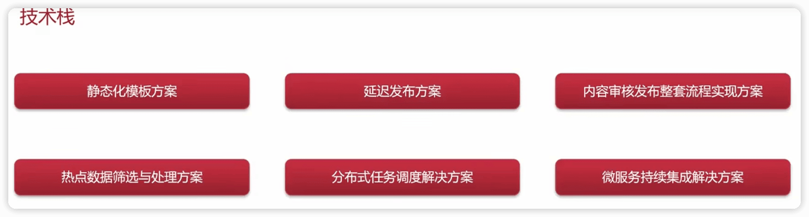
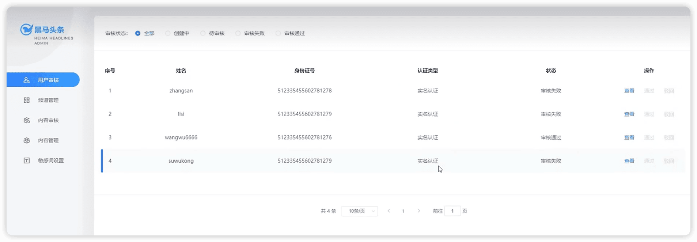
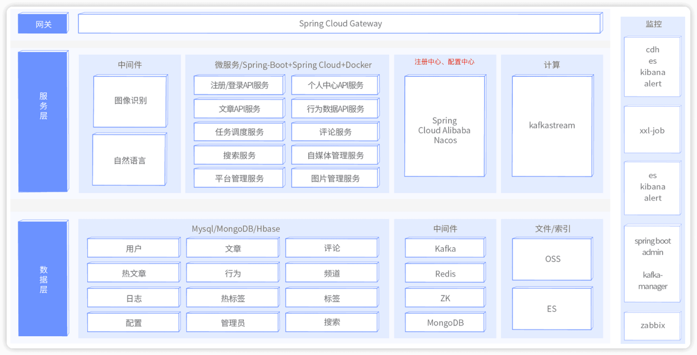

头条
-----

https://www.bilibili.com/video/BV1Qs4y1v7x4

## 介绍

### 技术栈

微服务项目


技术解决方案



### 项目前置知识

Springboot灵活使用的程度

Spring cloud 入门程度

Nacos基本使用程度


### 怎样学习项目

业务细节


## 项目介绍


### 环境搭建

功能->登录及网关认证校验


目标：接口测试工具及前后端联调


### 项目背景介绍

类似于今日头条，是一个新闻资讯类项目

#### 业务说明

功能架构图


自媒体平台是新闻写文章、发布文章、管理的平台


管理平台相当于xx头条的官方平台，权限比较大




项目演示地址：
平台管理：http://heima-admin-java.research.itcast.cn 
自媒体：http://heime-media-java.research.itcast.cn 
app端：http://heima-app-java.research.itcast.cn 

#### 项目术语

- 用户：黑马头条APP用户端用户
- 自媒体人：通过黑马自媒体系统发送文章的用户
- 管理员：使用黑马头条管理系统的用户
- App：黑马头条App
- We Media：黑马头条自媒体系统
- Admin：黑马头条管理系统

### 技术栈说明

基础层


服务层



### 课程概述


| 章节                           | 天数 | 内容                                                         |
| ------------------------------ | ---- | ------------------------------------------------------------ |
| 第一章 环境搭建                | 1    | springboot、springcloud、nacos、swagger                      |
| 第二章 文章列表查看            | 2    | freemarker、OSS、CDN、ElasticSearch、Redis                   |
| 第三章 热点文章计算            | 3    | kafka、kafkaStream、xxl-job、Redis                           |
| 第四章 CMS自媒体端文章发布审核 | 3    | 第三方接口、延迟队列、                                       |
| 第五章 项目部署 数据迁移       | 2    | Hbase、Jenkins、Git、Docker                                  |
| 项目实战                       | 4    | app端-文章行为、<br />app端-评论系统、<br />自媒体端-评论管理、<br />自媒体端-报表 |

### nacos环境搭建


Centos 虚拟机

#### docker安装Nacos安装

1. 使用vm虚拟机打开资料中的contos7镜像

2. docker拉取镜像

   ```shell
   docker pull nacos/nacos-server:1.2.0
   ```

3. 创建容器

   ```shell
   docker run --env MODE=standalone --name nacos --restart=always  -d -p 8848:8848 nacos/nacos-server:1.2.0
   ```

> MODE=standalone  单机版
> --restart=always  开机启动
> -p 8848:8848   映射端口
> -d 创建一个守护式容器在后台运行

4. 访问地址：http://10.211.55.5:8848/nacos 

```
WARNING: The requested image's platform (linux/amd64) does not match the detected host platform (linux/arm64/v8) and no specific platform was requested
```


### 初始工程搭建


### 登录


### 接口工具postman、swagger、knife4j


### 网关


### 前端集成


## 02-app端文章查看，静态化freemarker,分布式文件系统minIO


## 03-自媒体文章发布


## 04-自媒体文章-自动审核


## 05-延迟任务精准发布文章


## 06-kafka及异步通知文章上下架


## 07-app端文章搜索


## 08-平台管理


## 09-用户行为


## 10-xxl-Job分布式任务调度

定时计算热点文章


## 11-热点文章-实时计算
